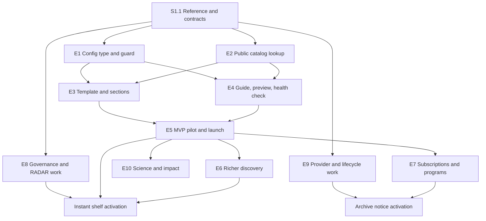

# Data Showcase: MVP and phased implementation plan

Source epic: [DT-3904](https://broadworkbench.atlassian.net/browse/DT-3904) and its 31 stories.

Status: proposed decomposition for product and engineering review; no application changes or Jira
tickets have been made. Planning IDs below (E1, S1.1, …) are local identifiers, not Jira issue keys.
Section 4 details the MVP epics (E1–E5) and outlines the post-MVP epics (E6–E10). Their detailed
stories are in the [post-MVP plan](data-showcase-post-mvp-plan.md), and each is re-planned before it
starts.

This plan covers **consent and duos-ui**, including the frontend server/proxy where necessary.
It turns the supplied single epic into ten independently scoped epics with implementation stories,
dependencies, acceptance checks, and release gates. The MVP is a complete authoring and discovery
workflow for real showcases, not a static reproduction of a mockup.

**Decision record, 2026-10-07.** Product accepted removing the source epic's “publish without a code
deployment” requirement. duos-ui releases to production daily and can ship hotfixes, and all content
owners accepted PR-based authoring. Showcases are therefore **code in duos-ui**, defined like the
featured data libraries in `libraryVersions.ts`. Consent's only MVP change is a public, read-only
catalog lookup. The earlier database-backed admin design is superseded (section 3).

**Decision record, 2026-10-08.** Because of time constraints, the public catalog lookup is a
**Postgres-backed consent endpoint** (S2.1 projection, S2.2 modes), not a public Elasticsearch
index. The index option, an index built only from the S2.1 projection and queried through a
guarded public endpoint, would let duos-ui change query shapes without backend work. It was
estimated at roughly 3–6 more backend engineer-weeks for R1 and needs an AppSec-approved staleness
window, so it is deferred with revisit triggers (section 3).

### Terms

| Term | Meaning here |
| --- | --- |
| Showcase | A public page for one program or partner, defined as a typed config entry in duos-ui. The flagship showcase is served at `/data`. |
| Section | One of the 23 fixed content blocks a showcase can enable, such as `hero` or `featured-tools`. |
| Masthead | The sticky top bar: DUOS and partner logos, search, sign-in and section navigation. |
| Hero | The first block under the masthead: introduction, headline statistics, calls to action and announcements. |
| Shelf | A horizontally scrolling row of cards. |
| Editorial shelf | A shelf whose datasets are listed by hand in config. |
| Computed shelf | A shelf whose datasets Consent ranks on each request, such as newest first. |
| CTA | Call to action: a button or link that asks the visitor to do something, such as "Request access". |
| Static hero decoration | A fixed background image behind the hero, instead of the artifact's animated canvas. |
| Handoff | A link from a public showcase into an existing DUOS workflow, such as search or a data access request. |
| BFF | Backend For Frontend: duos-ui's Fastify server, which proxies requests to Consent. |
| RADAR | Consent's existing rule-based automated DAC approval. |

## 1. Evidence and outstanding source material

Reviewed on 2026-10-07 against consent `05348f28` and sibling duos-ui `4572a0f6`. These are local
checkout observations, not assertions about what is deployed. The requirements source is
[DT-3904](https://broadworkbench.atlassian.net/browse/DT-3904) and its 31 stories.

The design artifact was reviewed from its HTML export, attached to DT-3904 as
`data-showcase-artifact.html`. The export is titled `DUOS — Data Use Oversight System`; the SHA-256
of the attached file is `1356b52733e99b48ac51b963db4ed3b49531a8fef803bda7369395acdf293ce0`. No
authoritative artifact version or timestamp was supplied. See the
[artifact review](data-showcase-artifact-review.md) for line references, complete findings and
observed versus recommended behavior.

The export confirms the visual order and distinct shelf, grid and panel layouts, but has 82
placeholder links, three non-submitting forms, no API integration and a static illustrated impact
panel rather than an iframe. It is a visual reference, not proof that the platform behaviors exist.
Product/design approval of the production interpretation belongs to S1.1.

Several requirements say “unchanged,” “original acceptance criteria stand,” or refer to a previous
decision without including that source. In particular, the original matching, archive, notification,
carousel, chart accessibility, and request-status requirements are missing. The recommendations
below are explicit proposed behavior, not a reconstruction of those omitted requirements.
The corrupted Story 29 text between research grouping URLs and “at a Glance” also needs correction.

### Verified starting points

Paths beginning `src/` below are in consent unless marked `duos-ui:`. New file names in the story
plans are proposed implementation targets; existing reuse points are distinguished here.

| Area | Observed implementation | Consequence for delivery |
| --- | --- | --- |
| Code-defined branding precedent | `duos-ui:src/libs/libraryVersions.ts` (a `LibraryVersions` record keyed by library key, each `LibraryVersion` holding query, icon, title, featured and order); `duos-ui:DATA-LIBRARY.md` (logo standards, ordering rule, testing checklist) | Showcases follow the same pattern: one typed entry per showcase, bundled logos, a contributor guide. |
| Backend | Dropwizard, Guice, JDBI; `ConsentApplication`, `ConsentModule`; Resource → Service → DAO | MVP adds one public lookup resource over existing layers; no showcase tables. |
| Public resource pattern | `OAuthCustomAuthFilter` authenticates only `swagger/` and `api/` paths and skips every other path. `resources/StatusResource.java` and `SupportResource.java` sit outside them with no role annotation. `PublicFeatureFlagResource` carries `@PermitAll`, which grants nothing there (review on PR #3136 questions whether it belongs). `docs/API_GUIDELINES.md` asks for an explicit `@RolesAllowed` or `@PermitAll` on endpoints | Model the public catalog lookup on `StatusResource`/`SupportResource`: outside `/api`, no `@Auth` parameter, no role annotation. S2.2 records this as an exception to the API guideline for unauthenticated resources, or updates the guideline. |
| Dataset identity and metadata | `models/Dataset.java`, `models/Study.java`, `db/DatasetDAO.java`, `service/DatasetService.java`; registration builder defines `accessManagement`, `numberOfParticipants`, `dbGaPPhsID` | Reuse authoritative properties. Participants, samples, bytes and release dates are different concepts; do not invent equivalences. |
| Dataset identifiers | `Dataset.getDatasetIdentifier()` builds `DUOS-` + zero-padded `alias`, a database sequence | Identifiers differ per environment. Configs use production identifiers (section 3). |
| Release dates | No “released in DUOS” field. The NewStudyDigest email already defines “newly available”: `dac_approval_date` for DAC-approved datasets, and `create_date` for open or external datasets, both in publicly visible studies (`DatasetDAO.getRecentDacApprovedDatasetStudyIds`, `getRecentlyCreatedOpenOrExternalDatasetStudyIds`, used by `EmailService.getRecentStudyInfoForDigestMessage`) | Rank `latest-data-releases` by that same date, so the shelf and the digest users already receive agree (section 2). The registration fields `embargoReleaseDate` and `alternativeDataSharingPlanTargetPublicReleaseDate` are a different concept. |
| Public visibility | `Study.publicVisibility`; existing Elasticsearch access-control planning | Anonymous cards need an explicit public projection and eligibility policy. |
| Existing automation | `service/DACAutomationRuleService.java`, `rules/DACAutomationRuleType.java`, `matching/DataUseMatcherV5.java`, `service/MatchService.java` | Extend RADAR and its existing decision path; do not introduce a parallel grant engine. |
| Public UI and sign-in | `duos-ui:src/routing/AppRoutes.tsx` places `/datalibrary`, study and dataset detail routes inside `Authenticated` | Public showcases can launch without making the entire library public; preserve intent through sign-in. |
| HTTP client/server | `duos-ui:src/libs/config.ts`, `src/libs/ajax/fetchAdapter.ts`, `server/src/proxy/publicProxy.ts` | Public upstream reads and authenticated BFF requests differ. Test both deployment modes and CSP/CORS. |
| Analytics | `duos-ui:src/libs/ajax/Metrics.ts`, `src/libs/events.ts` | Reuse Bard/Mixpanel capture and its anonymous path; add showcase context. |

Related local plans: [DAR metrics](dar-metrics-analytics-plan.md),
[primary data-use consistency](data-use-primary-consistency-plan.md), [VODAR](vodar-plan.md),
and [Elasticsearch access control](elasticsearch-service-duos-ui-usage.md).
Coordinate with these efforts; a proposal in another plan is not proof of shipped functionality.

## 2. Recommended MVP and release boundaries

### MVP outcome

An author adds or edits a showcase as a typed code entry by following the showcase guide. After PR
review (including program-owner approval of copy) and the daily release, anonymous visitors browse
the flagship at `/data` and one real partner at `/showcase/{key}`, discover datasets and compute
resources, and reach the existing library, request application, or external resource. Dataset
cards show live, eligible catalog metadata. A second partner is added by someone who did not build
the first, using only the guide.

The first release implements six section types: `masthead`, `hero`, `latest-data-releases`,
`open-access-datasets`, `featured-tools`, and `featured-workspaces`. Latest releases is a computed
shelf (section 3): consent ranks eligible datasets on every page load, so nobody maintains the list
by hand. **This section owns the date policy;** other sections point here. The proposed “new in
DUOS” date reuses the NewStudyDigest signals (section 1), one date per dataset: `create_date` for
open and external datasets, and `dac_approval_date` for DAC-approved controlled datasets. A dataset
with no applicable date is left off the shelf, and ties break by identifier. The shelf ranks all
eligible datasets with no 24-hour window; the digest keeps its window. `create_date` records row
insertion. `dac_approval_date` records the last approval-state update, so for a currently approved
dataset it is when the DAC approved it; older rows may have none. Neither records a provider's
publication or the moment a study became public, so the shelf's label says “new in DUOS”, not
“released”. It may include
controlled-access datasets, so MVP supports discovery of existing DUOS request paths as well as open
data. S1.1 confirms the definition and the shelf's visible label. If product rejects it, the shelf
stays off, the MVP has five sections, and controlled-access discovery relies on search and request
handoff only.

All 23 keys and their fixed order are reserved in the config type from day one. Unimplemented types
cannot be enabled (the CI guard rejects them). Each enabled type ships its renderer, config schema,
guard rules and fixtures together. This is a proposed phased reduction of the original all-sections
acceptance criteria, requiring product agreement in S1.1.

### Release map

| Release | Included epics/stories | Demonstrable completion |
| --- | --- | --- |
| R0: implementation-ready contracts | S1.1 and the field/visibility decisions in S2.1 | Reviewed artifact reconciled with remaining Jira/source gaps, MVP accepted, config type and lookup fixtures agreed across repositories. |
| R1: MVP pilot and public launch | E1–E5 in full | Real flagship plus two partners as code, the second added by guide alone; public lookup, browse and request handoff, basic analytics, accessibility and operational gates. |
| Partner waves (operational cadence, not a release) | S4.1 guide on R1 capabilities | Partner 3 onward ship as config-only PRs; no change to shared components. |
| R2: richer discovery | E6 | Rankings, aggregate charts, remaining compute types and research groupings; no changes to access decisions. |
| R3: program engagement | E7 and E10, independently releasable | Subscription delivery, community/education content, publications and agreed impact presentation; native workshop enrollment only if selected in S7.4. |
| R4a: automated access | E8 | Governed RADAR extension and an accurate instant-approval shelf. Needs the R2 ranking interface (S6.1) for the instant shelf; independent of R3/R4b. |
| R4b: archive awareness | E9, with E7 for delivered notices | Authoritative lifecycle information, advance notifications, and honest retrieval expectations. No billing or data-moving implementation. |

R1 includes the config type and showcase index, the CI guard, shared defaults, bundled assets,
date-bounded content, the public lookup endpoint, the template and six sections, the guide and
review roles, the identifier health check and analytics. It excludes rankings other than `newest`, email
signup, automated approval changes, archive notices, publication submissions, through.bio, advanced
charts and the remaining 17 sections. Disabled features must not display inert CTAs.

The source epic's explicit exclusions remain: redesigning manual DAC review, Terra execution,
through.bio's platform, retrieval billing, vanity domains, reordering sections/custom layouts, and
SSR/SEO work. Client-side title and meta description updates are still in scope. The admin UI,
draft/publish workflow and delegated editors are removed by the decision record; git history
provides the revision history and rollback the epic had excluded.

## 3. Cross-epic design decisions

### Code-defined showcases

Each showcase is a typed module in duos-ui (proposed `src/showcases/<key>.ts`), registered in an
index (`src/showcases/index.ts`) with key, title, route, `status` (`live` or `hidden`), flagship flag
and order, like `libraryVersions.ts`. The `ShowcaseConfig` type uses the same JSON shape the
database design would have stored: all 23 section keys in a `sections` object, typed items per
section, branding, nav labels and a `schemaVersion`. Keeping that shape means configs could become
seed data for a database later without changing how pages render.

- **Shared defaults.** A `defaultShowcase` object holds standard section enablement, nav labels,
  neutral copy and the default theme. Partner configs spread it and override what differs, so a
  new partner file is short. There is no separate template mechanism.
- **Keys.** The key is the stable identity used in routes, analytics and future subscriptions.
  It matches `^[a-z0-9]+(-[a-z0-9]+)*$`, cannot be `data` or `flagship`, and is never
  renamed or reused; a retired-keys list in the index is checked by the CI guard. Exactly one
  entry is the flagship, served at `/data`. Change a showcase's display title without changing
  its key. Replacing a showcase means retiring its old identity and creating a distinct entry;
  it must not silently transfer routes, analytics or subscriptions to the new identity.
- **CI guard.** A Vitest suite iterates every index entry and fails unless: the config validates
  against the shared schema at the current `schemaVersion`; all 23 keys are present in fixed order;
  only implemented types are enabled; URLs pass the policy below and no CTA is `#`; required alt
  text is present; date ranges are valid; dataset identifiers are well-formed `DUOS-` identifiers;
  keys are unique and not retired; and the asset budget is met. A registry change therefore cannot
  ship with a stale config. This replaces server-side config validation.
- **Historical key guard.** Compare the proposed index with the protected target-branch revision
  used by the required PR/merge check. Every previously present key removed from the index must
  appear in the proposed retired list; all previous tombstones must remain; no proposed entry may
  use a previously retired key. Run against the current target revision through an up-to-date
  branch or merge queue so concurrent PRs cannot validate against an obsolete registry. Fetch the
  required base revision in shallow checkouts and fail the check if it is unavailable. An empty
  baseline is allowed only for the first registry introduction when that revision has no index.
  Test the comparison with synthetic before/after snapshots. Rollbacks and hotfixes preserve the
  accumulated tombstones; rebuild older content with the current key history rather than deploying
  an old artifact that resurrects retired identities. Retirement is permanent; use `hidden` for
  reversible withdrawal. The E7 registry independently retains retirement tombstones.
- **Time-sensitive content.** Announcements, events, workshops and deadlines carry `startDate` and
  `endDate` and are filtered at render time with an injectable clock, so they appear and expire
  without a release. Daily releases bound every other content change to one day; urgent fixes use
  the hotfix path.
- **Public-bundle rule.** Everything merged to `develop` ships in the public JavaScript bundle.
  `status: 'hidden'` keeps a route off; it is not a privacy control. Merge only content that is
  cleared for public disclosure, including unannounced partner names.

An index entry and its partner config, shown as JSON (illustrative values; S1.2 fixes the types).
The index entry in `src/showcases/index.ts`:

```json
{ "key": "example-partner", "title": "Example Partner Data", "route": "/showcase/example-partner",
  "status": "hidden", "flagship": false, "order": 3 }
```

The `ShowcaseConfig` exported by `src/showcases/example-partner.ts`:

```json
{
  "schemaVersion": 1,
  "branding": {
    "logo": { "src": "showcase/example-partner/logo.svg", "alt": "Example Partner" },
    "theme": "blue"
  },
  "sections": {
    "masthead": { "enabled": true },
    "hero": {
      "enabled": true,
      "intro": "Discover Example Partner datasets in DUOS.",
      "stats": [{ "label": "Studies", "value": "120", "asOf": "2026-10-01" }],
      "announcements": [
        { "text": "New cohort available", "url": "/datalibrary", "startDate": "2026-10-01", "endDate": "2026-11-01" }
      ]
    },
    "latest-data-releases": { "enabled": true, "ranking": "newest", "scope": { "dac": ["Example DAC"] }, "limit": 12 },
    "open-access-datasets": { "enabled": true, "items": ["DUOS-000123", "DUOS-000456"] },
    "featured-tools": {
      "enabled": true,
      "items": [
        { "id": "terra", "name": "Terra", "description": "Analyze data in the cloud.", "launchUrl": "https://app.terra.bio/", "featured": true }
      ]
    },
    "most-requested-datasets": { "enabled": false }
  }
}
```

This is a partial excerpt, not a guard-valid config: a real config has all 23 section keys and
nav labels. A partner file merges `defaultShowcase` within `sections`, key by key, so it lists only
what differs while every key stays present in fixed order.

**Revisit trigger for a database/admin UI:** content-only PRs routinely wait on release timing, or
non-engineering owners need to edit without PRs. Measure with the section 8 lead-time metric.

### Superseded database design

The earlier plan stored draft and published JSONB documents in a `data_showcase` aggregate with
integer-version concurrency, an audit table, lifecycle states, flagship invariants, slug rules, an
admin editor and preview, a shared image-upload pipeline coordinated with DT-4234, and a catalog
picker. All of that is removed. Git supplies review, history and rollback; the CI guard supplies
validation; bundled assets replace uploads; PR review replaces publication approval.

### Decisions and alternatives

Each row pairs an outcome the source epic wants with the mechanism it prescribed or an alternative
that was considered, and records what this plan does instead.

| Outcome or option | Considered | Decision |
| --- | --- | --- |
| Admins publish without a deploy | Config tables plus admin editor; a headless CMS | **Removed by product decision.** Content ships by PR and the daily release. Revisit a database/admin UI only on the trigger above; a CMS adds a dependency and still needs live-catalog hydration. |
| Live content stays stable, and editors do not overwrite each other | Versioned configurations, a dirty flag, `updateDate` comparison | Branches, PR review and git merges; only merged, released code is live. |
| Consistent fixed template across partners | One entry per type with component/schema/form | Typed registry with reusable shelf/grid/featured-card/panel families; preserve the distinct layouts observed in the export. |
| Dataset cards stay accurate | A “unified catalog data model”; copying metadata into config | Configs hold identifiers only, and a safe public projection supplies live metadata. Copying metadata is rejected: cards go stale, and a dataset made private would stay public until edited. |
| Public catalog lookup | A public Elasticsearch index built from the S2.1 projection | **Deferred 2026-10-08 for time.** It would let the frontend query, rank and facet freely, but costs an indexer, removal on every eligibility-affecting write, rebuilds, a guarded query endpoint and an AppSec staleness window. Revisit if the all-eligible response is too large for client-side work, public full-text search or an anonymous data library is planned, or new lookup modes become a frequent backend request. S2.1 stays the only source of public fields. |
| Admins curate useful shelves | Precomputed rankings and admin prefill; hand-curated ranking shelves | Rankings are computed by consent on each request, with config pins and exclusions; editorial shelves stay curated. Hand-curated rankings are rejected because “latest” and “most requested” go stale and every refresh is a PR. |
| Compute cards | Reuse existing catalog asset records | Investigate in S3.4; MVP uses typed resource entries in config. |
| Researchers find suitable access paths | A new DUO approval engine | Measure existing RADAR coverage first (S8.1); add rules only for documented gaps. |
| Researchers know about archival early | A DUOS-owned storage state machine; scheduled provider polling | Mirror authoritative provider state and send notices; never own physical storage transitions. Use the provider's supported integration, which may be polling. |
| Partners control their branding | Arbitrary colors, fonts and imagery | Accessible theme presets or contrast-checked primary/accent overrides; fixed typography. |
| Program engagement is measurable | Every Mixpanel event carries a slug | Showcase key on showcase-origin events and attributed handoffs. |
| Program signups | Linking to an approved subscription or registration provider | A valid interim CTA after provider assessment; it does not complete E7. |
| Workshop enrollment | Provider registration links | Preferred first delivery (S7.4). |
| Impact presentation | Curated statistics, a static visual and an external link | Preferred first variant; it matches the export but not the ticket's live embed, which is conditional (S10.3). |
| Hero decoration | A static hero decoration | Preferred MVP variant, subject to design approval: no animation lifecycle or reduced-motion work. |

These are qualitative comparisons, not effort estimates. Six initial sections and code-defined
content are **scope changes**, recorded as product decisions rather than equivalent implementations.

### Small experiments to resolve the uncertain choices

| Experiment | Evidence to produce | Story / decision affected |
| --- | --- | --- |
| Public lookup spike | Known public/private synthetic datasets, field provenance, bounded query plan and response size for each lookup mode; count of public-eligible datasets and the size of an all-eligible response | S2.1/S2.2/S6.3 |
| Ranking query cost | Query plans and latency for newest, most requested and largest cohort at production scale, with eligibility and scope filters applied | S2.2/S6.1; whether rankings need caching or materialization |
| Cross-environment lookup | Read-only production-data previews through the BFF public proxy or approved legacy CSP/CORS; functional request flows use environment-local synthetic records; colliding aliases cannot cross environments | S2.2/S3.2/S4.2 identifier decision |
| Shared card slice | One dataset entry and one compute entry rendered from config and checked by the guard | S1.2/S3.3/S3.4 |
| Existing RADAR coverage matrix | Agreed DUO use cases classified as supported, unsupported or ambiguous with current rule tests | S8.1 |
| Provider capability check | Supported polling/events, notice lead-time budget, subscription attribution or impact-link capability | S7.1/S9.1/S10.3 |

### Dataset identifiers across environments

`DUOS-` identifiers derive from a per-environment database sequence, so a production identifier
does not name the same dataset in staging. Proposed policy: configs list **production** identifiers.
Non-production content previews resolve them against the production public lookup, which is
anonymous, read-only and returns only allowlisted fields. BFF mode uses the credential-stripping
public proxy defined below. Legacy mode uses an explicitly configured public lookup origin with
CORS and CSP allowances for the approved staging/local preview origins (S2.2). Those CORS
allowances apply to the `/showcase` path only; authenticated `/api` routes must not trust them.

Bind the lookup environment and DUOS handoff environment explicitly. Production pages use production
for both. A non-production preview using production metadata is read-only: disable authenticated
DUOS search, dataset-detail and request handoffs with an explanation in the preview UI. Do not pass
production aliases, dataset IDs or scope IDs to a staging/local backend, or silently redirect a
reviewer into a production request workflow. Approved external resource links may still be reviewed.

Unit tests use mocked synthetic fixtures. End-to-end request tests use a separate non-production
showcase fixture with synthetic datasets seeded in that environment and the actual local/staging
lookup and authentication flow. Its identifiers, scope IDs and destinations all belong to that
environment; it is excluded from production bundles. Add a collision case where the same `DUOS-`
alias names different records in two environments and prove no cross-environment handoff occurs.
The alternative, dbGaP `phs` IDs, is stable but missing for many datasets, so it would leave gaps.

### Public contract and security boundary

The public lookup lives outside `/api` with no role annotation, following `StatusResource` and
`SupportResource` (section 1). It returns an allowlist of display fields and must not serialize full `Dataset` or `Study` objects,
internal storage locations or request state. Confirm the existing visibility policy before using
`publicVisibility`; missing or ambiguous visibility fails closed. Public eligibility and access type
are independent: an open dataset can still have non-public catalog metadata.

**Approved fields only, enforced at the query.** `Dataset` and `Study` carry everything, including
`createUser`, `piEmail`, `createUserEmail`, certification and data-sharing-plan files and free-form
`properties` bags. Loading them and stripping fields is a deny-list that fails open when a field is
added. Instead, the lookup uses a dedicated projection query that selects named columns and
allowlisted `dataset_property.schema_property` and `study_property.key` values only, maps rows
straight into a flat DTO, and never constructs `Dataset`, `Study` or `User` objects (S2.1).

**Editorial versus computed shelves.** Each dataset shelf is one of two kinds, chosen in config:

| Kind | Config | Resolution | Used by |
| --- | --- | --- | --- |
| Editorial | `items`: ordered production identifiers | Lookup returns eligible items in configured order | Highlight lists, related datasets, any shelf a program owner picks by hand |
| Computed | `ranking` from a fixed set (`newest`, `most-requested`, `largest-cohort`; later `instant-eligible`, `archive-soonest`), optional `scope`, `limit`, `pin`, `exclude` | Consent applies eligibility and scope, places eligible pins first, removes exclusions, and ranks the rest on every request | `latest-data-releases`, `most-requested-datasets`, `largest-cohorts`, `instant-approval`, `datasets-moving-to-archive`, and `open-access-datasets` when its showcase chooses the computed kind (S3.3) |

S1.2 implements one typed section-to-allowed-rankings mapping, shared by the CI guard and its
tests; this table summarizes it. For MVP: `latest-data-releases` accepts `newest`, and
`open-access-datasets` accepts `newest` when computed.

`scope` uses a small fixed vocabulary of database-backed attributes agreed in S2.1 (for example
submitter institution, DAC or study); it is never a raw Elasticsearch or SQL fragment. The program
owner approves the ranking and scope in the PR rather than a list. Ranking runs after eligibility,
so private datasets never influence or appear in a ranked shelf.

Two illustrative shelf fragments (the outer names are labels, not registry keys), and the lookup
request each produces. The `scope.dac` key and its value type are provisional until S2.1 fixes the
scope vocabulary:

```json
{
  "editorial": { "enabled": true, "items": ["DUOS-000123", "DUOS-000456"] },
  "computed": {
    "enabled": true,
    "ranking": "newest",
    "scope": { "dac": ["Example DAC"] },
    "limit": 12,
    "pin": ["DUOS-000789"],
    "exclude": ["DUOS-000111"]
  }
}
```

```json
{ "mode": "identifiers", "section": "open-access-datasets", "identifiers": ["DUOS-000123", "DUOS-000456"] }
```

```json
{ "mode": "ranking", "section": "latest-data-releases", "ranking": "newest",
  "scope": { "dac": ["Example DAC"] }, "limit": 12, "pin": ["DUOS-000789"], "exclude": ["DUOS-000111"] }
```

Each returned summary carries only S2.1's approved fields. The field names below are proposed and
finalized in S2.1:

```json
{ "identifier": "DUOS-000789", "title": "Example Cohort", "accessManagement": "controlled",
  "dacName": "Example DAC", "participantCount": 5400, "availableDate": "2026-09-30" }
```

An unresolved identifier returns a separate response variant,
`{ "identifier": "DUOS-000999", "status": "unavailable" }`, which the summary's exact-key test does
not cover.

The page batch-resolves all unique identifiers once, then reconstructs configured order. Unknown
(including hard-deleted), private or otherwise ineligible identifiers share one public `unavailable` result and
disappear from rendered shelves. Response shape, status and diagnostic text must not distinguish
private records from nonexistent ones. The S4.3 health check reports only that public result;
authorized catalog owners investigate the reason through existing authenticated administration.
Unknown attributes stay unknown, not zero/free/instant. Resolve against authoritative current data;
an index may accelerate search but stale index values must not make eligibility decisions. Use
no-store responses initially; add caching only with tested catalog-change invalidation.

Each registry type defines `hasRenderableContent`, so copy/settings-only sections such as hero,
conference and impact are not hidden just because `items` is empty. Sub-navigation and page
rendering consume the same effective visible-section list; empty and disabled sections have no
anchor. The registry's `navigable` property is false for masthead/hero and true for content
sections. Add stable DOM IDs to all types. Support short `navLabel` defaults/overrides and optional
eyebrow copy separately from titles/subtitles.

Use stable item IDs within each showcase for analytics and related-content references; the CI
guard checks uniqueness. Hide related-workspace CTAs when the target item or section is absent or
disabled. Richer resource/publication/program fields identified in the artifact review are optional
typed fields, not an unrestricted metadata map.

Accept HTTPS URLs or same-origin internal paths beginning with one `/`. Reject `//host`, backslash
variants, control characters, credentials, `javascript:`, `data:` and malformed encodings, in the CI
guard and again defensively in the renderer. Markdown renders without raw HTML; embedded frames
require a separate provider allowlist, sandbox/CSP policy and agreement.

### Assets, routes and frontend transport

Logos and images are bundled under `duos-ui:src/images/showcase/<key>/`, one directory per
showcase, using the `DATA-LIBRARY.md` asset standards: SVG
preferred, transparent PNG fallback, 256×256 canvas for logos, optimized, within its size limits.
Hero and card images are not forced into that square. SVGs are reviewed in the PR and referenced
through ``, never inlined. Each image placement in config carries its alt text; logos require
it, and decorative empty alt is allowed only for non-logo images. Set a per-showcase asset budget
(S1.3) and lazy-load below-the-fold images, since `libraryVersions.ts` already bundles 30+ logos.

Routes are `/data` (flagship) and `/showcase/:key`, rendered outside `Authenticated` and generated
from the index. Unknown or hidden keys render the standard not-found page. Transport is explicit:

- **BFF mode:** add `POST /public/showcase/datasets` to
  `duos-ui:server/src/proxy/publicProxy.ts`, forwarding only to Consent's
  `POST /showcase/datasets`. The existing BFF CSP excludes the Consent origin, so the browser must
  use this same-origin route. Reuse the public proxy's credential stripping, response hardening
  and JSON validation; strip cookies, Authorization and CSRF headers before forwarding. The route
  uses no session or authenticated CSRF endpoint and does not broaden BFF `connect-src`.
- **Legacy mode:** the client posts directly to the explicitly configured public lookup origin,
  with `credentials: 'omit'` and no auth headers. Include that exact origin in legacy CSP and
  configure Consent CORS/preflight for approved UI origins, including production-data previews.
  Scope those origin and preflight allowances to `/showcase/*`, so they never widen what
  authenticated `/api` routes accept. CORS is set in Consent's proxy configuration, which is not
  tracked in this repository; the local developer `config/site.conf` already sets wildcard CORS on
  every path outside `/introspect/`. Production CORS has not been verified, so S2.2 first records
  what production allows today and changes only `/showcase/*`.
- **Environment configuration:** add a dedicated server-side showcase upstream setting and legacy
  client lookup-origin setting. Production points to production; content-preview deployments point
  to production; functional-test deployments point to their own seeded environment. Do not change
  the authenticated API base URL or accept an upstream URL from a request parameter. Missing
  configuration fails visibly (503 from the proxy), with no fallback to another environment.
- **Failure/limits:** enforce the S2.2 body limit and a rate limit both at the public proxy and
  directly in Consent, so direct callers cannot bypass either. Consent's existing `RateLimitFilter`
  does not cover this route: it skips every path outside `api/`, skips requests with no principal,
  and does nothing in any environment where its `isEnabled()` config switch is off. S2.2 therefore adds
  an anonymous per-client-IP limit for `/showcase/*` that is on in every environment. In legacy mode
  the browser calls Consent directly, so this limit is the only throttle. Configure the proxy limit
  with the existing public-proxy pattern and a pilot-load budget. Failed lookups show a retryable
  unavailable state, never mock data.

### Subscription registry synchronization (E7, not MVP)

Code remains the content source of truth. For subscriptions, E7 generates a versioned manifest from
the validated configs and retired-keys list and synchronizes it to a Consent registry snapshot, so a
new partner needs a config PR and deployment synchronization, not a Consent code release. Membership
fails closed, is evaluated independently of a shelf's display limit, and stops on retirement;
unsubscribe works during outages. The full contract is in the
[post-MVP plan](data-showcase-post-mvp-plan.md#subscription-registry-synchronization-e7).

## 4. Epics and detailed implementation stories

Every story includes implementation work and its acceptance/test boundary. Backend file shorthand
`http/...` means `src/main/java/org/broadinstitute/consent/http/...`; backend tests mirror those
packages under `src/test/java/`. Frontend unit tests belong under `duos-ui/test/`, following current
conventions, with Playwright scenarios in the existing e2e harness. All fixtures are synthetic.

### E1 — Code-defined showcase configuration (MVP)

**Outcome:** showcases are typed, validated code entries that any engineer can add by following a
guide. **Owner:** duos-ui lead with consent contract reviewer. **Dependencies:** S1.1 precedes the
config type. **Source stories:** 24, 25, 27–30 (reinterpreted for code-defined content) and
foundational portions of 26/31.

#### S1.1 — Review the identified reference and settle implementable contracts

- **Implement:** use the completed [artifact review](data-showcase-artifact-review.md) and the
  export attached to DT-3904 to agree the production interpretation. Recover omitted original Jira criteria;
  reconcile the 21 anchor IDs versus 23 registry types, participant/sample semantics, richer card/
  panel fields, static impact versus embed, and workshop enrollment versus alerts. Correct the
  corrupted Story 29 text. Agree the six-section MVP, the identifier policy and the release-date
  source. Produce TypeScript config fixtures for all 23 keys and lookup request/response examples.
- **Frontend:** design review covers desktop/mobile shelves, carousel controls, keyboard order,
  logo slots, error states and the difference between enabled and actually visible sections.
- **Acceptance/tests:** product/design and both implementation owners can identify which behavior
  comes from the artifact versus this proposal; fixtures enumerate all 23 keys in fixed order.
  No claim that the still-missing earlier Jira criteria have been recovered from the HTML.
- **Dependency/size:** timebox discovery, then record any unresolved decision with its owner.

#### S1.2 — Config type, showcase index and CI guard

- **Frontend:** add `src/types/showcase.ts` (`ShowcaseConfig`, per-section item types, theme,
  branding with alt text, `schemaVersion`), `src/showcases/index.ts` with the entry and retired-key
  lists, and the CI guard suite described in section 3. Schemas for unimplemented section types are
  reserved but rejected when enabled. Export a JSON Schema from the types (or define it once and
  derive the types) so the guard and any future backend share one definition. Add the historical
  key comparison and required CI base-revision setup from section 3. Mirror S2.2's collection and
  ranking limits in config validation; cap the page's deduplicated editorial lookup at 200 IDs.
- **Acceptance/tests:** guard tests prove each rule fails on a deliberately broken fixture: missing
  or reordered keys, enabled unimplemented type, `#` or unsafe URL, missing logo alt, inverted date
  range, malformed identifier, duplicate or retired key, duplicate item ID, over-budget assets, a
  enabled dataset shelf with both or neither of `items`/`ranking` (a disabled section may omit both), an unknown ranking or scope key, and a
  ranking not allowed for its section, and exceeded lookup input/output limits. Before/after
  snapshots cover removal without a tombstone, a key rename without retiring the old key,
  tombstone deletion, retired-key reuse in a later revision and rollback resurrection. Valid
  retirement, title-only edits and hiding/restoring the same entry pass. Missing base history
  fails CI; concurrent-PR tests require comparison against the updated target registry.
- **Dependencies/PR boundary:** S1.1; types and guard before any real showcase entry.

#### S1.3 — Shared defaults, assets and time-bounded content

- **Frontend:** add `defaultShowcase` and a small set of accessible theme presets; primary/accent
  overrides pass a CI contrast check in light and dark themes. Add the date-window filter with an
  injectable clock for announcements, events and deadlines. Set the per-showcase asset budget and
  lazy-loading convention.
- **Acceptance/tests:** a partner config that only overrides branding renders correctly; low-
  contrast overrides fail CI; fixed-clock tests show items appearing and expiring without a code
  change; over-budget assets fail CI.
- **Dependencies/PR boundary:** S1.2.

### E2 — Public-safe live catalog lookup (MVP)

**Outcome:** configs list dataset identifiers or name a ranking, while pages show accurate, eligible
live metadata limited to approved fields.
This is consent's only MVP change. **Owner:** consent catalog lead with duos-ui dataset-card owner.
**Source:** Story 1 and MVP slices of 5/8/29. **Dependencies:** visibility/field decisions start in
S1.1; the lookup feeds E3.

#### S2.1 — Define the minimal catalog projection and eligibility policy

- **Backend — allowlist:** define the approved fields once, e.g. a `ShowcasePublicField` enum giving
  each field's table/column or property source, type, units and nullability. Distinguish dataset
  properties (`schema_property`, `property_value`, `property_type`) from study properties
  (`key`, `value`, `type`); `study_property` has no `schema_property` column. Candidates:
  identifier, title, access management, reviewing DAC name, translated consent, participant count,
  “new in DUOS” date (section 2) and safe destination. Evaluate optional PI display name, data types, file
  formats and phenotype/sub-cohort fields against public-data policy before adding them. Add size
  only when a trusted byte source is known. Free-text fields (study description, phenotype) need an
  explicit decision — approve, truncate or omit — because they can contain emails or internal notes.
  Adding a field is a code change reviewed by data stewards and AppSec.
- **Backend — projection:** add a dedicated DAO query, e.g. `DatasetDAO.findShowcaseSummaries`, and
  mapper. It selects named columns only (never `SELECT *` or the existing `Dataset`/`Study`
  mappers), filters `dataset_property.schema_property IN (:datasetPropertyAllowlist)` and
  `study_property.key IN (:studyPropertyAllowlist)` separately, and maps rows into a flat
  `ShowcaseDatasetSummary` with no nested `User`, `Institution` or file
  objects and no `properties`/`data` maps. The query is one fixed text block that follows the DAO
  SQL rule in `docs/ai/CLAUDE.md`: the allowlist values reach it only as bound list parameters,
  never as SQL assembled from constants. The DTO's fields mirror the same allowlist.
- **Backend — eligibility:** evaluate eligibility in the same query's `WHERE` clause. Every row
  needs study `public_visibility = true`; a null value or a dataset with no study fails closed.
  Discoverability and requestability differ. Existing visibility does not require DAC approval, but
  `DataAccessRequestService.validateRequestDatasetsAreApproved` rejects a DAR containing any dataset
  whose `dac_approval` is not true. A controlled-access card that offers a DAR handoff therefore
  requires `dataset.dac_approval = true`. Open and external cards use their approved provider
  actions instead. Classify access with the digest's canonical open/external rule
  (`DatasetDAO.getRecentlyCreatedOpenOrExternalDatasetStudyIds`), extended explicitly with
  `Dataset.getAccessManagement()`'s legacy property and case/whitespace normalization; this can
  include rows the current digest misses. Reuse the existing `public_visibility` predicates in
  `DatasetDAO`. Mirror only the public-study branch of `DatasetService.verifyPublicVisibilityAccess`:
  exclude its admin, creator and custodian exceptions and its no-study allowance, so the public page
  shows only what an ordinary signed-in reader sees through public visibility. Datasets are hard-deleted
  (`DatasetDAO.deleteDatasetById`; `dataset` has no deleted column), so a removed dataset is simply
  absent. Per-section rules, such as canonical open access, add to these. Eligibility inputs may be
  non-public; they filter rows and are never returned. Agree the `scope` vocabulary here from
  database-backed attributes.
- **Frontend:** define null-safe card labels: participants must not be called samples without an
  authoritative conversion; unknown counts show no numeric claim.
- **Acceptance/tests:** synthetic records cover open/controlled/external, controlled without DAC
  approval, private/missing/null-visibility, a hard-deleted identifier, legacy properties and
  unknown values. A key-set test asserts the serialized
  summary's JSON keys equal the allowlist exactly, so a new DTO field fails until it is approved. An
  unapproved dataset `schema_property` or study `key` is never returned. Database tests exercise
  both property sources against the actual schema, including type conversion and null handling.
  Product/data stewards approve field definitions.
- **Dependencies/PR boundary:** S1.1; allowlist + projection query + eligibility tests in one PR.

#### S2.2 — Public batch lookup endpoint

- **Backend:** add `PublicShowcaseCatalogResource`, e.g. `POST /showcase/datasets`, outside `/api`
  with no role annotation (section 1), with three modes that all return S2.1 summaries:
  - `identifiers`: an editorial list, capped at 200 submitted identifiers, deduplicated and
    resolved in one bounded query; returns eligible summaries plus a per-identifier `unavailable`
    result for every unresolved identifier. Nonexistent, private, deleted and section-ineligible
    records have the same result; do not query existence separately to distinguish those cases.
  - `ranking`: one of the fixed rankings with optional `scope`, `limit` (default 12, maximum 50), `pin` and
    `exclude`. Ranking queries return identifiers only, which then go through the S2.1 projection.
    MVP implements `newest` after S1.1 approves the section 2 date policy; S6.1 adds the others.
  - `all`: every public-eligible dataset, paged (`pageSize` default 100, maximum 200), for flagship
    full-catalog charts (S6.3). Use deterministic identifier ordering and a validated continuation
    cursor bound to the request filters; never offer an unbounded page or caller-supplied offset.
  A `section` parameter applies section-specific eligibility. Unknown modes, rankings or scope keys
  return 400. No-store cache headers; register in `ConsentModule`/`ConsentApplication`.
- **Backend — hard limits:** reject JSON bodies over 64 KiB with 413 before deserialization, both
  at Consent's public resource boundary and the BFF proxy. Count submitted array entries before
  deduplication: `identifiers` maximum 200, `pin` maximum 50 and `exclude` maximum 200. Each approved
  scope key accepts at most 20 typed values; reject unknown keys, nested query objects and arbitrary
  strings in place of the agreed attribute types. Identifier strings are at most 32 characters
  and must pass `Dataset.parseIdentifierToAlias`; continuation cursors are at most 512 characters.
  `limit` and `pageSize` must be positive integers within their caps; pins never increase the result
  beyond `limit`. Reject mode-incompatible fields and over-limit inputs with 400 before DAO calls.
  Publish these initial limits in OpenAPI and align the frontend guard. Revisit the numeric values
  only through a reviewed contract change backed by the lookup/load spike.
- **Backend — rate limit:** add an anonymous per-client-IP rate limit for `/showcase/*` in Consent
  (section 3, Failure/limits): either extend `RateLimitFilter` with a public-path branch or add a
  dedicated filter. It answers 429 with `Retry-After` and is enabled independently of the
  authenticated limiter's `isEnabled()` switch. It reads the client IP from the forwarding header
  only when the immediate peer is the trusted proxy, otherwise uses the socket peer, so a caller
  cannot pick its own key by spoofing the header.
  Size it from the lookup/load spike and the pilot-load budget.
- **Frontend/server/ops:** implement the section 3 BFF public proxy and its dedicated upstream
  configuration, legacy CSP/CORS/preflight, and public-route rate limit. Document preview versus
  functional-test environment configuration. This transport work is required for MVP.
- **Frontend:** add `src/libs/ajax/ShowcaseCatalog.ts` with mode-aware routing: same-origin
  `/public/showcase/datasets` in BFF mode and the configured direct public lookup in legacy mode.
  Calls carry no auth options or credentials and use no authenticated session/CSRF dependency.
  Add a test mock with synthetic fixtures; never fall back to mock data in a deployed build.
- **Acceptance/tests:** anonymous access works in every mode. Planted sensitive values in
  `piEmail`, `createUserEmail`, custodian emails, data location, certification files and an
  unapproved property never appear anywhere in a response body, including errors. Private,
  hard-deleted, unapproved controlled and null-visibility records return no metadata and never appear in or affect a ranking; pins to
  ineligible datasets are dropped; exclusions hold; ranking ties are deterministic with a fixed
  clock. Swapping a private record for a nonexistent identifier produces equivalent response
  shape/status/diagnostics, including mixed batches; caller-supplied identifiers may be echoed.
  For every collection, string and numeric bound test the maximum and maximum-plus-one, including
  repeated identifiers that would become small after deduplication; rejected input makes no DAO
  calls. Test body-size rejection (413) both directly and through the proxy, malformed/mismatched
  cursors, page termination, mode-incompatible fields and unknown parameters (400). Test anonymous
  BFF and legacy requests under enforced CSP, credential stripping, no session/CSRF calls,
  preflight, missing upstream configuration and rate-limit responses (429) both through the proxy
  and directly at Consent, including with the authenticated limiter disabled. Query-count checks at
  maximum size. Document the Consent route in `assets/paths/` and `assets/api-docs.yaml`, plus the
  frontend proxy/configuration contract in duos-ui.
- **Dependencies/PR boundary:** S2.1; `identifiers` mode and OpenAPI first, then `ranking`/`all`
  modes, then the public proxy/configuration and mode-aware frontend client.

### E3 — Accessible public template and MVP sections (MVP)

**Outcome:** one reusable public page serves every showcase and connects discovery to existing
workflows. **Owner:** duos-ui lead with consent reviewer. **Source:** 3–5, 8, 14, 18, 26, parts of 29.
**Dependencies:** develop against S1.1 fixtures and the S2.2 mock; real integration requires E2.

#### S3.1 — Registry, template, transport and routes

- **Frontend:** add `src/components/showcase/sectionRegistry.ts`, `ShowcaseTemplate` and page
  loaders. Registry entries own fixed order, component, item type, default labels, `navigable` and
  renderability. Generate `/data` and `/showcase/:key` routes from the index, outside `Authenticated`.
- **Frontend:** share accessible shelf, grid, featured-card and structured-panel primitives while
  preserving their registry-specific layouts. Use template-owned typography and scoped light/dark
  tokens; confirm whether system dark mode is part of the approved MVP. Reuse the application
  footer with real destinations. Do not port the artifact's embedded fonts/assets and inline script
  wholesale or treat its CSS as a production accessibility implementation.
- **Frontend/server:** gate routes by index `status` and a rollout flag, use S2.2's mode-aware
  public client, validate image origins and the configured legacy lookup origin, and retain the
  existing BFF CSP through same-origin proxying. Add no session dependency for anonymous reads.
  Set/reset page title and meta description on routing.
- **Acceptance/tests:** Vitest covers fixed order, disabled/empty/unsupported types, accessible
  theme fallback, lookup error/retry, unknown/hidden key 404 and no mock data in deployed builds.
  Playwright loads `/data` and a partner anonymously with BFF on/off; assert there is no sign-in
  redirect until an authenticated destination. Add semantic section/card headings and named shelf
  controls with boundary states. Reduced motion suppresses smooth scrolling; mobile/zoom checks
  must catch the artifact's observed 390px viewport versus 428px body-width overflow instead of
  masking it with `overflow-x:hidden`.
- **Dependencies/PR boundary:** S1.2 first; E2 integration before release.

#### S3.2 — Masthead, navigation and existing search/request handoff

- **Frontend:** render primary/ordered partner logos, sign-in action, search and only valid anchors.
  Use skip links, meaningful headings, visible keyboard focus and responsive overflow behavior.
  Submit search to the existing `/datalibrary` query mechanism; inspect/reuse its encoding.
- **Frontend:** generate the sub-nav from visible navigable entries, preserving short labels and
  excluding masthead/hero. Account for the sticky header when scrolling to headings. Turn the
  mockup's inert search button and placeholder links into real keyboard-operable destinations.
- **Frontend/backend:** search, dataset detail and requests are signed-in pages (`AppRoutes.tsx`
  wraps them in `Authenticated`), so each handoff from the public page runs: visitor clicks, signs
  in if needed, lands on the intended destination. Label these actions as requiring sign-in, and
  preserve the intended search/dataset destination through the existing authentication flow.
  Dataset request actions enter the current DAR path; show the existing login/eligibility
  requirements accurately. Enforce the environment binding in section 3: production-data previews
  cannot enter environment-local authenticated flows. No new approval behavior and no anonymous
  library API exposure.
- **Acceptance/tests:** search text survives sign-in safely, return destinations are internal,
  request actions retain selected dataset IDs, logo links have accessible names, disabled or empty
  sections produce no dead anchors, and the normal DUOS navigation remains usable. Test production
  handoff routing with fixtures and a full non-production request flow with environment-local
  synthetic records; colliding aliases across environments must never select the wrong dataset.
- **Dependencies/PR boundary:** S3.1 and existing authentication integration; no new search engine.

#### S3.3 — Hero and the first dataset shelves

- **Frontend:** implement `hero`, `latest-data-releases` and `open-access-datasets` as registry
  entries with matching config schemas. MVP hero supports approved stats entered in config (labeled
  with an as-of date), date-bounded announcements, CTA/onboarding links and optional imagery.
  Computed stats arrive in E6. Preserve the observed desktop intro/onboarding/announcement hierarchy
  and stacked mobile layout. Prefer a static decorative background for MVP. Carousel supports an
  explicit pause control, focus/hover pause, manual controls and reduced motion; inactive slides
  must leave both the tab order and accessibility tree. Use accessible consent tooltips rather than
  CSS pseudo-elements. New badges use the section 2 “new in DUOS” date and an approved badge window.
- **Frontend/backend:** `latest-data-releases` is a computed shelf (`ranking: 'newest'`, optional
  scope, pins and exclusions). `open-access-datasets` supports either kind; whether the flagship's
  is a curated highlight list or computed “open access, newest first” is a product decision in
  S1.1. Both use E2 projection/eligibility. No release-signup CTA before E7.
- **Acceptance/tests:** config stats render without pretending to be live; expired/future
  announcements behave deterministically with an injectable clock. Shelf cards show current DAC,
  consent and participant values where available. Label study count, dataset count, tool count and
  bytes distinctly. Check free-credit/training promises and deadlines with content owners; the
  artifact is not an authoritative program source. Open-data actions are real links and distinguish
  direct download from opening a provider page. Test empty shelves, missing fields, mobile/keyboard
  navigation and changed access management.
- **Dependencies/PR boundary:** S3.1/S3.2 + E2; hero and dataset shelves may ship as separate PRs.

#### S3.4 — Analysis apps and starter workspaces

- **Frontend:** implement `featured-tools` and `featured-workspaces` with one shared resource-card
  primitive and separate registry entries. Fields: name, description, tags, optional thumbnail,
  launch URL and docs URL. Analysis apps allow at most one featured large card (CI guard).
- **Frontend:** preserve the full-width featured app plus app grid and separate workspace shelf.
  Add optional typed publisher, difficulty, estimated-duration and related-dataset/tool references
  for workspace parity. Use a validated external launch link rather than implying a workspace-cloning
  API. Only show clone/usage counts from a trusted identified source; omit them until available.
  Give every resource card an explicit accessible action. No Terra credentials or execution.
- **Acceptance/tests:** safe links open the intended resources, missing optional images have a
  stable layout, featured-card keyboard order is sensible, and two featured apps fail the guard.
- **Dependencies/PR boundary:** S3.1 + S1.3.

### E4 — PR-based authoring and validation (MVP)

**Outcome:** anyone comfortable with PRs can add or change a showcase safely, with program-owner
approval, without help from the original authors. **Owner:** duos-ui lead with product/content owner.
**Source:** 27–30 (reinterpreted: index replaces the manage table, PR review replaces publication).
**Dependencies:** E1; health check needs E2.

#### S4.1 — Showcase guide and review roles

- **Implement:** add `duos-ui:SHOWCASE.md`, modeled on `DATA-LIBRARY.md`: intake checklist (owners,
  logos with alt text, colors, dataset identifiers, tools/workspaces, copy, dates), creating a config
  from `defaultShowcase`, asset standards, adding the index entry, ordering and key rules, the
  public-bundle rule, preview steps, and a testing checklist. Document permanent retirement versus
  reversible hiding, preservation of tombstones during rollback, and fetching the CI base revision.
  Include a worked partner example and the lookup/config limits from S2.2.
- **Implement:** define review roles: CODEOWNERS (or named reviewers) for `src/showcases/` and
  showcase assets; the program owner approves copy and claims in the PR; an engineer approves code.
  Add a PR template section for showcase changes (owner approval, preview link/screenshots, health
  check result).
- **Acceptance/tests:** an engineer who did not write the guide adds a synthetic showcase using only
  the guide, and CI catches each mistake listed in the guard tests.
- **Dependencies/PR boundary:** S1.2/S1.3; documentation PR.

#### S4.2 — Preview procedure

- **Implement:** document and support preview of a branch: local `pnpm start` (Vite only;
  `pnpm run start:server` to preview BFF mode) and staging, both
  resolving production identifiers in read-only content-preview mode per the identifier policy,
  with `status: 'hidden'` entries viewable in non-production builds only. Document the separate
  environment-local synthetic fixture for functional request testing. Use PR preview deployments
  if the team adds them; none were found in `.github/workflows`.
- **Acceptance/tests:** a reviewer can see a pending showcase with real live cards before merge,
  authenticated DUOS handoffs are disabled in production-data previews, and a hidden entry is not
  routable in a production build. Synthetic integration fixtures never enter production bundles.
- **Dependencies/PR boundary:** S2.2 public proxy and legacy CSP/CORS configuration + S3.1.

#### S4.3 — Scheduled identifier and link health check

- **Implement:** a scheduled job (GitHub Action or equivalent) resolves every configured identifier
  and pin against the production lookup and checks configured external links, then reports
  identifiers that return `unavailable`, computed shelves that resolve empty, and broken links
  to the showcase owners. It also runs on PRs that touch `src/showcases/`. It uses the same anonymous
  contract and cannot diagnose existence or privacy; owners use existing authorized catalog tools
  when investigation is needed. This replaces the database design's admin warnings and readiness report.
- **Acceptance/tests:** synthetic private and nonexistent identifiers produce the same unavailable
  report; a broken link is reported separately. Transient failures retry before alerting; the job
  never blocks the page, which already hides ineligible records at runtime.
- **Dependencies/PR boundary:** S2.2 + S1.2.

### E5 — Flagship, partner pilot and measured launch (MVP)

**Outcome:** the complete workflow reaches real users with approved content and a recoverable
rollout, and adding a partner is proven repeatable. **Owner:** product/content owner +
frontend/backend release owners. **Source:** 31, 26, shared metrics. **Dependencies:** E1–E4.
Content inventory and analytics design start in parallel with R0.

#### S5.1 — Flagship and pilot partner configs

- **Frontend/content:** add the flagship and pilot partner as config entries, starting `hidden`.
  Transfer approved artifact copy, tooltip/CTA structure and assets after S1.1; do not copy
  illustrative studies, counts, fees or citations. Remove the illustrative-data footer only once
  illustrative content is absent. Product/content owners approve real fields in the PR.
- **Acceptance/tests:** both showcases have meaningful dataset and compute content; missing-source
  sections remain off; the health check is clean; no mock data reaches production.
- **Dependencies/PR boundary:** E1–E4; one PR per showcase.

#### S5.2 — Showcase event context and baseline metrics

- **Frontend:** wrap existing `Metrics.captureEvent` with showcase context: key, section key, item ID
  where applicable and release version. Instrument page view, section/item engagement, search
  submission, request handoff and resource launch. `/data` reports the flagship's key.
- **Analytics:** preserve showcase attribution through login and request submission where feasible,
  documenting gaps and the attribution window. Exclude non-production and preview traffic. Do not
  send raw search text, emails or DAR research text.
- **Acceptance/tests:** events have stable context in anonymous and authenticated modes; rerendering
  does not inflate page views. A failed metrics request does not block browsing. Define engagement
  denominator and baseline date. Actual request completion is not inferred from a click alone.
- **Dependencies/PR boundary:** S3.1; shared event helper before section releases.

#### S5.3 — Cross-repository release qualification and runbook

- **Implement:** run the release matrix in section 8, including accessibility/manual review and
  public/private metadata adversarial checks against the lookup. Document the rollout flag,
  alerting, content ownership and support handling for broken links or ineligible datasets.
  Measure page/lookup sizes and performance against an agreed pilot load budget.
- **Rollout:** deploy the consent lookup, then duos-ui with entries `hidden`, and verify them in
  staging (read-only live cards via the production lookup); qualify request flows separately with
  environment-local synthetic records. After content approval, a PR flips `status` to
  `live` while the S3.1 rollout flag is off; enabling the flag is the public launch, verified in
  production immediately. Roll back by reverting the PR
  (hotfix if urgent) or disabling the rollout flag; users return to existing entry points. A revert
  must retain accumulated retirement tombstones and pass the historical key guard; rebuilding prior
  content does not authorize redeployment of an artifact that restores a retired key.
- **Acceptance/tests:** a named product owner accepts the pilot and its approved scope; both
  anonymous routes pass in staging and production with mocks off. A rollback drill restores the old
  entry experience. Record PR-open-to-production lead time.
- **Follow-up:** prepare a Jira-ready retirement story under E10/S10.4; creating external Jira tickets
  or changing library tiles is not part of this documentation task.

#### S5.4 — Second partner by guide

- **Implement:** a person who did not build the pilot adds the second partner using only
  `SHOWCASE.md`. Record every point where they needed help or the guide was unclear; fix the guide,
  or log a product decision when a request needs a new section type or field. Do not add
  partner-specific branches to shared components.
- **Acceptance/tests:** the second partner is live through a config-only PR (config, index entry,
  assets); intake-to-production time is recorded. Partner waves (section 2) proceed only after this.
- **Dependencies/PR boundary:** S5.1, S5.3, S4.1–S4.3.

### Post-MVP epics (E6–E10), in outline

These epics are summarized here; their detailed stories are in the
[post-MVP plan](data-showcase-post-mvp-plan.md), and each is re-planned before it starts. Story IDs
(S6.1 and so on) are the same in both documents.

**E6 — Ranked discovery, charts and the remaining catalog/resource shelves.** Ranked shelves stay
current without hand curation, and visitors get richer discovery without new access decisions.
Owner: catalog/analytics backend owner + frontend discovery owner. Source: 2, 6, 7, 13, 15–17, 20.
Depends on: E1–E5 interfaces.
- Adds the `most-requested` and `largest-cohort` rankings, always after eligibility and scope.
- Popularity is private: a minimum request count before a dataset can rank, and no public request
  totals, volume trends or timing sample counts.
- Charts and computed hero statistics are computed client-side from S2.2's lookups, never from the
  authenticated Elasticsearch search.
- Stories: S6.1 ranking modes, S6.2 most-requested and largest-cohort shelves, S6.3 charts and
  computed hero statistics, S6.4 workflows/notebooks/AI models, S6.5 research areas and initiatives.

**E7 — Program subscriptions, community and education.** Showcase opt-ins lead to managed
delivery, not dead signup forms. Owner: notifications backend, frontend and
communications/privacy. Source: 5, 22, 23. Depends on: E1–E5; archive notices also on E9.
- Subscriptions key on the permanent showcase key and validate against the synchronized registry
  (section 3).
- Decide first whether release alerts extend the existing NewStudyDigest or run beside it, with one
  “new in DUOS” definition.
- Workshops start with provider registration links; native multi-session signup is conditional.
- No signup control ships until end-to-end delivery exists.
- Stories: S7.1 preferences and enrollment, S7.2 alert delivery, S7.3 conference and education
  sections, S7.4 workshop registration.

**E8 — Governed DUO/RADAR automation and instant-approval discovery.** Eligible requests get
auditable grants through the existing decision path; ambiguous ones go to manual review. Owner:
consent/RADAR lead, DAC governance and frontend DAR owner. Source: 9–10. Depends on: governance
from R0; the instant shelf also needs the S6.1 ranking interface.
- Measure existing RADAR coverage first, and extend `DACAutomationRuleService` only for proven gaps.
- Unknown or ambiguous outcomes produce no grant and fall back to manual review; a kill switch is
  independent of showcasing.
- Shadow evaluation runs before any grant, and activation is its own release gate.
- Stories: S8.1 policy, S8.2 decision path, S8.3 instant shelf and status, S8.4 shadow evaluation
  and rollout.

**E9 — Storage lifecycle awareness and advance notices.** Researchers get credible warning before
retrieval becomes slower or costlier. Owner: data-storage integration, consent backend,
notifications and frontend. Source: 11–12. Depends on: an authoritative provider contract; E7 for
delivery.
- Mirror the provider's lifecycle state; DUOS never moves data, changes grants or bills.
- The archive shelf is computed (`archive-soonest`) only, and the config cannot override provider
  dates, sizes or fees.
- Stories: S9.1 lifecycle contract, S9.2 ingestion and reconciliation, S9.3 archive shelf and
  notices, S9.4 pilot.

**E10 — Publications, impact and legacy showcase migration.** Verified program impact and curated
science become discoverable; legacy tiles retire only once replacements are proven. Owner:
content/product, frontend/backend and the impact partner. Source: 19, 21, part of 31. Depends on:
E1–E5; per-program agreement for any embed.
- Publications are curated in config. Self-reports use an external form by default; native
  moderation is conditional.
- Impact starts as an approved static summary plus a provider link; a live embed needs agreement.
- Featured-library tiles retire only after per-partner parity.
- Stories: S10.1 curated publications, S10.2 self-report submission, S10.3 impact presentation,
  S10.4 featured-library retirement.


## 5. Section registry completeness and source-story mapping

The 23 section numbers in the source table are not the same as source story numbers. Preserve the
exact keys below even when the visible heading is renamed (for example `featured-tools` means
Analysis Apps). Every row inherits shared config/visibility/anchor/CI-guard criteria.

| Order | Registry key | Renderer + config schema delivery | Source story |
| --- | --- | --- | --- |
| 1 | `masthead` | R1 S3.2 | 3 |
| 2 | `hero` | R1 S3.3; computed stats S6.3 | 4 |
| 3 | `latest-data-releases` | R1 S3.3 computed `newest` shelf (NewStudyDigest dates, confirmed in S1.1); signup S7.2 | 5 |
| 4 | `most-requested-datasets` | S6.1/S6.2 computed shelf | 6 |
| 5 | `largest-cohorts` | S6.1/S6.2 computed shelf | 7 |
| 6 | `open-access-datasets` | R1 S3.3 (curated or computed, decided in S1.1) | 8 |
| 7 | `instant-approval` | S8.3 | 10 |
| 8 | `datasets-at-a-glance` | S6.3 | 13 |
| 9 | `datasets-moving-to-archive` | S9.3 | 12 |
| 10 | `featured-tools` | R1 S3.4 | 14 |
| 11 | `new-workflow-tools` | S6.4 | 15 |
| 12 | `notebooks` | S6.4 | 16 |
| 13 | `ai-models` | S6.4 | 17 |
| 14 | `featured-workspaces` | R1 S3.4 | 18 |
| 15 | `latest-published-science` | S10.1/S10.2 | 19 |
| 16 | `research-area` | S6.5 | 20 |
| 17 | `research-initiative` | S6.5 | 20 |
| 18 | `anvil-impact` | S10.3 | 21 |
| 19 | `community-conference` | S7.3 | 22 |
| 20 | `where-else` | S7.3 | 23 |
| 21 | `anvil-workshops` | S7.3/S7.4 | 23 |
| 22 | `anvil-scholars` | S7.3 | 23 |
| 23 | `tech-policy-interns` | S7.3 | 23 |

Non-section source coverage completes the original 31 stories:

| Source story | Delivery |
| --- | --- |
| 1 Catalog model | S2.1–S2.2; lifecycle/automation enrichments E8/E9 |
| 2 Aggregation/rollups | S2.2 ranking and `all` modes, S6.1/S6.3; ranking extensions S8.3/S9.3 |
| 9 DUO matching engine | S8.1–S8.4 |
| 11 Lifecycle state machine | S9.1–S9.4 |
| 24 Model/API | S1.2 config type; S2.2 public lookup |
| 25 Images | S1.3 bundled assets per `DATA-LIBRARY.md` (upload pipeline removed) |
| 26 Template/routes | S3.1–S3.4/S5.3 |
| 27 Manage table | S1.2 showcase index (admin table removed) |
| 28 General/branding editor | S1.2/S1.3 config and theme presets (editor removed) |
| 29 Section editor | Per-section config schemas in each section story (editor removed) |
| 30 Draft/preview/publish | S4.1 PR review, S4.2 preview, `status` and daily release (workflow removed) |
| 31 Seed/legacy follow-up | S5.1/S10.4 |

## 6. Delivery dependencies and practical slicing



This is a dependency map, not a claim that all governance/provider work must wait for MVP. Start
remaining Jira/source reconciliation, DAC policy, storage-provider ownership and through.bio
agreement early. Consent E2 and duos-ui E1/E3 proceed in parallel once S1.1 fixtures are stable.
E5 is the MVP integration gate. Do not force E8/E9 into the critical path of E1–E5.

Suggested implementation increments within MVP:

1. Agree contracts, identifier policy and data visibility; land the config type and CI guard.
2. Land the public lookup with tests; land the template plus one synthetic dataset section.
3. Complete the six section families against fixtures, then against the real lookup.
4. Write the guide, preview procedure and health check.
5. Add flagship and pilot partner as hidden entries, qualify, approve and go live.
6. Add the second partner by guide only, then start partner waves.

Each story is a delivery unit and may use the explicitly listed smaller PRs. Do not assign dates
or story points from this document: capacity, recovered criteria and provider/governance lead times
are not yet known. E8/E9 have the highest external uncertainty; E2 (public data exposure) and E3
(accessibility) carry the main MVP risk now that the admin workflow is gone.

## 7. Decisions and risks requiring resolution

Proposals in this table are planning recommendations. Product/technical sign-off happens as part
of the listed implementation story, not as a prerequisite to saving this planning document.

| Decision or risk | Proposed position / required evidence | Owner | Gate |
| --- | --- | --- | --- |
| Code-defined content | **Decided 2026-10-07:** no-deploy requirement removed; daily releases with hotfixes; PR authoring accepted | Product | Recorded |
| Public lookup backing store | **Decided 2026-10-08:** Postgres-backed consent endpoint for time; public Elasticsearch index deferred (section 3 triggers) | Product/engineering leads | Recorded; revisit at E6 or on a trigger |
| Artifact interpretation and earlier criteria | Approve documented visual/schema differences and recover missing earlier Jira criteria | Product/design | S1.1 |
| Artifact-only fields and interactions | Resolve participants versus samples, metric windows, structured program/group fields and optional resource/publication relationships | Product/catalog/design | S1.1 and owning section stories |
| Release-date source | Proposed: the NewStudyDigest “new in DUOS” dates (`dac_approval_date`, or `create_date` for open/external), with no 24-hour window and a label that does not claim provider publication. If product rejects it, keep `latest-data-releases` off and launch with five sections | Product/catalog | S1.1/S2.1 |
| Dataset identifiers across environments | Production identifiers for production/content previews; disable authenticated DUOS handoffs in production-data previews; functional tests use environment-local synthetic records and destinations | Frontend/backend/AppSec | S2.2/S3.2/S4.2 |
| Public-bundle exposure | Merge only public-safe content; `hidden` is not a privacy control | Product/content | S4.1 and every showcase PR |
| Review roles | CODEOWNERS or named reviewers for showcase paths; program owner approves copy in the PR | Product/frontend lead | S4.1 |
| Workshop enrollment | Prefer provider links; native multi-session signup requires a separate provider enrollment contract | Program/frontend/backend | S7.4 |
| Impact presentation | Prefer approved static summary/image plus provider link; live embed conditional on agreement | Product/partner | S10.3 |
| MVP size | Six sections (five if product rejects the section 2 date policy) and complete authoring/public workflow | Product | R0 |
| Branding | Theme presets or contrast-checked primary/accent overrides; fixed typography | Design | S1.1/S1.3 |
| Public data exposure | Table-specific allowlist driving a dedicated projection query (no full `Dataset`/`Study` objects), explicit visibility policy, free-text field decisions; private/nonexistent IDs share `unavailable` | Catalog/AppSec | S2.1/S2.2 before anonymous lookup |
| Computed versus curated shelves | Rankings are computed by consent with config pins/exclusions; editorial shelves are curated; `open-access-datasets` kind decided per showcase | Product | S1.1/S3.3 |
| Ranking scope vocabulary | Small fixed set of database-backed attributes (e.g. institution, DAC, study); never raw query fragments | Product/catalog/AppSec | S2.1 |
| Popularity disclosure | Minimum request count before ranking, no public request totals/volume trends or timing sample counts, eligibility before ranking; volume displays require a separate policy revision | Privacy/metrics owner | S6.1/S6.2/S8.3 |
| Full-catalog charts | Client-side from the `all` mode if the measured response fits; otherwise a fixed-list server aggregation; never the authenticated Elasticsearch search | Frontend/catalog | S2.2 experiment/S6.3 |
| Release/sample/size semantics | Establish authoritative sources/units; leave unavailable claims out | Catalog/product | S2.1/S3.3/S6.2 |
| Empty section behavior | Type-specific content predicate and no public dead anchors | Product/design | S1.1/S3.1 |
| Search scope/library replacement | MVP global library handoff; partner query scoping via `libraryVersions` keys later | Product/frontend | S3.2/S10.4 |
| Public lookup transport | Required BFF `POST /public/showcase/datasets` proxy with credential stripping and unchanged BFF CSP; mode-aware client; configured direct origin plus CSP/CORS in legacy mode, with CORS allowances scoped to `/showcase/*` | Frontend/server | S2.2/S3.1/S5.3 |
| Public lookup bounds | Consent and proxy enforce 64 KiB bodies and a rate limit; Consent's limit is anonymous per client IP, independent of `RateLimitFilter`'s `isEnabled()` switch; Consent enforces ID/pin/exclusion/scope/string limits, maximum ranking size 50 and page size 200 before DAO calls | Backend/frontend/server | S2.2 |
| Two “new data” notification paths | Extend or deliberately coexist with NewStudyDigest; one definition of “new in DUOS” | Notifications owner/product | S7.2 |
| Permanent showcase keys | Required check compares against the current protected target revision; removed keys become tombstones, tombstones persist, and rollback cannot restore retired identities | Frontend/release owners | S1.2/S4.1 |
| Return to a database/admin UI | Only if the section 8 lead-time metric or owner feedback shows PR authoring is the bottleneck | Product | After partner waves |
| Subscription registry and audience | Versioned release manifest synchronized to Consent; active-key/topic validation, explicit editorial/computed membership, deployment/rollback reconciliation and retirement suppression | Frontend release/notifications owners | S7.1 before signup activation |
| Subscription consent/audience | Define identity, opt-in, retention, duplicate delivery and archive-notice audience; use synchronized membership independently of shelf display limits | Communications/privacy | S7.1/S9.3 |
| DUO policy and SO timing | Reuse governed RADAR path; fail closed to manual review; define timing clock | DAC governance | S8.1/S8.4 |
| Archive price/SLA/source | Provider contract and freshness, no inferred costs or movement guarantees | Storage owner | S9.1 |
| through.bio agreement | Per-program approval and attribution; allowed origin/fallback additionally required for embed mode | Partner/product/AppSec | S10.3 |
| Publication submissions | External form by default; native moderation only if tracking is required | Content/backend | S10.2 |
| Stale catalog cards | Recheck live eligibility for every lookup; bounded batches, no-store initially | Catalog/backend | S2.2 |

## 8. Verification, metrics and definition of done

### Shared implementation checks

Backend work preserves Resource → Service → DAO, explicit auth annotations on authenticated
endpoints (the public lookup is the recorded exception, section 1), constructor injection
and existing error handling. Every API change updates the OpenAPI entry point and referenced path/
schema files. Strict Mockito Resource/Service tests verify validation/auth/status behavior, with
database tests for the projection query. Use no `lenient()` stubbing.

Frontend work uses current TypeScript/MUI patterns and Vitest. Each shipped registry type has
renderer, config schema and CI guard coverage. Run Playwright across anonymous journeys. Use only
synthetic fixtures in tests; real showcase content lives only in `src/showcases/`.

| Release-critical scenario | Required proof |
| --- | --- |
| Config validity | CI guard rejects every rule violation and lookup-limit violation; all real entries pass; before/after checks reject removal/rename without retirement, tombstone deletion and reuse; missing or stale base history cannot pass; rollback preserves tombstones |
| Public data exposure | JSON key set equals the allowlist; planted sensitive values never appear in any response; private, hard-deleted, unapproved controlled and null-visibility records return no metadata and never affect rankings; unavailable results do not distinguish private from nonexistent IDs |
| Computed shelves | Rankings, scope, pins and exclusions resolve correctly with a fixed clock, including `archive-soonest`; popularity thresholds hold and no request counts or volume trends are returned |
| Live metadata | Catalog rename/DAC/access/visibility/deletion changes appear without a release; no stale public eligibility |
| Identifier health | Scheduled check reports unavailable identifiers without existence/privacy diagnoses, plus broken links to owners |
| Visibility gating | `hidden` entries are not routable in production; flipping to `live` and reverting both work |
| Time-bounded content | Items appear and expire on schedule with a fixed clock |
| Routing | `/data`, partner key, unknown/hidden 404, login return-to; BFF same-origin public proxy with no forwarded credentials/session dependency and enforced CSP, legacy direct lookup with CSP/CORS/preflight; production-data previews block authenticated DUOS handoffs; environment-local synthetic request flows pass and alias collisions cannot cross environments |
| Subscription synchronization (E7) | Deployment-authorized manifest activation, active-key/topic validation, freshness failure, rollback, retirement and queued-send suppression; editorial/computed membership independent of display limits; unsubscribe survives outages |
| Accessibility | Keyboard-only page; inactive carousel links excluded; semantic headings; sticky-header anchor offset; accessible tooltips; reduced-motion shelf scrolling; WCAG AA contrast in supported themes; no page overflow at mobile widths/zoom |
| Performance/failure | Maximum supported config, lookup query count and size, asset budget, failed lookup/analytics and no mock fallback; exact-limit/over-limit requests for every input bound, 413 at Consent and proxy, 400 before DAO calls, capped pagination, and 429 with `Retry-After` at both Consent and the proxy, including direct calls with the authenticated limiter disabled |
| Launch realism | Approved real content, rollback by revert or flag, no illustrative claims, named content/support owners |

Implementation verification commands, from each repository, should include:

```bash
# consent: focused tests during each story; full verification before release
./mvnw spotless:check
./mvnw verify

# duos-ui: target story-specific Vitest/Playwright files during development
pnpm type-check
pnpm lint
pnpm test
pnpm test:e2e
pnpm build
```

Use the repository's documented Java/Maven/container and Node/pnpm prerequisites. Add necessary
test/service configuration for integration runs rather than interpreting unavailable infrastructure
as passing tests.

### Metric ownership and availability

| Metric | Source and interpretation | First measurable release |
| --- | --- | --- |
| Showcase change lead time | PR opened to production release for showcase-only PRs; median and distribution. Judged against the daily-release assumption | R1 |
| Partner intake-to-production time | Intake checklist complete to the partner going `live` | R1 (S5.4) |
| Shared-code changes per partner launch | Changes outside the partner's config, index entry and assets; target 0 | R1 (S5.4) and each wave |
| Live showcases | `live` entries in the index | R1 |
| Engagement per showcase | Bard events tagged with showcase key; exclude preview/bots under agreed policy | R1 |
| Dataset/tool/workspace click-through | Unique engaged sessions divided by eligible page/section exposures | R1 |
| Successful request conversion | Confirmed existing DAR submission with valid attribution; clicks reported separately | R1 if attribution integration is validated |
| Verified opt-in rate | Verified topic enrollments over eligible signup exposures | R3/E7 |
| Automated versus manual decisions | Authoritative election/vote outcome and source; document DAR-dataset denominator | R4a/E8 |
| Instant approval timing | Submission-to-decision and eligible-to-decision clocks; p50/p95 and pending/SO exclusions stated | R4a/E8 |
| Pre/post archive retrieval reduction | Provider retrieval outcomes, comparable cohort and baseline; not inferred from access-request clicks | R4b/E9, conditional on provider data |
| Workshop/enrollment conversion | Partner-confirmed completion where available, otherwise explicitly labeled outbound click-through | E7 with partner instrumentation |

### Completion boundaries

This document covers both repositories, records the code-defined content decision, maps all 31
DT-3904 stories and 23 sections, and reconciles the reviewed artifact with remaining source gaps
and explicit scope decisions. It does not create Jira tickets or implement a showcase.

The MVP implementation is complete only when E1–E5 acceptance checks pass with mocks off, the agreed
MVP scope and factual content are approved, the flagship and pilot partner are live in production,
and the second partner shipped through a config-only PR by someone using only the guide. Later
epics have their own activation gates; they are not silently included in or declared complete by
the MVP launch.
