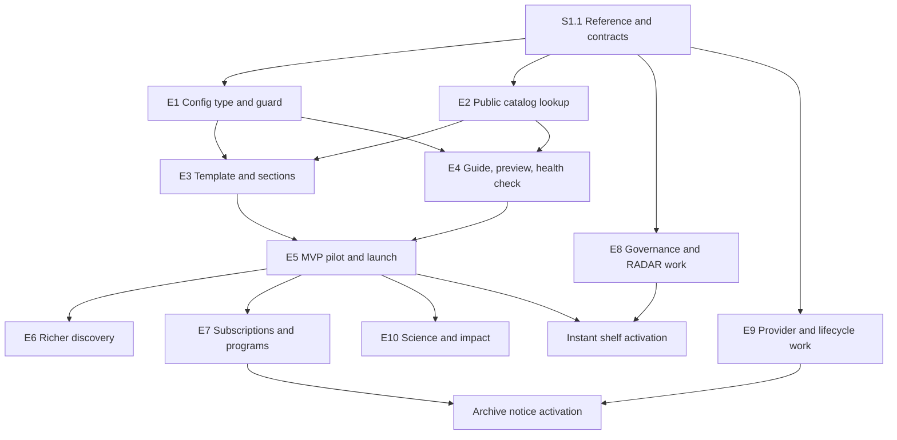

# Data Showcase: MVP and phased implementation plan

Status: proposed decomposition for product and engineering review; no application changes or Jira
tickets have been made. Planning IDs below are local identifiers, not Jira issue keys.

This plan covers **consent and duos-ui**, including the frontend server/proxy where necessary.
It turns the supplied single epic into ten independently scoped epics with implementation stories,
dependencies, acceptance checks, and release gates. The MVP is a complete authoring and discovery
workflow for real showcases, not a static reproduction of a mockup.

**Decision record, 2026-10-07.** Product accepted removing the source epic's “publish without a code
deployment” requirement. duos-ui releases to production daily and can ship hotfixes, and all content
owners accepted PR-based authoring. Showcases are therefore **code in duos-ui**, defined like the
featured data libraries in `libraryVersions.ts`. Consent's only MVP change is a public, read-only
catalog lookup. The earlier database-backed admin design is superseded (section 3).

**Decision record, 2026-10-08.** Because of time constraints, the public catalog lookup is a
**Postgres-backed consent endpoint** (S2.1 projection, S2.2 modes), not a public Elasticsearch
index. The index option, an index built only from the S2.1 projection and queried through a
guarded public endpoint, would let duos-ui change query shapes without backend work. It was
estimated at roughly 3–6 more backend engineer-weeks for R1 and needs an AppSec-approved staleness
window, so it is deferred with revisit triggers (section 3).

## 1. Evidence and outstanding source material

Reviewed on 2026-10-07 against consent `05348f28` and sibling duos-ui `4572a0f6`. These are local
checkout observations, not assertions about what is deployed. The requirements source is the ticket
text supplied in this conversation; its Jira key and URL were not supplied.

The [Claude artifact reference](https://claude.ai/code/artifact/0ce96e5e-57b4-4943-9682-7c9538c98176)
has been reviewed through the HTML export supplied by the user after remote retrieval failed.
The sharing query parameter is intentionally omitted from repository documentation. The export is
titled `DUOS — Data Use Oversight System`; its exact SHA-256 is
`1356b52733e99b48ac51b963db4ed3b49531a8fef803bda7369395acdf293ce0`. No authoritative artifact
version/timestamp was supplied. See the [artifact review](data-showcase-artifact-review.md) for
source provenance, line references, complete findings and observed versus recommended behavior.

The export confirms the visual order and distinct shelf, grid and panel layouts, but has 82
placeholder links, three non-submitting forms, no API integration and a static illustrated impact
panel rather than an iframe. It is a visual reference, not proof that the platform behaviors exist.
Product/design approval of the production interpretation belongs to S1.1.

Several requirements say “unchanged,” “original acceptance criteria stand,” or refer to a previous
decision without including that source. In particular, the original matching, archive, notification,
carousel, chart accessibility, and request-status requirements are missing. The recommendations
below are explicit proposed behavior, not a reconstruction of those omitted requirements.
The corrupted Story 29 text between research grouping URLs and “at a Glance” also needs correction.

### Verified starting points

Paths beginning `src/` below are in consent unless marked `duos-ui:`. New file names in the story
plans are proposed implementation targets; existing reuse points are distinguished here.

| Area | Observed implementation | Consequence for delivery |
| --- | --- | --- |
| Code-defined branding precedent | `duos-ui:src/libs/libraryVersions.ts` (typed `LibraryVersion` entries with key, query, icon, title, featured, order); `duos-ui:DATA-LIBRARY.md` (logo standards, ordering rule, testing checklist) | Showcases follow the same pattern: one typed entry per showcase, bundled logos, a contributor guide. |
| Backend | Dropwizard, Guice, JDBI; `ConsentApplication`, `ConsentModule`; Resource → Service → DAO | MVP adds one public lookup resource over existing layers; no showcase tables. |
| Public resource pattern | `resources/PublicFeatureFlagResource.java` uses `@Path("feature")` and `@PermitAll` outside `/api` | Model the public catalog lookup on it. |
| Dataset identity and metadata | `models/Dataset.java`, `models/Study.java`, `db/DatasetDAO.java`, `service/DatasetService.java`; registration builder defines `accessManagement`, `numberOfParticipants`, `dbGaPPhsID` | Reuse authoritative properties. Participants, samples, bytes and release dates are different concepts; do not invent equivalences. |
| Dataset identifiers | `Dataset.getDatasetIdentifier()` builds `DUOS-` + zero-padded `alias`, a database sequence | Identifiers differ per environment. Configs use production identifiers (section 3). |
| Release dates | No “released in DUOS” field. Nearest: `embargoReleaseDate`, `alternativeDataSharingPlanTargetPublicReleaseDate` (`DatasetRegistrationSchemaV1Builder.java:20,48`) | The `latest-data-releases` shelf has no authoritative source yet (section 7). |
| Public visibility | `Study.publicVisibility`; existing Elasticsearch access-control planning | Anonymous cards need an explicit public projection and eligibility policy. |
| Existing automation | `service/DACAutomationRuleService.java`, `rules/DACAutomationRuleType.java`, `matching/DataUseMatcherV5.java`, `service/MatchService.java` | Extend RADAR and its existing decision path; do not introduce a parallel grant engine. |
| Public UI and sign-in | `duos-ui:src/routing/AppRoutes.tsx` places `/datalibrary`, study and dataset detail routes inside `Authenticated` | Public showcases can launch without making the entire library public; preserve intent through sign-in. |
| HTTP client/server | `duos-ui:src/libs/config.ts`, `src/libs/ajax/fetchAdapter.ts`, `server/src/proxy/publicProxy.ts` | Public upstream reads and authenticated BFF requests differ. Test both deployment modes and CSP/CORS. |
| Analytics | `duos-ui:src/libs/ajax/Metrics.ts`, `src/libs/events.ts` | Reuse Bard/Mixpanel capture and its anonymous path; add showcase context. |

Related local plans: [DAR metrics](dar-metrics-analytics-plan.md),
[primary data-use consistency](data-use-primary-consistency-plan.md), [VODAR](vodar-plan.md),
and [Elasticsearch access control](elasticsearch-service-duos-ui-usage.md).
Coordinate with these efforts; a proposal in another plan is not proof of shipped functionality.

## 2. Recommended MVP and release boundaries

### MVP outcome

An author adds or edits a showcase as a typed code entry by following the showcase guide. After PR
review (including program-owner approval of copy) and the daily release, anonymous visitors browse
the flagship at `/data` and one real partner at `/showcase/{key}`, discover datasets and compute
resources, and reach the existing library, request application, or external resource. Dataset
cards show live, eligible catalog metadata. A second partner is added by someone who did not build
the first, using only the guide.

The first release implements six section types: `masthead`, `hero`, `latest-data-releases`,
`open-access-datasets`, `featured-tools`, and `featured-workspaces`. Latest releases is a computed
shelf (section 3): consent ranks eligible datasets by release date on every page load, so nobody
maintains the list by hand. It may include controlled-access datasets, so MVP supports discovery of
existing DUOS request paths as well as open data. If authoritative release dates are unavailable,
the release shelf stays off; do not relabel registration timestamps as releases. In that case the MVP has five sections and
controlled-access discovery relies on search and request handoff only.

All 23 keys and their fixed order are reserved in the config type from day one. Unimplemented types
cannot be enabled (the CI guard rejects them). Each enabled type ships its renderer, config schema,
guard rules and fixtures together. This is a proposed phased reduction of the original all-sections
acceptance criteria, requiring product agreement in S1.1.

### Release map

| Release | Included epics/stories | Demonstrable completion |
| --- | --- | --- |
| R0: implementation-ready contracts | S1.1 and the field/visibility decisions in S2.1 | Reviewed artifact reconciled with remaining Jira/source gaps, MVP accepted, config type and lookup fixtures agreed across repositories. |
| R1: MVP pilot and public launch | E1–E5 in full | Real flagship plus two partners as code, the second added by guide alone; public lookup, browse and request handoff, basic analytics, accessibility and operational gates. |
| Partner waves (operational cadence, not a release) | S4.1 guide on R1 capabilities | Partner 3 onward ship as config-only PRs; no change to shared components. |
| R2: richer discovery | E6 | Rankings, aggregate charts, remaining compute types and research groupings; no changes to access decisions. |
| R3: program engagement | E7 and E10, independently releasable | Subscription delivery, community/education content, publications and agreed impact presentation; native workshop enrollment only if selected in S7.4. |
| R4a: automated access | E8 | Governed RADAR extension and an accurate instant-approval shelf. Can release independently of R2/R3/R4b. |
| R4b: archive awareness | E9, with E7 for delivered notices | Authoritative lifecycle information, advance notifications, and honest retrieval expectations. No billing or data-moving implementation. |

R1 includes the config type and showcase index, the CI guard, shared defaults, bundled assets,
date-bounded content, the public lookup endpoint, the template and six sections, the guide and
review roles, the identifier health check and analytics. It excludes rankings other than `newest`, email
signup, automated approval changes, archive notices, publication submissions, through.bio, advanced
charts and the remaining 17 sections. Disabled features must not display inert CTAs.

The source epic's explicit exclusions remain: redesigning manual DAC review, Terra execution,
through.bio's platform, retrieval billing, vanity domains, reordering sections/custom layouts, and
SSR/SEO work. Client-side title and meta description updates are still in scope. The admin UI,
draft/publish workflow and delegated editors are removed by the decision record; git history
provides the revision history and rollback the epic had excluded.

## 3. Cross-epic design decisions

### Code-defined showcases

Each showcase is a typed module in duos-ui (proposed `src/showcases/<key>.ts`), registered in an
index (`src/showcases/index.ts`) with key, title, route, `status` (`live` or `hidden`), flagship flag
and order, like `libraryVersions.ts`. The `ShowcaseConfig` type uses the same JSON shape the
database design would have stored: all 23 section keys in a `sections` object, typed items per
section, branding, nav labels and a `schemaVersion`. Keeping that shape means configs could become
seed data for a database later without changing how pages render.

- **Shared defaults.** A `defaultShowcase` object holds standard section enablement, nav labels,
  neutral copy and the default theme. Partner configs spread it and override what differs, so a
  new partner file is short. There is no separate template mechanism.
- **Keys.** The key is the stable identity used in routes, analytics and future subscriptions.
  It matches `^[a-z0-9]+(-[a-z0-9]+)*$`, cannot be `data` or `flagship`, and is never
  renamed or reused; a retired-keys list in the index is checked by the CI guard. Exactly one
  entry is the flagship, served at `/data`. Change a showcase's display title without changing
  its key. Replacing a showcase means retiring its old identity and creating a distinct entry;
  it must not silently transfer routes, analytics or subscriptions to the new identity.
- **CI guard.** A Vitest suite iterates every index entry and fails unless: the config validates
  against the shared schema at the current `schemaVersion`; all 23 keys are present in fixed order;
  only implemented types are enabled; URLs pass the policy below and no CTA is `#`; required alt
  text is present; date ranges are valid; dataset identifiers are well-formed `DUOS-` identifiers;
  keys are unique and not retired; and the asset budget is met. A registry change therefore cannot
  ship with a stale config. This replaces server-side config validation.
- **Historical key guard.** Compare the proposed index with the protected target-branch revision
  used by the required PR/merge check. Every previously present key removed from the index must
  appear in the proposed retired list; all previous tombstones must remain; no proposed entry may
  use a previously retired key. Run against the current target revision through an up-to-date
  branch or merge queue so concurrent PRs cannot validate against an obsolete registry. Fetch the
  required base revision in shallow checkouts and fail the check if it is unavailable. An empty
  baseline is allowed only for the first registry introduction when that revision has no index.
  Test the comparison with synthetic before/after snapshots. Rollbacks and hotfixes preserve the
  accumulated tombstones; rebuild older content with the current key history rather than deploying
  an old artifact that resurrects retired identities. Retirement is permanent; use `hidden` for
  reversible withdrawal. The E7 registry independently retains retirement tombstones.
- **Time-sensitive content.** Announcements, events, workshops and deadlines carry `startDate` and
  `endDate` and are filtered at render time with an injectable clock, so they appear and expire
  without a release. Daily releases bound every other content change to one day; urgent fixes use
  the hotfix path.
- **Public-bundle rule.** Everything merged to `develop` ships in the public JavaScript bundle.
  `status: 'hidden'` keeps a route off; it is not a privacy control. Merge only content that is
  cleared for public disclosure, including unannounced partner names.

**Revisit trigger for a database/admin UI:** content-only PRs routinely wait on release timing, or
non-engineering owners need to edit without PRs. Measure with the section 8 lead-time metric.

### Superseded database design

The earlier plan stored draft and published JSONB documents in a `data_showcase` aggregate with
integer-version concurrency, an audit table, lifecycle states, flagship invariants, slug rules, an
admin editor and preview, a shared image-upload pipeline coordinated with DT-4234, and a catalog
picker. All of that is removed. Git supplies review, history and rollback; the CI guard supplies
validation; bundled assets replace uploads; PR review replaces publication approval.

### Assumptions review: outcomes versus implementation choices

| Product outcome to preserve | Prescribed mechanism that can change | Recommendation |
| --- | --- | --- |
| Admins publish without a deploy | Config tables plus admin editor | **Removed by product decision.** Content ships by PR and the daily release. |
| Live content remains stable during editing | Versioned configurations or a dirty flag | Branches and PR review; only merged, released code is live. |
| Editors do not overwrite each other | Compare `updateDate` | Git merges and conflicts. |
| Consistent fixed template across partners | One entry per type with component/schema/form | Typed registry with reusable shelf/grid/featured-card/panel families; preserve the distinct layouts observed in the export. |
| Dataset cards stay accurate | “Unified catalog data model” | Configs hold identifiers only; a safe public projection supplies live metadata. |
| Researchers find suitable access paths | New DUO approval engine | First measure existing RADAR coverage; add new rules only for documented gaps. |
| Researchers know about archival early | DUOS-owned storage state machine | Mirror authoritative provider state and send notices; do not own physical storage transitions. |
| Partners control their branding | Arbitrary colors/fonts/imagery | Accessible theme presets or primary/accent overrides checked for contrast in CI; fixed typography. |
| Admins curate useful shelves | Precomputed rankings and admin prefill | Rankings are computed shelves resolved by consent on each request; editorial shelves are curated in config. Pins and exclusions give editors control over computed shelves. |
| Program engagement is measurable | Every Mixpanel event carries a slug | Showcase key on showcase-origin events and attributed handoffs. |

### Other strategies considered

| Strategy | Tradeoff | Recommendation |
| --- | --- | --- |
| Database-backed configs plus admin UI | No-deploy editing, at the cost of persistence, concurrency, lifecycle, uploads and an editor | Superseded; revisit only on the trigger above. |
| Headless CMS | Editors and media, but a new dependency, identity integration and live-catalog hydration still needed | Not needed now that PR authoring is accepted. |
| Copy dataset metadata into config | No backend change | Rejected: cards go stale and a dataset made private would stay public until edited. |
| Public Elasticsearch index built from the S2.1 projection | Frontend can query, rank, facet and search freely within the approved fields; costs an indexer, removal on every eligibility-affecting write, scheduled rebuild and reconciliation, a guarded query endpoint, an Elasticsearch dependency for public pages and an AppSec staleness window | **Deferred 2026-10-08 for time.** Revisit if the all-eligible response is too large for client-side work, public full-text search or an anonymous data library is planned, or new lookup modes become a frequent backend request. S2.1 stays the only source of public fields, so the projection carries over. |
| Reuse existing catalog asset records for compute cards | Fewer duplicate names/URLs where coverage is reliable | Investigate in S3.4; MVP uses typed resource entries in config. |
| Existing RADAR eligibility shelf first | Fast-access discovery without new matching rules | S8.1 tests coverage; skip new rule work if existing rules meet agreed cases. |
| Scheduled polling of storage provider | Simpler than events; lower immediacy | Start with the provider's supported integration. |
| Link to approved subscription/registration provider | Avoids a new email subsystem; may lose attribution | Valid interim CTA after provider assessment; not completion of S7. |
| Curated impact statistics + static visual and external link | Matches the export; differs from the ticket's live embed | Preferred initial impact variant; embed conditional (S10.3). |
| Provider workshop registration links | Real enrollment without owning capacity/cancellation | Preferred first workshop delivery (S7.4). |
| Static hero decoration | No animation lifecycle or reduced-motion complexity | Preferred MVP variant, subject to design approval. |
| Hand-curated ranking shelves (the ticket's prefill model) | Full editorial control, but “latest” and “most requested” go stale and every refresh is a PR | Rejected for rankings. Computed shelves with config-level pins/exclusions instead; editorial shelves stay curated. |

These are qualitative comparisons, not effort estimates. Six initial sections and code-defined
content are **scope changes**, recorded as product decisions rather than equivalent implementations.

### Small experiments to resolve the uncertain choices

| Experiment | Evidence to produce | Story / decision affected |
| --- | --- | --- |
| Public lookup spike | Known public/private synthetic datasets, field provenance, bounded query plan and response size for each lookup mode; count of public-eligible datasets and the size of an all-eligible response | S2.1/S2.2/S6.3 |
| Ranking query cost | Query plans and latency for newest, most requested and largest cohort at production scale, with eligibility and scope filters applied | S2.2/S6.1; whether rankings need caching or materialization |
| Cross-environment lookup | Read-only production-data previews through the BFF public proxy or approved legacy CSP/CORS; functional request flows use environment-local synthetic records; colliding aliases cannot cross environments | S2.2/S3.2/S4.2 identifier decision |
| Shared card slice | One dataset entry and one compute entry rendered from config and checked by the guard | S1.2/S3.3/S3.4 |
| Existing RADAR coverage matrix | Agreed DUO use cases classified as supported, unsupported or ambiguous with current rule tests | S8.1 |
| Provider capability check | Supported polling/events, notice lead-time budget, subscription attribution or impact-link capability | S7.1/S9.1/S10.3 |

### Dataset identifiers across environments

`DUOS-` identifiers derive from a per-environment database sequence, so a production identifier
does not name the same dataset in staging. Proposed policy: configs list **production** identifiers.
Non-production content previews resolve them against the production public lookup, which is
anonymous, read-only and returns only allowlisted fields. BFF mode uses the credential-stripping
public proxy defined below. Legacy mode uses an explicitly configured public lookup origin with
CORS and CSP allowances for the approved staging/local preview origins (S2.2).

Bind the lookup environment and DUOS handoff environment explicitly. Production pages use production
for both. A non-production preview using production metadata is read-only: disable authenticated
DUOS search, dataset-detail and request handoffs with an explanation in the preview UI. Do not pass
production aliases, dataset IDs or scope IDs to a staging/local backend, or silently redirect a
reviewer into a production request workflow. Approved external resource links may still be reviewed.

Unit tests use mocked synthetic fixtures. End-to-end request tests use a separate non-production
showcase fixture with synthetic datasets seeded in that environment and the actual local/staging
lookup and authentication flow. Its identifiers, scope IDs and destinations all belong to that
environment; it is excluded from production bundles. Add a collision case where the same `DUOS-`
alias names different records in two environments and prove no cross-environment handoff occurs.
The alternative, dbGaP `phs` IDs, is stable but missing for many datasets, so it would leave gaps.

### Public contract and security boundary

The public lookup lives outside `/api` with `@PermitAll`, following `PublicFeatureFlagResource`.
It returns an allowlist of display fields and must not serialize full `Dataset` or `Study` objects,
internal storage locations or request state. Confirm the existing visibility policy before using
`publicVisibility`; missing or ambiguous visibility fails closed. Public eligibility and access type
are independent: an open dataset can still have non-public catalog metadata.

**Approved fields only, enforced at the query.** `Dataset` and `Study` carry everything, including
`createUser`, `piEmail`, `createUserEmail`, certification and data-sharing-plan files and free-form
`properties` bags. Loading them and stripping fields is a deny-list that fails open when a field is
added. Instead, the lookup uses a dedicated projection query that selects named columns and
allowlisted `dataset_property.schema_property` and `study_property.key` values only, maps rows
straight into a flat DTO, and never constructs `Dataset`, `Study` or `User` objects (S2.1).

**Editorial versus computed shelves.** Each dataset shelf is one of two kinds, chosen in config:

| Kind | Config | Resolution | Used by |
| --- | --- | --- | --- |
| Editorial | `items`: ordered production identifiers | Lookup returns eligible items in configured order | Highlight lists, related datasets, any shelf a program owner picks by hand |
| Computed | `ranking` from a fixed set (`newest`, `most-requested`, `largest-cohort`; later `instant-eligible`, `archive-soonest`), optional `scope`, `limit`, `pin`, `exclude` | Consent applies eligibility and scope, places eligible pins first, removes exclusions, and ranks the rest on every request | `latest-data-releases`, `most-requested-datasets`, `largest-cohorts`, `instant-approval`, `datasets-moving-to-archive` |

`scope` uses a small fixed vocabulary of database-backed attributes agreed in S2.1 (for example
submitter institution, DAC or study); it is never a raw Elasticsearch or SQL fragment. The program
owner approves the ranking and scope in the PR rather than a list. Ranking runs after eligibility,
so private datasets never influence or appear in a ranked shelf.

The page batch-resolves all unique identifiers once, then reconstructs configured order. Unknown,
private, deleted or otherwise ineligible identifiers share one public `unavailable` result and
disappear from rendered shelves. Response shape, status and diagnostic text must not distinguish
private records from nonexistent ones. The S4.3 health check reports only that public result;
authorized catalog owners investigate the reason through existing authenticated administration.
Unknown attributes stay unknown, not zero/free/instant. Resolve against authoritative current data;
an index may accelerate search but stale index values must not make eligibility decisions. Use
no-store responses initially; add caching only with tested catalog-change invalidation.

Each registry type defines `hasRenderableContent`, so copy/settings-only sections such as hero,
conference and impact are not hidden just because `items` is empty. Sub-navigation and page
rendering consume the same effective visible-section list; empty and disabled sections have no
anchor. The registry's `navigable` property is false for masthead/hero and true for content
sections. Add stable DOM IDs to all types. Support short `navLabel` defaults/overrides and optional
eyebrow copy separately from titles/subtitles.

Use stable item IDs within each showcase for analytics and related-content references; the CI
guard checks uniqueness. Hide related-workspace CTAs when the target item or section is absent or
disabled. Richer resource/publication/program fields identified in the artifact review are optional
typed fields, not an unrestricted metadata map.

Accept HTTPS URLs or same-origin internal paths beginning with one `/`. Reject `//host`, backslash
variants, control characters, credentials, `javascript:`, `data:` and malformed encodings, in the CI
guard and again defensively in the renderer. Markdown renders without raw HTML; embedded frames
require a separate provider allowlist, sandbox/CSP policy and agreement.

### Assets, routes and frontend transport

Logos and images are bundled under `duos-ui:src/images/`, following `DATA-LIBRARY.md`: SVG
preferred, transparent PNG fallback, 256×256 canvas for logos, optimized, within its size limits.
Hero and card images are not forced into that square. SVGs are reviewed in the PR and referenced
through ``, never inlined. Each image placement in config carries its alt text; logos require
it, and decorative empty alt is allowed only for non-logo images. Set a per-showcase asset budget
(S1.3) and lazy-load below-the-fold images, since `libraryVersions.ts` already bundles 30+ logos.

Routes are `/data` (flagship) and `/showcase/:key`, rendered outside `Authenticated` and generated
from the index. Unknown or hidden keys render the standard not-found page. Transport is explicit:

- **BFF mode:** add `POST /public/showcase/datasets` to
  `duos-ui:server/src/proxy/publicProxy.ts`, forwarding only to Consent's
  `POST /showcase/datasets`. The existing BFF CSP excludes the Consent origin, so the browser must
  use this same-origin route. Reuse the public proxy's credential stripping, response hardening
  and JSON validation; strip cookies, Authorization and CSRF headers before forwarding. The route
  uses no session or authenticated CSRF endpoint and does not broaden BFF `connect-src`.
- **Legacy mode:** the client posts directly to the explicitly configured public lookup origin,
  with `credentials: 'omit'` and no auth headers. Include that exact origin in legacy CSP and
  configure Consent CORS/preflight for approved UI origins, including production-data previews.
- **Environment configuration:** add a dedicated server-side showcase upstream setting and legacy
  client lookup-origin setting. Production points to production; content-preview deployments point
  to production; functional-test deployments point to their own seeded environment. Do not change
  the authenticated API base URL or accept an upstream URL from a request parameter. Missing
  configuration fails visibly (503 from the proxy), with no fallback to another environment.
- **Failure/limits:** enforce the S2.2 body limit at the public proxy and directly in Consent, so
  direct callers cannot bypass it. Configure the route's rate limit using the existing public-proxy
  pattern and a pilot-load budget. Failed lookups show a retryable unavailable state, never mock data.

### Subscription registry synchronization (E7, not MVP)

Code remains the content source of truth. E7 adds a versioned JSON manifest generated from the
validated duos-ui configs and retired-keys list, plus a Consent registry snapshot for subscription
workers. A new partner needs a config PR and deployment synchronization, not a Consent code release.

- **Manifest contract:** include schema version, target environment, frontend release identifier,
  content hash, and entries containing stable key, `live`/`hidden`/`retired` state, enabled topics
  and topic membership definitions. Retirement is represented by tombstones from the retired-keys
  list; it is not a third routable frontend status. Include only subscription-relevant public
  metadata, with no executable config or arbitrary query fragments.
- **Membership:** an editorial source contributes its configured dataset identifiers. A computed
  source contributes its fixed scope and section eligibility predicate plus pins/exclusions.
  Consent evaluates membership against authoritative catalog data, independently of ranking order
  and display `limit`; a top-N cutoff must not silently discard notification recipients. Pins must
  satisfy scope/eligibility, exclusions win, and the union is deduplicated. Program owners approve
  each topic's source sections and scope explicitly; unrelated shelves do not imply subscription
  membership. Visibility is rechecked before sending. Archive topics additionally use E9 criteria.
- **Delivery and authority:** S7.1 adds an authenticated `/api` synchronization contract restricted
  to the deployment identity, preserving Resource → Service → DAO. The release pipeline stages a
  validated immutable snapshot and pauses enrollment/sends before switching frontend releases,
  then activates the snapshot and resumes only after that frontend release is serving. Use an
  expected-active revision and monotonic activation revision to reject stale/concurrent updates;
  retries are idempotent. Rollback explicitly reactivates a prior compatible snapshot under a new
  activation revision, while retained retirement tombstones prevent key reuse.
- **Failure and retirement:** pause new enrollment and sends during release/snapshot mismatch or
  failed synchronization; never fall back to accepting arbitrary keys. Monitor the active release
  and snapshot revision, define a bounded freshness interval in S7.1, and fail closed when that
  check expires. Hidden, removed, retired or topic-disabled entries cannot enroll or deliver;
  missing entries in a replacement snapshot are inactive. Recheck registry state before each send,
  including queued jobs. Unsubscribe remains available during outages and after retirement.
- **Ownership:** the frontend release owner owns manifest generation/activation and rollback;
  the notifications owner owns snapshot validation, reconciliation and delivery gating. Agree
  protocol fixtures, failure recovery and freshness before enabling any S7 signup UI.

## 4. Epics and detailed implementation stories

Every story includes implementation work and its acceptance/test boundary. Backend file shorthand
`http/...` means `src/main/java/org/broadinstitute/consent/http/...`; backend tests mirror those
packages under `src/test/java/`. Frontend unit tests belong under `duos-ui/test/`, following current
conventions, with Playwright scenarios in the existing e2e harness. All fixtures are synthetic.

### E1 — Code-defined showcase configuration (MVP)

**Outcome:** showcases are typed, validated code entries that any engineer can add by following a
guide. **Owner:** duos-ui lead with consent contract reviewer. **Dependencies:** S1.1 precedes the
config type. **Source stories:** 24, 25, 28–30 (reinterpreted for code-defined content) and
foundational portions of 26/31.

#### S1.1 — Review the identified reference and settle implementable contracts

- **Implement:** use the completed [artifact review](data-showcase-artifact-review.md) and recorded
  source hash to agree the production interpretation. Recover omitted original Jira criteria;
  reconcile the 21 anchor IDs versus 23 registry types, participant/sample semantics, richer card/
  panel fields, static impact versus embed, and workshop enrollment versus alerts. Correct the
  corrupted Story 29 text. Agree the six-section MVP, the identifier policy and the release-date
  source. Produce TypeScript config fixtures for all 23 keys and lookup request/response examples.
- **Frontend:** design review covers desktop/mobile shelves, carousel controls, keyboard order,
  logo slots, error states and the difference between enabled and actually visible sections.
- **Acceptance/tests:** product/design and both implementation owners can identify which behavior
  comes from the artifact versus this proposal; fixtures enumerate all 23 keys in fixed order.
  No claim that the still-missing earlier Jira criteria have been recovered from the HTML.
- **Dependency/size:** timebox discovery, then record any unresolved decision with its owner.

#### S1.2 — Config type, showcase index and CI guard

- **Frontend:** add `src/types/showcase.ts` (`ShowcaseConfig`, per-section item types, theme,
  branding with alt text, `schemaVersion`), `src/showcases/index.ts` with the entry and retired-key
  lists, and the CI guard suite described in section 3. Schemas for unimplemented section types are
  reserved but rejected when enabled. Export a JSON Schema from the types (or define it once and
  derive the types) so the guard and any future backend share one definition. Add the historical
  key comparison and required CI base-revision setup from section 3. Mirror S2.2's collection and
  ranking limits in config validation; cap the page's deduplicated editorial lookup at 200 IDs.
- **Acceptance/tests:** guard tests prove each rule fails on a deliberately broken fixture: missing
  or reordered keys, enabled unimplemented type, `#` or unsafe URL, missing logo alt, inverted date
  range, malformed identifier, duplicate or retired key, duplicate item ID, over-budget assets, a
  dataset shelf with both or neither of `items`/`ranking`, an unknown ranking or scope key, and a
  ranking not allowed for its section, and exceeded lookup input/output limits. Before/after
  snapshots cover removal without a tombstone, a key rename without retiring the old key,
  tombstone deletion, retired-key reuse in a later revision and rollback resurrection. Valid
  retirement, title-only edits and hiding/restoring the same entry pass. Missing base history
  fails CI; concurrent-PR tests require comparison against the updated target registry.
- **Dependencies/PR boundary:** S1.1; types and guard before any real showcase entry.

#### S1.3 — Shared defaults, assets and time-bounded content

- **Frontend:** add `defaultShowcase` and a small set of accessible theme presets; primary/accent
  overrides pass a CI contrast check in light and dark themes. Add the date-window filter with an
  injectable clock for announcements, events and deadlines. Set the per-showcase asset budget and
  lazy-loading convention.
- **Acceptance/tests:** a partner config that only overrides branding renders correctly; low-
  contrast overrides fail CI; fixed-clock tests show items appearing and expiring without a code
  change; over-budget assets fail CI.
- **Dependencies/PR boundary:** S1.2.

### E2 — Public-safe live catalog lookup (MVP)

**Outcome:** configs list dataset identifiers or name a ranking, while pages show accurate, eligible
live metadata limited to approved fields.
This is consent's only MVP change. **Owner:** consent catalog lead with duos-ui dataset-card owner.
**Source:** Story 1 and MVP slices of 5/8/29. **Dependencies:** visibility/field decisions start in
S1.1; the lookup feeds E3.

#### S2.1 — Define the minimal catalog projection and eligibility policy

- **Backend — allowlist:** define the approved fields once, e.g. a `ShowcasePublicField` enum giving
  each field's table/column or property source, type, units and nullability. Distinguish dataset
  properties (`schema_property`, `property_value`, `property_type`) from study properties
  (`key`, `value`, `type`); `study_property` has no `schema_property` column. Candidates:
  identifier, title, access management, reviewing DAC name, translated consent, participant count,
  approved release date and safe destination. Evaluate optional PI display name, data types, file
  formats and phenotype/sub-cohort fields against public-data policy before adding them. Add size
  only when a trusted byte source is known. Free-text fields (study description, phenotype) need an
  explicit decision — approve, truncate or omit — because they can contain emails or internal notes.
  Adding a field is a code change reviewed by data stewards and AppSec.
- **Backend — projection:** add a dedicated DAO query, e.g. `DatasetDAO.findShowcaseSummaries`, and
  mapper. It selects named columns only (never `SELECT *` or the existing `Dataset`/`Study`
  mappers), filters `dataset_property.schema_property IN (:datasetPropertyAllowlist)` and
  `study_property.key IN (:studyPropertyAllowlist)` separately, and maps rows into a flat
  `ShowcaseDatasetSummary` with no nested `User`, `Institution` or file
  objects and no `properties`/`data` maps. The SQL and the DTO are both derived from the allowlist.
- **Backend — eligibility:** evaluate eligibility in the same query's `WHERE` clause: not deleted,
  study `publicVisibility = true` (null fails closed), and per-section rules such as canonical
  open-access management, including legacy handling already in `Dataset`. Explicitly verify the
  existing public-visibility/access-control rules rather than merely checking DAC approval.
  Eligibility inputs may be non-public; they filter rows and are never returned. Agree the `scope`
  vocabulary here from database-backed attributes.
- **Frontend:** define null-safe card labels: participants must not be called samples without an
  authoritative conversion; unknown counts show no numeric claim.
- **Acceptance/tests:** synthetic records cover open/controlled/external, private/missing/null-
  visibility/deleted, legacy properties and unknown values. A key-set test asserts the serialized
  summary's JSON keys equal the allowlist exactly, so a new DTO field fails until it is approved. An
  unapproved dataset `schema_property` or study `key` is never returned. Database tests exercise
  both property sources against the actual schema, including type conversion and null handling.
  Product/data stewards approve field definitions.
- **Dependencies/PR boundary:** S1.1; allowlist + projection query + eligibility tests in one PR.

#### S2.2 — Public batch lookup endpoint

- **Backend:** add `PublicShowcaseCatalogResource`, e.g. `POST /showcase/datasets`, `@PermitAll`,
  outside `/api`, with three modes that all return S2.1 summaries:
  - `identifiers`: an editorial list, capped at 200 submitted identifiers, deduplicated and
    resolved in one bounded query; returns eligible summaries plus a per-identifier `unavailable`
    result for every unresolved identifier. Nonexistent, private, deleted and section-ineligible
    records have the same result; do not query existence separately to distinguish those cases.
  - `ranking`: one of the fixed rankings with optional `scope`, `limit` (default 12, maximum 50), `pin` and
    `exclude`. Ranking queries return identifiers only, which then go through the S2.1 projection.
    MVP implements `newest` once a release-date source exists; S6.1 adds the others.
  - `all`: every public-eligible dataset, paged (`pageSize` default 100, maximum 200), for flagship
    full-catalog charts (S6.3). Use deterministic identifier ordering and a validated continuation
    cursor bound to the request filters; never offer an unbounded page or caller-supplied offset.
  A `section` parameter applies section-specific eligibility. Unknown modes, rankings or scope keys
  return 400. No-store cache headers; register in `ConsentModule`/`ConsentApplication`.
- **Backend — hard limits:** reject JSON bodies over 64 KiB with 413 before deserialization, both
  at Consent's public resource boundary and the BFF proxy. Count submitted array entries before
  deduplication: `identifiers` maximum 200, `pin` maximum 50 and `exclude` maximum 200. Each approved
  scope key accepts at most 20 typed values; reject unknown keys, nested query objects and arbitrary
  strings in place of the agreed attribute types. Identifier strings are at most 32 characters
  and must pass the agreed DUOS identifier parser; continuation cursors are at most 512 characters.
  `limit` and `pageSize` must be positive integers within their caps; pins never increase the result
  beyond `limit`. Reject mode-incompatible fields and over-limit inputs with 400 before DAO calls.
  Publish these initial limits in OpenAPI and align the frontend guard. Revisit the numeric values
  only through a reviewed contract change backed by the lookup/load spike.
- **Frontend/server/ops:** implement the section 3 BFF public proxy and its dedicated upstream
  configuration, legacy CSP/CORS/preflight, and public-route rate limit. Document preview versus
  functional-test environment configuration. This transport work is required for MVP.
- **Frontend:** add `src/libs/ajax/ShowcaseCatalog.ts` with mode-aware routing: same-origin
  `/public/showcase/datasets` in BFF mode and the configured direct public lookup in legacy mode.
  Calls carry no auth options or credentials and use no authenticated session/CSRF dependency.
  Add a test mock with synthetic fixtures; never fall back to mock data in a deployed build.
- **Acceptance/tests:** anonymous access works in every mode. Planted sensitive values in
  `piEmail`, `createUserEmail`, custodian emails, data location, certification files and an
  unapproved property never appear anywhere in a response body, including errors. Private, deleted
  and null-visibility records return no metadata and never appear in or affect a ranking; pins to
  ineligible datasets are dropped; exclusions hold; ranking ties are deterministic with a fixed
  clock. Swapping a private record for a nonexistent identifier produces equivalent response
  shape/status/diagnostics, including mixed batches; caller-supplied identifiers may be echoed.
  For every collection, string and numeric bound test the maximum and maximum-plus-one, including
  repeated identifiers that would become small after deduplication; rejected input makes no DAO
  calls. Test body-size rejection (413) both directly and through the proxy, malformed/mismatched
  cursors, page termination, mode-incompatible fields and unknown parameters (400). Test anonymous
  BFF and legacy requests under enforced CSP, credential stripping, no session/CSRF calls,
  preflight, missing upstream configuration and rate-limit responses (429). Query-count checks at
  maximum size. Document the Consent route in `assets/paths/` and `assets/api-docs.yaml`, plus the
  frontend proxy/configuration contract in duos-ui.
- **Dependencies/PR boundary:** S2.1; `identifiers` mode and OpenAPI first, then `ranking`/`all`
  modes, then the public proxy/configuration and mode-aware frontend client.

### E3 — Accessible public template and MVP sections (MVP)

**Outcome:** one reusable public page serves every showcase and connects discovery to existing
workflows. **Owner:** duos-ui lead with consent reviewer. **Source:** 3–5, 8, 14, 18, 26, parts of 29.
**Dependencies:** develop against S1.1 fixtures and the S2.2 mock; real integration requires E2.

#### S3.1 — Registry, template, transport and routes

- **Frontend:** add `src/components/showcase/sectionRegistry.ts`, `ShowcaseTemplate` and page
  loaders. Registry entries own fixed order, component, item type, default labels, `navigable` and
  renderability. Generate `/data` and `/showcase/:key` routes from the index, outside `Authenticated`.
- **Frontend:** share accessible shelf, grid, featured-card and structured-panel primitives while
  preserving their registry-specific layouts. Use template-owned typography and scoped light/dark
  tokens; confirm whether system dark mode is part of the approved MVP. Reuse the application
  footer with real destinations. Do not port the artifact's embedded fonts/assets and inline script
  wholesale or treat its CSS as a production accessibility implementation.
- **Frontend/server:** gate routes by index `status` and a rollout flag, use S2.2's mode-aware
  public client, validate image origins and the configured legacy lookup origin, and retain the
  existing BFF CSP through same-origin proxying. Add no session dependency for anonymous reads.
  Set/reset page title and meta description on routing.
- **Acceptance/tests:** Vitest covers fixed order, disabled/empty/unsupported types, accessible
  theme fallback, lookup error/retry, unknown/hidden key 404 and no mock data in deployed builds.
  Playwright loads `/data` and a partner anonymously with BFF on/off; assert there is no sign-in
  redirect until an authenticated destination. Add semantic section/card headings and named shelf
  controls with boundary states. Reduced motion suppresses smooth scrolling; mobile/zoom checks
  must catch the artifact's observed 390px viewport versus 428px body-width overflow instead of
  masking it with `overflow-x:hidden`.
- **Dependencies/PR boundary:** S1.2 first; E2 integration before release.

#### S3.2 — Masthead, navigation and existing search/request handoff

- **Frontend:** render primary/ordered partner logos, sign-in action, search and only valid anchors.
  Use skip links, meaningful headings, visible keyboard focus and responsive overflow behavior.
  Submit search to the existing `/datalibrary` query mechanism; inspect/reuse its encoding.
- **Frontend:** generate the sub-nav from visible navigable entries, preserving short labels and
  excluding masthead/hero. Account for the sticky header when scrolling to headings. Turn the
  mockup's inert search button and placeholder links into real keyboard-operable destinations.
- **Frontend/backend:** preserve intended search/dataset destination through existing authentication
  flows. Dataset request actions enter the current DAR path; show the existing login/eligibility
  requirements accurately. Enforce the environment binding in section 3: production-data previews
  cannot enter environment-local authenticated flows. No new approval behavior and no anonymous
  library API exposure.
- **Acceptance/tests:** search text survives sign-in safely, return destinations are internal,
  request actions retain selected dataset IDs, logo links have accessible names, disabled or empty
  sections produce no dead anchors, and the normal DUOS navigation remains usable. Test production
  handoff routing with fixtures and a full non-production request flow with environment-local
  synthetic records; colliding aliases across environments must never select the wrong dataset.
- **Dependencies/PR boundary:** S3.1 and existing authentication integration; no new search engine.

#### S3.3 — Hero and the first dataset shelves

- **Frontend:** implement `hero`, `latest-data-releases` and `open-access-datasets` as registry
  entries with matching config schemas. MVP hero supports approved stats entered in config (labeled
  with an as-of date), date-bounded announcements, CTA/onboarding links and optional imagery.
  Computed stats arrive in E6. Preserve the observed desktop intro/onboarding/announcement hierarchy
  and stacked mobile layout. Prefer a static decorative background for MVP. Carousel supports an
  explicit pause control, focus/hover pause, manual controls and reduced motion; inactive slides
  must leave both the tab order and accessibility tree. Use accessible consent tooltips rather than
  CSS pseudo-elements. New badges use the approved release-date window, not creation.
- **Frontend/backend:** `latest-data-releases` is a computed shelf (`ranking: 'newest'`, optional
  scope, pins and exclusions). `open-access-datasets` supports either kind; whether the flagship's
  is a curated highlight list or computed “open access, newest first” is a product decision in
  S1.1. Both use E2 projection/eligibility. No release-signup CTA before E7.
- **Acceptance/tests:** config stats render without pretending to be live; expired/future
  announcements behave deterministically with an injectable clock. Shelf cards show current DAC,
  consent and participant values where available. Label study count, dataset count, tool count and
  bytes distinctly. Check free-credit/training promises and deadlines with content owners; the
  artifact is not an authoritative program source. Open-data actions are real links and distinguish
  direct download from opening a provider page. Test empty shelves, missing fields, mobile/keyboard
  navigation and changed access management.
- **Dependencies/PR boundary:** S3.1/S3.2 + E2; hero and dataset shelves may ship as separate PRs.

#### S3.4 — Analysis apps and starter workspaces

- **Frontend:** implement `featured-tools` and `featured-workspaces` with one shared resource-card
  primitive and separate registry entries. Fields: name, description, tags, optional thumbnail,
  launch URL and docs URL. Analysis apps allow at most one featured large card (CI guard).
- **Frontend:** preserve the full-width featured app plus app grid and separate workspace shelf.
  Add optional typed publisher, difficulty, estimated-duration and related-dataset/tool references
  for workspace parity. Use a validated external launch link rather than implying a workspace-cloning
  API. Only show clone/usage counts from a trusted identified source; omit them until available.
  Give every resource card an explicit accessible action. No Terra credentials or execution.
- **Acceptance/tests:** safe links open the intended resources, missing optional images have a
  stable layout, featured-card keyboard order is sensible, and two featured apps fail the guard.
- **Dependencies/PR boundary:** S3.1 + S1.3.

### E4 — PR-based authoring and validation (MVP)

**Outcome:** anyone comfortable with PRs can add or change a showcase safely, with program-owner
approval, without help from the original authors. **Owner:** duos-ui lead with product/content owner.
**Source:** 27–30 (reinterpreted: index replaces the manage table, PR review replaces publication).
**Dependencies:** E1; health check needs E2.

#### S4.1 — Showcase guide and review roles

- **Implement:** add `duos-ui:SHOWCASE.md`, modeled on `DATA-LIBRARY.md`: intake checklist (owners,
  logos with alt text, colors, dataset identifiers, tools/workspaces, copy, dates), creating a config
  from `defaultShowcase`, asset standards, adding the index entry, ordering and key rules, the
  public-bundle rule, preview steps, and a testing checklist. Document permanent retirement versus
  reversible hiding, preservation of tombstones during rollback, and fetching the CI base revision.
  Include a worked partner example and the lookup/config limits from S2.2.
- **Implement:** define review roles: CODEOWNERS (or named reviewers) for `src/showcases/` and
  showcase assets; the program owner approves copy and claims in the PR; an engineer approves code.
  Add a PR template section for showcase changes (owner approval, preview link/screenshots, health
  check result).
- **Acceptance/tests:** an engineer who did not write the guide adds a synthetic showcase using only
  the guide, and CI catches each mistake listed in the guard tests.
- **Dependencies/PR boundary:** S1.2/S1.3; documentation PR.

#### S4.2 — Preview procedure

- **Implement:** document and support preview of a branch: local `pnpm dev` and staging, both
  resolving production identifiers in read-only content-preview mode per the identifier policy,
  with `status: 'hidden'` entries viewable in non-production builds only. Document the separate
  environment-local synthetic fixture for functional request testing. Use PR preview deployments
  if the team adds them; none were found in `.github/workflows`.
- **Acceptance/tests:** a reviewer can see a pending showcase with real live cards before merge,
  authenticated DUOS handoffs are disabled in production-data previews, and a hidden entry is not
  routable in a production build. Synthetic integration fixtures never enter production bundles.
- **Dependencies/PR boundary:** S2.2 public proxy and legacy CSP/CORS configuration + S3.1.

#### S4.3 — Scheduled identifier and link health check

- **Implement:** a scheduled job (GitHub Action or equivalent) resolves every configured identifier
  and pin against the production lookup and checks configured external links, then reports
  identifiers that return `unavailable`, computed shelves that resolve empty, and broken links
  to the showcase owners. It also runs on PRs that touch `src/showcases/`. It uses the same anonymous
  contract and cannot diagnose existence or privacy; owners use existing authorized catalog tools
  when investigation is needed. This replaces the database design's admin warnings and readiness report.
- **Acceptance/tests:** synthetic private and nonexistent identifiers produce the same unavailable
  report; a broken link is reported separately. Transient failures retry before alerting; the job
  never blocks the page, which already hides ineligible records at runtime.
- **Dependencies/PR boundary:** S2.2 + S1.2.

### E5 — Flagship, partner pilot and measured launch (MVP)

**Outcome:** the complete workflow reaches real users with approved content and a recoverable
rollout, and adding a partner is proven repeatable. **Owner:** product/content owner +
frontend/backend release owners. **Source:** 31, 26, shared metrics. **Dependencies:** E1–E4.
Content inventory and analytics design start in parallel with R0.

#### S5.1 — Flagship and pilot partner configs

- **Frontend/content:** add the flagship and pilot partner as config entries, starting `hidden`.
  Transfer approved artifact copy, tooltip/CTA structure and assets after S1.1; do not copy
  illustrative studies, counts, fees or citations. Remove the illustrative-data footer only once
  illustrative content is absent. Product/content owners approve real fields in the PR.
- **Acceptance/tests:** both showcases have meaningful dataset and compute content; missing-source
  sections remain off; the health check is clean; no mock data reaches production.
- **Dependencies/PR boundary:** E1–E4; one PR per showcase.

#### S5.2 — Showcase event context and baseline metrics

- **Frontend:** wrap existing `Metrics.captureEvent` with showcase context: key, section key, item ID
  where applicable and release version. Instrument page view, section/item engagement, search
  submission, request handoff and resource launch. `/data` reports the flagship's key.
- **Analytics:** preserve showcase attribution through login and request submission where feasible,
  documenting gaps and the attribution window. Exclude non-production and preview traffic. Do not
  send raw search text, emails or DAR research text.
- **Acceptance/tests:** events have stable context in anonymous and authenticated modes; rerendering
  does not inflate page views. A failed metrics request does not block browsing. Define engagement
  denominator and baseline date. Actual request completion is not inferred from a click alone.
- **Dependencies/PR boundary:** S3.1; shared event helper before section releases.

#### S5.3 — Cross-repository release qualification and runbook

- **Implement:** run the release matrix in section 8, including accessibility/manual review and
  public/private metadata adversarial checks against the lookup. Document the rollout flag,
  alerting, content ownership and support handling for broken links or ineligible datasets.
  Measure page/lookup sizes and performance against an agreed pilot load budget.
- **Rollout:** deploy the consent lookup, then duos-ui with entries `hidden`, and verify them in
  staging (read-only live cards via the production lookup); qualify request flows separately with
  environment-local synthetic records. After content approval, a PR flips `status` to
  `live` while the S3.1 rollout flag is off; enabling the flag is the public launch, verified in
  production immediately. Roll back by reverting the PR
  (hotfix if urgent) or disabling the rollout flag; users return to existing entry points. A revert
  must retain accumulated retirement tombstones and pass the historical key guard; rebuilding prior
  content does not authorize redeployment of an artifact that restores a retired key.
- **Acceptance/tests:** a named product owner accepts the pilot and its approved scope; both
  anonymous routes pass in staging and production with mocks off. A rollback drill restores the old
  entry experience. Record PR-open-to-production lead time.
- **Follow-up:** prepare a Jira-ready retirement story under E10/S10.4; creating external Jira tickets
  or changing library tiles is not part of this documentation task.

#### S5.4 — Second partner by guide

- **Implement:** a person who did not build the pilot adds the second partner using only
  `SHOWCASE.md`. Record every point where they needed help or the guide was unclear; fix the guide,
  or log a product decision when a request needs a new section type or field. Do not add
  partner-specific branches to shared components.
- **Acceptance/tests:** the second partner is live through a config-only PR (config, index entry,
  assets); intake-to-production time is recorded. Partner waves (section 2) proceed only after this.
- **Dependencies/PR boundary:** S5.1, S5.3, S4.1–S4.3.

### E6 — Ranked discovery, charts and the remaining catalog/resource shelves (post-MVP)

**Outcome:** ranked shelves stay current without hand curation and visitors see richer discovery without new access
decisions. **Owner:** catalog/analytics backend owner + frontend discovery owner.
**Source:** 2, 6, 7, 13, 15–17, 20 and the corresponding config schemas. **Dependencies:** E1–E5 interfaces.

#### S6.1 — Public ranking modes

- **Backend:** add `most-requested` and `largest-cohort` to the S2.2 `ranking` mode through a bounded
  `ShowcaseRankingService`/DAO; add `instant-eligible` and `archive-soonest` when E8/E9 data exist.
  Rankings return identifiers only and always run after eligibility and scope filters.
- **Backend — most requested:** reuse DAR metrics definitions, excluding draft DARs, with an
  explicit rolling window, renewal and multi-dataset counting policy. Because popularity reveals
  request activity: require a minimum request count before a dataset can rank, never return counts,
  and never rank on requests to ineligible datasets. Agree the threshold with privacy owners.
- **Backend — performance:** start with bounded indexed queries computed per request; add short-lived
  caching or materialized rollups only if the ranking-cost experiment or production load justifies
  it. Deterministic ties.
- **Acceptance/tests:** fixed-clock data verifies time windows, duplicate requests, the minimum-count
  threshold, eligibility before ranking, scope filters, pins/exclusions, sparse counts, null
  participant values and tie order. No response contains request counts or requester identity.
- **Dependencies/PR boundary:** S2.2 + metrics-owner and privacy agreement; one PR per ranking.

#### S6.2 — Most requested and largest cohorts

- **Backend/frontend:** add config schemas, CI guard rules and renderers for `most-requested-datasets`
  and `largest-cohorts` as computed shelves on the S6.1 rankings, using shared dataset cards. Show live reviewing DAC
  and the correctly labeled cohort measure. Define cohort eligibility when the catalog has only
  participant counts; do not equate samples with participants without sign-off.
- **Backend/frontend:** omit the artifact's lifetime request totals, request-volume sparklines and
  quarterly volume changes under S6.1's no-public-request-count policy. Do not add these to config
  or the projection. Any future volume display requires a separately approved privacy-policy
  revision and updated contract/tests; provenance alone is insufficient. Optional median review
  duration requires an approved suppression threshold, source, denominator, clock, window and
  freshness, with sample counts kept internal. Sub-cohort/phenotype displays likewise require
  known provenance. Unknown metrics are hidden, never filled from sample copy.
- **Acceptance/tests:** pins and exclusions apply on top of the ranking; metadata changes stay
  live. Tests cover invalidated datasets, empty public shelves, rolling-window explanation and no
  public disclosure of requester identities or request volumes for any dataset. Contract and
  renderer tests reject request-total/trend fields and verify suppression of sparse timing metrics.
- **Dependencies/PR boundary:** S6.1; deliver each shelf with its config schema and API fixtures.

#### S6.3 — Curated-set charts and computed hero statistics

- **Frontend/backend:** for a curated set, aggregate client-side over the deduplicated union of
  eligible datasets already returned by the S2.2 lookup, which is bounded and needs no new endpoint.
  Flagship-only full-catalog mode is also computed client-side, from the S2.2 `all` mode, so no
  aggregate endpoint is needed if the measured all-eligible response fits one page load. If it does
  not, fall back to a server-side aggregation built from a fixed list over the same projection.
  Never use the authenticated Elasticsearch search for this: it requires sign-in, returns full
  index documents and lets the caller define aggregations. Explicitly define
  chart categories, missing-value buckets and whether counts are datasets or participants; never
  sum participants across datasets and label them unique people without deduplication evidence.
- **Frontend:** initially support the observed disease-area and data-type bars plus access-mode
  donut, with an explicit multi-label/category policy. Account for external/unknown access modes;
  do not force them into the three illustrated slices. Compute unique studies by study identity,
  tool totals from defined resource scope, and bytes only from compatible authoritative measures.
  The mockup's repeated 1,842 value is not evidence that study and dataset counts are equal.
- **Frontend:** implement `datasets-at-a-glance`, chart selection in config, hero computed/manual mode,
  bar/donut visualizations and filter click-through using existing library query encoding. Provide
  text/table equivalents, keyboard-operable filters and labels independent of color.
- **Acceptance/tests:** repeated IDs count once, hidden/deleted records contribute nothing, the CI
  guard rejects full-catalog mode outside the flagship, empty charts are honest and aggregates agree with rendered
  membership. Test the heading/filter/text-equivalent corrections in the artifact review; earlier
  Jira accessibility criteria still require recovery in S1.1.
- **Dependencies/PR boundary:** E2 `all` mode; chart fields (disease area, data types) must first be
  approved and exposed in the S2.1 projection; query/aggregate tests before chart components.

#### S6.4 — Workflows, notebooks and AI models

- **Backend/frontend:** add `new-workflow-tools`, `notebooks` and `ai-models` as distinct registry
  types using E3's resource-card primitives and config schemas. Validate configured names/descriptions/tags/
  thumbnails/launch/docs URLs; add appropriate user-facing resource labels and empty states.
- **Backend/frontend:** add optional typed version, runtime/platform, notebook environment and
  model parameter-count fields where approved content exists. Usage-in-workspaces and added-date
  badges require defined sources/meaning. Keep these out of generic hand-entered analytics and
  omit unavailable fields rather than making external telemetry a release dependency.
- **Acceptance/tests:** each type independently supports config validation, item order, enabled/empty
  semantics, safe launch links and thumbnail alt handling. Test all three entries even if they
  share implementation. No execution, credential exchange or model hosting is implied by a card.
- **Dependencies/PR boundary:** S3.4/S1.2; one small PR per entry or a tightly scoped shared-family PR.

#### S6.5 — Research areas and initiatives

- **Backend/frontend:** add `research-area` and `research-initiative` with label, description,
  approved icon/image and destination URL config schemas. Keep destinations explicit until the
  scoped-library decision is resolved; display only approved groupings.
- **Backend/frontend:** preserve research-area grids and initiative groups within the fixed section.
  Add group ID/title, acronym/full name and optional dated availability badge to initiative items;
  the export has four groups and thirteen cards, not one flat shelf. Group/item ordering does not
  authorize section reordering. Avoid hardcoded group counts in editable eyebrow copy.
- **Acceptance/tests:** group cards navigate correctly, internal filter links survive authentication,
  unsafe destinations fail both validators and public empty/disabled groups have no anchor.
- **Dependencies/PR boundary:** E1/E3 patterns; independent of rollup implementation.

### E7 — Program subscriptions, community and education (post-MVP)

**Outcome:** showcase-specific opt-ins result in managed delivery, not dead signup forms.
**Owner:** notifications backend owner, frontend owner and communications/privacy stakeholders.
**Source:** 5, 22, 23 and shared notification requirement. **Dependencies:** E1–E5; archive notices
depend on E9 authoritative lifecycle events.

#### S7.1 — Subscription preferences and enrollment lifecycle

- **Backend:** design `ShowcaseSubscription` storage keyed by showcase key (immutable and never
  reused, enforced by the S1.2 CI guard), topic, subscriber identity/channel and consent state, with
  timestamps. Implement the section 3 manifest/synchronization contract and persisted registry
  snapshots. Validate key syntax, then require an active `live` entry and enabled topic in the
  current synchronized snapshot; reject unknown, hidden, retired and removed keys. A matching key
  pattern alone never authorizes enrollment. Reuse existing mail infrastructure where suitable,
  but add explicit subscription/verification/unsubscribe contracts.
  Resolve anonymous-versus-signed-in enrollment, double opt-in, retention and abuse limits before
  implementation. Public token actions need narrow non-`/api` routes; authenticated preferences
  remain under `/api`. Verification/unsubscribe tokens are opaque, expiring and stored safely.
- **Frontend:** add accessible signup/confirmation/preferences/unsubscribe states. Avoid exposing
  whether an email already exists. State exactly which program and topic is being subscribed to.
  Generate the manifest in the release pipeline and keep enrollment unavailable until its release
  revision is active in Consent. Environment-local tests synchronize only synthetic configs.
- **Acceptance/tests:** deduplicate enrollment, isolate two showcases, reject unknown/hidden/
  retired keys and disabled topics, verify token expiry/replay, suppress unsubscribed recipients
  and exercise rate limits. Test synchronization authorization, malformed manifests, environment
  mismatch, stale/concurrent activation, retries, deployment failure, rollback and freshness expiry.
  Removal/retirement stops enrollment and queued sends; unsubscribe still works during an outage.
  Never put email addresses into analytics.
- **Dependencies/PR boundary:** communications decisions + E1 showcase keys; agree manifest fixtures,
  then registry storage/sync API, release integration and subscription API, then UI flows. Update
  the showcase guide and release runbook with synchronization, retirement and recovery procedures.

#### S7.2 — Reliable release and registration-alert delivery

- **Backend:** implement source events, audience resolution, durable job/outbox state, retry/backoff,
  per-event/per-recipient idempotency and delivery observability using existing SendGrid/mail hooks.
  Resolve release membership from the active synchronized manifest using section 3's editorial/
  computed membership rules. Record the manifest revision used for audience resolution; recheck
  current membership, public eligibility, topic/registry state and unsubscribe before sending.
  Scope changes do not replay old release events automatically. Deduplicate a dataset that appears
  in multiple shelves and specify cross-showcase duplicate-email preference. Operationally
  reconcile failed deliveries.
- **Frontend:** enable release signup only after end-to-end delivery exists; display meaningful
  pending/success/failure states and link to preference management. Track opt-in and verified opt-in
  distinctly; provider acceptance is not proof of inbox delivery.
- **Acceptance/tests:** synthetic provider failures/retries, unsubscribe-before-send, duplicate events,
  showcase retirement, schedule cancellation and topic isolation produce correct outcomes. Test
  editorial membership, computed scope with pins/exclusions, datasets outside the visible top N,
  changed visibility/scope before send, manifest mismatch and queued jobs after retirement.
  QA verifies delivery through a test sink, never real researchers. Registration sends on approved
  state change.
- **Dependencies/PR boundary:** S7.1 registry synchronization + release-date source; worker/outbox
  and UI activation separately.

#### S7.3 — Conference and education section family

- **Backend/frontend:** implement `community-conference`, `where-else`, `anvil-workshops`,
  `anvil-scholars`, `tech-policy-interns` with typed config schemas and CI guard rules. Conference carries date/
  timezone/location/description, optional past-event history and open-registration versus alert-signup
  state. Where Else supports linked event tiles with optional date/location, reflecting the export;
  a generic-links-only variant needs explicit product agreement. Program panels support Markdown
  without raw HTML, CTA links and structured lead/audience/deadline/focus facts. Workshops support
  upcoming/recent sessions and a private-training CTA without exposing private material. Preserve
  season/year-only dates without inventing exact timestamps.
- **Acceptance/tests:** explicit timezones render consistently; expired events do not claim upcoming
  registration. Alert signup requires S7.1/S7.2; inline workshop enrollment requires S7.4, while
  safe provider registration links do not. Copy-only panels
  render through type-specific emptiness rules; test Markdown/link safety and each registry key.
- **Dependencies/PR boundary:** E1/E3; static panels can precede subscription delivery with signup disabled.

#### S7.4 — Workshop registration strategy and conditional enrollment integration

- **Decision:** the export lets visitors select several sessions and submit one email address.
  This is distinct from subscribing to an alert about registration opening. Prefer a real provider
  registration URL per session initially; record the resulting interaction difference with product.
  Implement native multi-session signup only if that behavior is required for release.
- **Backend, if native signup is chosen:** agree provider contracts for stable session IDs,
  enrollment, capacity/closed sessions, identity/consent, cancellation and outcomes. Add a narrowly
  scoped resource/service/adapter with idempotency, rate limiting, verified recipient handling and
  per-session results. Subscription state is not evidence of enrollment. Reuse delivery plumbing
  where appropriate without treating an email-send success as successful registration.
- **Frontend:** for the preferred link variant, render accessible session cards/links with clear
  provider handoff. For native signup, implement labeled multi-select, validation, pending state,
  partial-success/retry feedback and confirmation/cancellation instructions. Never show the export's
  checkbox form unless its submission path works end to end.
- **Acceptance/tests:** verify correct session destinations for the link variant. Native integration
  additionally tests duplicate submissions, one closed session among several, provider outage,
  invalid/expired identity verification and accurate per-session status without duplicate enrollment.
- **Dependencies/PR boundary:** S7.3 plus program/provider decision; native path additionally uses
  S7.1/S7.2 consent/delivery capabilities. Scope and estimate the adapter after provider validation;
  this is a conditional post-MVP story, not a new MVP prerequisite.

### E8 — Governed DUO/RADAR automation and instant-approval discovery (post-MVP)

**Outcome:** eligible requests receive auditable existing-system grants, while ambiguous/ineligible
requests continue through manual review. **Owner:** consent/RADAR lead, DAC governance and frontend
DAR owner. **Source:** 9–10 and instant metrics/rankings. **Dependencies:** governance can start
at R0; production activation waits for the missing original criteria and explicit rule approval.

#### S8.1 — Ratify eligibility, matching and measurement policy

- **Implement:** inventory existing RADAR rules and matching results against the intended DUO
  behavior. Specify which DACs/datasets opt in, rule/ontology versions, ambiguous/unknown terms,
  requester/SO/DAA eligibility, country constraints, revocations and multi-dataset outcomes.
  The mockup's research-use-statement tooltip does not specify a free-text or LLM-based matcher;
  preserve structured, deterministic rule evaluation unless separately justified and approved.
  Coordinate primary-data-use and VODAR work without conflating their scopes. Define whether the
  approval target measures submission-to-decision or eligible-after-SO-to-decision; report both
  where meaningful. “Under 5–10 minutes” is a target, not an unconditional UI promise.
- **Frontend:** design conditional eligibility copy and status states before exposing “instant.”
- **Acceptance/tests:** DAC/product owners approve synthetic positive/negative/ambiguous scenarios
  and fallback behavior. No new rule treats ontology compatibility alone as authority to grant access.
- **Alternative exit:** if existing RADAR rules satisfy all agreed launch cases, record that result
  and scope S8.2 to proven audit/idempotency/integration gaps; do not build a new matcher just because
  the source calls this an “engine.” S8.3/S8.4 still validate discovery claims and rollout metrics.
- **Dependencies/PR boundary:** recovered source criteria; policy/test fixtures before rule coding.

#### S8.2 — Extend the existing decision path safely

- **Backend:** extend `DACAutomationRuleService`, rule implementations and matching adapters only
  where S8.1 shows gaps. Keep existing election/vote/notification semantics and approval consumers.
  Re-evaluate authoritative dataset restrictions, DAC opt-in, request and SO prerequisites at
  decision time; a showcase field or stale search badge cannot authorize access.
- **Backend:** persist rule/version, evaluated input identifiers, outcome/reason and decision
  timestamps for audit. Make retries/concurrent triggers idempotent per DAR/dataset decision and
  integrate notifications after committed decisions. Unknown/ambiguous/error outcomes produce no
  grant and fall back to existing review with observable reasons.
- **Acceptance/tests:** synthetic positive/negative/ambiguous matches; changed consent/DAC opt-in,
  canceled/reopened requests, SO pending, mixed datasets, duplicate execution and transaction
  failure. Assert no duplicate vote/grant/email and no regressions to ordinary manual review or
  approved-user endpoints. Keep a kill switch independent of showcasing.
- **Dependencies/PR boundary:** S8.1; evaluator/rule tests, then persisted-decision integration.

#### S8.3 — Instant shelf, request status and ranking

- **Backend:** expose current dataset-level automation eligibility and privacy-safe median timing
  with window/freshness and an indication when timing is unavailable for insufficient samples.
  Sample counts remain internal under S6.1's no-public-request-count policy. Eligibility is not a
  user-specific guaranteed outcome.
  Add the `instant-eligible` ranking to S2.2; request status remains authenticated and scoped to its owner.
- **Frontend:** implement `instant-approval` renderer/config schema, consent tooltip and “Request now”
  handoff into the existing DAR. Show pending SO/automation/manual/approved/failed states through
  the existing request UI; specify polling/backoff/cancellation or reuse its current mechanism after
  source review. Suppress misleading median values for insufficient samples.
- **Acceptance/tests:** disable a DAC rule while a card is open; submitting does not bypass the
  updated policy. Test authorization of status reads, partial multi-dataset outcomes, live shelf
  invalidation and correct actor-specific messaging without request-state leakage to public pages.
- **Dependencies/PR boundary:** S8.2 + E2/E6 ranking interface; API projection then UI integration.

#### S8.4 — Shadow evaluation and controlled rollout

- **Implement:** run new matching behavior in evaluation-only mode against synthetic/staging cases
  and an approved evaluation process before enabling grants. DACs opt in to a pilot; compare expected
  outcomes, false-approval prevention and p50/p95 timing, including SO delays. Track automated versus
  manual outcomes from votes, not clicks, using agreed reporting definitions.
- **Acceptance/tests:** kill-switch drill stops new automated grants while manual routing remains
  available. Audit, alerting and operational owner are in place. Disabling a rule does not silently
  revoke existing grants; any revocation follows the established authorized workflow.
- **Dependencies/PR boundary:** S8.1–S8.3; activation is a distinct release gate, not bundled with MVP.

### E9 — Storage lifecycle awareness and advance notices (post-MVP)

**Outcome:** researchers receive credible warning before retrieval becomes slower or costlier.
**Owner:** data-storage integration owner, consent backend, notifications and frontend owners.
**Source:** 11–12. **Dependencies:** authoritative provider contract; E7 for actual notification
delivery. Storage movement, access grants and billing remain separate concerns.

#### S9.1 — Authoritative lifecycle and retrieval contract

- **Implement:** identify who supplies lifecycle state, scheduled archive time, byte size, fee/
  currency/basis and retrieval SLA. Define ownership, refresh frequency, cancellation/rescheduling,
  timezone and provider event ordering. Proposed states are ACTIVE, ARCHIVE_SCHEDULED, ARCHIVED and
  RESTORING, with retrieval requests modeled separately if the provider requires them. Reconcile
  with omitted original criteria before finalizing transitions. A local countdown is not proof
  that the provider moved data.
- **Contract:** the artifact mixes a per-GB banner with total-dollar card values. Define whether
  totals are provider quotes or estimates, decimal/binary byte units, currency, fee exclusions and
  quote expiry. Do not derive a production tariff from the illustrated amounts or use its generic
  24–48-hour SLA for every provider. A hot-storage claim does not waive DUOS access approval.
- **Frontend:** approve exact messaging for estimates, unknown price/SLA, stale status and a
  request made before the deadline. Do not promise a pre-archive access request prevents archival
  unless the storage owner explicitly supports that guarantee.
- **Acceptance/tests:** storage/product owners sign off on transition/event examples, notice lead
  times and the source of retrieval requests needed for the success metric. Unknown fees stay
  unknown; the platform does not collect payment.
- **Dependencies/PR boundary:** external contract before lifecycle schema and promises.

#### S9.2 — Lifecycle ingestion and reconciliation

- **Backend:** add normalized lifecycle metadata, provider event/version identifiers and observed/
  effective timestamps. Implement authenticated provider ingestion or controlled scheduled polling,
  allowed transitions, idempotent processing and reconciliation. Expose current safe fields through
  E2 projection. Repeated/out-of-order events cannot regress newer state or trigger duplicate notices.
- **Frontend/admin:** show source/freshness/errors in catalog administration as appropriate. Showcase
  configs select a computed archive shelf through ranking/scope/pins/exclusions, but the schema has
  no fields that could override provider lifecycle/fees.
- **Acceptance/tests:** scheduled→rescheduled/canceled, scheduled→archived, restore and provider
  outage paths use synthetic clocks/events. A stale feed is visibly degraded and does not silently
  invent a state. No worker moves data or alters grants as a side effect.
- **Dependencies/PR boundary:** S9.1; metadata + importer + reconciliation tests together.

#### S9.3 — Archive shelf, warning and notice workflow

- **Backend:** add the `archive-soonest` ranking and section eligibility excluding already
  archived records. Use S7's delivery mechanism for lead-time notices, deduplication, correction
  after rescheduling and suppression after unsubscribe/archive cancellation. Agree the audience:
  interested subscribers, approved researchers, pending requesters, or a defined combination.
- **Frontend:** implement `datasets-moving-to-archive` with warning strip, UTC-based countdown,
  size, fee/currency/basis, SLA/freshness and appropriate request/retrieval CTA. Its config requires
  `ranking: 'archive-soonest'`, with optional fixed-vocabulary `scope`, capped `limit`, `pin` and
  `exclude`; it has no editorial `items` list. Lifecycle state, archive time, size, fees and SLA
  come only from the E9 projection. The CI guard rejects hand-entered provider values/countdowns
  and any other ranking. Pins must satisfy scope and archive eligibility; exclusions win.
- **Acceptance/tests:** timezone/deadline boundary, missing estimates, provider outage, canceled
  schedule and already-archived records yield truthful output. Test scope, capped limits,
  deterministic archive-time ordering, eligible/ineligible pins, exclusions and invalid configs.
  Notice membership uses the synchronized S7 manifest independently of the shelf's display limit.
  Notice timing is verified with a test sink. If the backend cannot confirm future eligibility,
  hide or label the claim rather than
  showing a negative countdown as though archival were still upcoming.
- **Dependencies/PR boundary:** S9.2 + S7.2; shelf may ship before notifications only with that limited
  behavior explicitly released and no claims that notice delivery is complete.

#### S9.4 — Pilot and measure archive outcomes

- **Implement:** pilot with a cooperative storage provider, verify operational contacts and failed
  ingestion/delivery alerts. Define a comparable pre/post archive retrieval cohort and baseline;
  distinguish retrieval requests from dataset access requests and provider completion from clicks.
- **Acceptance/tests:** demonstrate notice receipt before a real scheduled transition under an
  approved pilot, reconcile observed provider state, and exercise stale-feed recovery. If retrieval
  outcome data is unavailable, mark the reduction metric unmeasurable rather than claiming success.
- **Dependencies/PR boundary:** S9.1–S9.3; separate activation gate from automated approval rollout.

### E10 — Publications, impact and legacy showcase migration (post-MVP)

**Outcome:** verified program impact and curated science become discoverable; legacy tiles retire
only when replacement workflows are proven. **Owner:** content/product, frontend/backend and impact
partner owner. **Source:** 19, 21, follow-up portion of 31. **Dependencies:** E1–E5; agreement for embed.

#### S10.1 — Curated publications

- **Backend/frontend:** implement `latest-published-science` with citation, summary, destination and
  year, per-showcase labels/links and self-report prompt setting. Add the config schema, CI guard
  rules and renderer together. Approved curated publications can launch before submission moderation;
  keep the prompt off until S10.2 is available.
- **Backend/frontend:** for reference parity, support optional journal, authors, month/date,
  cited-dataset IDs and related-workspace item/link alongside the common fields. Resolve catalog
  labels live and suppress related CTAs whose target is unavailable; do not copy sample citations
  or imply the artifact's workspace associations have been scientifically verified.
- **Acceptance/tests:** bounded citation/year validation, safe links, item ordering, no raw HTML,
  accessible cards and empty/disabled behavior. Publication presence alone does not substantiate
  a claimed clinical or program outcome.
- **Dependencies/PR boundary:** E1/E3; independently releasable registry entry.

#### S10.2 — Self-report submission and moderation (conditional)

- **Decision:** an external form link (for example a program-owned form) is the default; approved
  submissions reach the page through an ordinary config PR. Build the native path below only if
  product needs in-DUOS submission tracking.
- **Backend, if native:** inspect for an existing moderation capability; if absent, add an authenticated
  publication-submission resource/service/DAO with stable showcase attribution, submitter/audit,
  pending/approved/rejected states and admin-only review. Establish abuse/duplicate policy. Approval
  makes an item available for curation; it never changes a live page by itself.
- **Frontend, if native:** add submission form, feedback and admin moderation list/detail. Approved
  submissions are copied into a showcase config by PR.
- **Acceptance/tests:** submission/review permissions, duplicate submissions, rejection/resubmission
  and two-showcase isolation. Approved content stays off the page until a config PR ships it.
  Synthetic citation/identity fixtures only.
- **Dependencies/PR boundary:** S10.1 plus moderation owner; submission API then review/curation UI.

#### S10.3 — through.bio impact presentation and agreement gate

- **Preferred strategy:** implement `anvil-impact` as approved summary/stat content, attribution,
  optional approved static image and a real external portfolio link. The inspected artifact uses
  a static SVG illustration, not a live iframe. This option preserves its presentation intent with
  less integration work, but changes the ticket's embed-specific criterion and needs product agreement.
- **Backend/frontend:** define typed display mode (`summary` or `embed`), content provenance and
  refresh ownership. Implement only the agreed initial mode and reject unsupported settings. If
  live embedding is selected, add an approved URL/provider allowlist, frame sandbox, CSP, lazy
  loading, accessible frame title and fallback link/message. Never fetch arbitrary URLs server-side
  or accept executable HTML/SVG in config; static images are bundled assets reviewed in the PR.
- **Acceptance/tests:** off by default; enablement requires recorded program agreement/content
  approval. For summary mode, test factual approved content, attribution, image alt and real safe
  links without iframe requests. Embed mode additionally tests rejected origins, blocked/slow
  frames and usability without third-party cookies. Do not port the illustrative clinical graph
  as factual evidence or treat a config flag as the external agreement itself.
- **Dependencies/PR boundary:** per-program agreement + S1.1 mode decision; release independently
  of science. A live embed is a separate follow-up slice if summary mode launches first.

#### S10.4 — Retire featured-library maintenance after parity

- **Implement:** showcases and featured libraries are now the same code pattern, so a showcase
  entry can carry the `libraryVersions.ts` key whose query scopes its “browse all” link. Inventory
  every featured tile; map it to a showcase or document why it remains. Preserve existing
  `/datalibrary/:query` bookmarks/search semantics. Migrate entry links incrementally, verify
  equivalent destinations, and merge `DATA-LIBRARY.md` into the showcase guide where they overlap.
- **Acceptance/tests:** no removal until product approves parity and usage evidence for affected
  partners. Test old links and authenticated search scopes, maintain a reversible link switch, and
  avoid deleting query definitions still used elsewhere. Prepare a distinct Jira ticket after MVP;
  no automatic retirement triggered by the first flagship publication.
- **Dependencies/PR boundary:** proven E5 launch + partner-by-partner parity, not simply E1–E4 complete.


## 5. Section registry completeness and source-story mapping

The 23 section numbers in the source table are not the same as source story numbers. Preserve the
exact keys below even when the visible heading is renamed (for example `featured-tools` means
Analysis Apps). Every row inherits shared config/visibility/anchor/CI-guard criteria.

| Order | Registry key | Renderer + config schema delivery | Source story |
| --- | --- | --- | --- |
| 1 | `masthead` | R1 S3.2 | 3 |
| 2 | `hero` | R1 S3.3; computed stats S6.3 | 4 |
| 3 | `latest-data-releases` | R1 S3.3 computed `newest` shelf (release-date source required); signup S7.2 | 5 |
| 4 | `most-requested-datasets` | S6.1/S6.2 computed shelf | 6 |
| 5 | `largest-cohorts` | S6.1/S6.2 computed shelf | 7 |
| 6 | `open-access-datasets` | R1 S3.3 (curated or computed, decided in S1.1) | 8 |
| 7 | `instant-approval` | S8.3 | 10 |
| 8 | `datasets-at-a-glance` | S6.3 | 13 |
| 9 | `datasets-moving-to-archive` | S9.3 | 12 |
| 10 | `featured-tools` | R1 S3.4 | 14 |
| 11 | `new-workflow-tools` | S6.4 | 15 |
| 12 | `notebooks` | S6.4 | 16 |
| 13 | `ai-models` | S6.4 | 17 |
| 14 | `featured-workspaces` | R1 S3.4 | 18 |
| 15 | `latest-published-science` | S10.1/S10.2 | 19 |
| 16 | `research-area` | S6.5 | 20 |
| 17 | `research-initiative` | S6.5 | 20 |
| 18 | `anvil-impact` | S10.3 | 21 |
| 19 | `community-conference` | S7.3 | 22 |
| 20 | `where-else` | S7.3 | 23 |
| 21 | `anvil-workshops` | S7.3/S7.4 | 23 |
| 22 | `anvil-scholars` | S7.3 | 23 |
| 23 | `tech-policy-interns` | S7.3 | 23 |

Non-section source coverage completes the original 31 stories:

| Source story | Delivery |
| --- | --- |
| 1 Catalog model | S2.1–S2.2; lifecycle/automation enrichments E8/E9 |
| 2 Aggregation/rollups | S2.2 ranking and `all` modes, S6.1/S6.3; ranking extensions S8.3/S9.3 |
| 9 DUO matching engine | S8.1–S8.4 |
| 11 Lifecycle state machine | S9.1–S9.4 |
| 24 Model/API | S1.2 config type; S2.2 public lookup |
| 25 Images | S1.3 bundled assets per `DATA-LIBRARY.md` (upload pipeline removed) |
| 26 Template/routes | S3.1–S3.4/S5.3 |
| 27 Manage table | S1.2 showcase index (admin table removed) |
| 28 General/branding editor | S1.2/S1.3 config and theme presets (editor removed) |
| 29 Section editor | Per-section config schemas in each section story (editor removed) |
| 30 Draft/preview/publish | S4.1 PR review, S4.2 preview, `status` and daily release (workflow removed) |
| 31 Seed/legacy follow-up | S5.1/S10.4 |

## 6. Delivery dependencies and practical slicing



This is a dependency map, not a claim that all governance/provider work must wait for MVP. Start
remaining Jira/source reconciliation, DAC policy, storage-provider ownership and through.bio
agreement early. Consent E2 and duos-ui E1/E3 proceed in parallel once S1.1 fixtures are stable.
E5 is the MVP integration gate. Do not force E8/E9 into the critical path of E1–E5.

Suggested implementation increments within MVP:

1. Agree contracts, identifier policy and data visibility; land the config type and CI guard.
2. Land the public lookup with tests; land the template plus one synthetic dataset section.
3. Complete the six section families against fixtures, then against the real lookup.
4. Write the guide, preview procedure and health check.
5. Add flagship and pilot partner as hidden entries, qualify, approve and go live.
6. Add the second partner by guide only, then start partner waves.

Each story is a delivery unit and may use the explicitly listed smaller PRs. Do not assign dates
or story points from this document: capacity, recovered criteria and provider/governance lead times
are not yet known. E8/E9 have the highest external uncertainty; E2 (public data exposure) and E3
(accessibility) carry the main MVP risk now that the admin workflow is gone.

## 7. Decisions and risks requiring resolution

Proposals in this table are planning recommendations. Product/technical sign-off happens as part
of the listed implementation story, not as a prerequisite to saving this planning document.

| Decision or risk | Proposed position / required evidence | Owner | Gate |
| --- | --- | --- | --- |
| Code-defined content | **Decided 2026-10-07:** no-deploy requirement removed; daily releases with hotfixes; PR authoring accepted | Product | Recorded |
| Public lookup backing store | **Decided 2026-10-08:** Postgres-backed consent endpoint for time; public Elasticsearch index deferred (section 3 triggers) | Product/engineering leads | Recorded; revisit at E6 or on a trigger |
| Artifact interpretation and earlier criteria | Approve documented visual/schema differences and recover missing earlier Jira criteria | Product/design | S1.1 |
| Artifact-only fields and interactions | Resolve participants versus samples, metric windows, structured program/group fields and optional resource/publication relationships | Product/catalog/design | S1.1 and owning section stories |
| Release-date source | No “released in DUOS” field exists; choose a source (possibly a new field) or keep `latest-data-releases` off and launch with five sections | Product/catalog | S1.1/S2.1 |
| Dataset identifiers across environments | Production identifiers for production/content previews; disable authenticated DUOS handoffs in production-data previews; functional tests use environment-local synthetic records and destinations | Frontend/backend/AppSec | S2.2/S3.2/S4.2 |
| Public-bundle exposure | Merge only public-safe content; `hidden` is not a privacy control | Product/content | S4.1 and every showcase PR |
| Review roles | CODEOWNERS or named reviewers for showcase paths; program owner approves copy in the PR | Product/frontend lead | S4.1 |
| Workshop enrollment | Prefer provider links; native multi-session signup requires a separate provider enrollment contract | Program/frontend/backend | S7.4 |
| Impact presentation | Prefer approved static summary/image plus provider link; live embed conditional on agreement | Product/partner | S10.3 |
| MVP size | Six sections (five without release dates) and complete authoring/public workflow | Product | R0 |
| Branding | Theme presets or contrast-checked primary/accent overrides; fixed typography | Design | S1.1/S1.3 |
| Public data exposure | Table-specific allowlist driving a dedicated projection query (no full `Dataset`/`Study` objects), explicit visibility policy, free-text field decisions; private/nonexistent IDs share `unavailable` | Catalog/AppSec | S2.1/S2.2 before anonymous lookup |
| Computed versus curated shelves | Rankings are computed by consent with config pins/exclusions; editorial shelves are curated; `open-access-datasets` kind decided per showcase | Product | S1.1/S3.3 |
| Ranking scope vocabulary | Small fixed set of database-backed attributes (e.g. institution, DAC, study); never raw query fragments | Product/catalog/AppSec | S2.1 |
| Popularity disclosure | Minimum request count before ranking, no public request totals/volume trends or timing sample counts, eligibility before ranking; volume displays require a separate policy revision | Privacy/metrics owner | S6.1/S6.2/S8.3 |
| Full-catalog charts | Client-side from the `all` mode if the measured response fits; otherwise a fixed-list server aggregation; never the authenticated Elasticsearch search | Frontend/catalog | S2.2 experiment/S6.3 |
| Release/sample/size semantics | Establish authoritative sources/units; leave unavailable claims out | Catalog/product | S2.1/S3.3/S6.2 |
| Empty section behavior | Type-specific content predicate and no public dead anchors | Product/design | S1.1/S3.1 |
| Search scope/library replacement | MVP global library handoff; partner query scoping via `libraryVersions` keys later | Product/frontend | S3.2/S10.4 |
| Public lookup transport | Required BFF `POST /public/showcase/datasets` proxy with credential stripping and unchanged BFF CSP; mode-aware client; configured direct origin plus CSP/CORS in legacy mode | Frontend/server | S2.2/S3.1/S5.3 |
| Public lookup bounds | Consent and proxy enforce 64 KiB bodies; Consent enforces ID/pin/exclusion/scope/string limits, maximum ranking size 50 and page size 200 before DAO calls | Backend/frontend/server | S2.2 |
| Permanent showcase keys | Required check compares against the current protected target revision; removed keys become tombstones, tombstones persist, and rollback cannot restore retired identities | Frontend/release owners | S1.2/S4.1 |
| Return to a database/admin UI | Only if the section 8 lead-time metric or owner feedback shows PR authoring is the bottleneck | Product | After partner waves |
| Subscription registry and audience | Versioned release manifest synchronized to Consent; active-key/topic validation, explicit editorial/computed membership, deployment/rollback reconciliation and retirement suppression | Frontend release/notifications owners | S7.1 before signup activation |
| Subscription consent/audience | Define identity, opt-in, retention, duplicate delivery and archive-notice audience; use synchronized membership independently of shelf display limits | Communications/privacy | S7.1/S9.3 |
| DUO policy and SO timing | Reuse governed RADAR path; fail closed to manual review; define timing clock | DAC governance | S8.1/S8.4 |
| Archive price/SLA/source | Provider contract and freshness, no inferred costs or movement guarantees | Storage owner | S9.1 |
| through.bio agreement | Per-program approval and attribution; allowed origin/fallback additionally required for embed mode | Partner/product/AppSec | S10.3 |
| Publication submissions | External form by default; native moderation only if tracking is required | Content/backend | S10.2 |
| Stale catalog cards | Recheck live eligibility for every lookup; bounded batches, no-store initially | Catalog/backend | S2.2 |

## 8. Verification, metrics and definition of done

### Shared implementation checks

Backend work preserves Resource → Service → DAO, explicit auth annotations, constructor injection
and existing error handling. Every API change updates the OpenAPI entry point and referenced path/
schema files. Strict Mockito Resource/Service tests verify validation/auth/status behavior, with
database tests for the projection query. Use no `lenient()` stubbing.

Frontend work uses current TypeScript/MUI patterns and Vitest. Each shipped registry type has
renderer, config schema and CI guard coverage. Run Playwright across anonymous journeys. Use only
synthetic fixtures in tests; real showcase content lives only in `src/showcases/`.

| Release-critical scenario | Required proof |
| --- | --- |
| Config validity | CI guard rejects every rule violation and lookup-limit violation; all real entries pass; before/after checks reject removal/rename without retirement, tombstone deletion and reuse; missing or stale base history cannot pass; rollback preserves tombstones |
| Public data exposure | JSON key set equals the allowlist; planted sensitive values never appear in any response; private/deleted/null-visibility records return no metadata and never affect rankings; unavailable results do not distinguish private from nonexistent IDs |
| Computed shelves | Rankings, scope, pins and exclusions resolve correctly with a fixed clock, including `archive-soonest`; popularity thresholds hold and no request counts or volume trends are returned |
| Live metadata | Catalog rename/DAC/access/visibility/deletion changes appear without a release; no stale public eligibility |
| Identifier health | Scheduled check reports unavailable identifiers without existence/privacy diagnoses, plus broken links to owners |
| Visibility gating | `hidden` entries are not routable in production; flipping to `live` and reverting both work |
| Time-bounded content | Items appear and expire on schedule with a fixed clock |
| Routing | `/data`, partner key, unknown/hidden 404, login return-to; BFF same-origin public proxy with no forwarded credentials/session dependency and enforced CSP, legacy direct lookup with CSP/CORS/preflight; production-data previews block authenticated DUOS handoffs; environment-local synthetic request flows pass and alias collisions cannot cross environments |
| Subscription synchronization (E7) | Deployment-authorized manifest activation, active-key/topic validation, freshness failure, rollback, retirement and queued-send suppression; editorial/computed membership independent of display limits; unsubscribe survives outages |
| Accessibility | Keyboard-only page; inactive carousel links excluded; semantic headings; sticky-header anchor offset; accessible tooltips; reduced-motion shelf scrolling; WCAG AA contrast in supported themes; no page overflow at mobile widths/zoom |
| Performance/failure | Maximum supported config, lookup query count and size, asset budget, failed lookup/analytics and no mock fallback; exact-limit/over-limit requests for every input bound, 413 at Consent and proxy, 400 before DAO calls, capped pagination and proxy 429 behavior |
| Launch realism | Approved real content, rollback by revert or flag, no illustrative claims, named content/support owners |

Implementation verification commands, from each repository, should include:

```bash
# consent: focused tests during each story; full verification before release
./mvnw spotless:check
./mvnw verify

# duos-ui: target story-specific Vitest/Playwright files during development
pnpm type-check
pnpm lint
pnpm test
pnpm test:e2e
pnpm build
```

Use the repository's documented Java/Maven/container and Node/pnpm prerequisites. Add necessary
test/service configuration for integration runs rather than interpreting unavailable infrastructure
as passing tests.

### Metric ownership and availability

| Metric | Source and interpretation | First measurable release |
| --- | --- | --- |
| Showcase change lead time | PR opened to production release for showcase-only PRs; median and distribution. Judged against the daily-release assumption | R1 |
| Partner intake-to-production time | Intake checklist complete to the partner going `live` | R1 (S5.4) |
| Shared-code changes per partner launch | Changes outside the partner's config, index entry and assets; target 0 | R1 (S5.4) and each wave |
| Live showcases | `live` entries in the index | R1 |
| Engagement per showcase | Bard events tagged with showcase key; exclude preview/bots under agreed policy | R1 |
| Dataset/tool/workspace click-through | Unique engaged sessions divided by eligible page/section exposures | R1 |
| Successful request conversion | Confirmed existing DAR submission with valid attribution; clicks reported separately | R1 if attribution integration is validated |
| Verified opt-in rate | Verified topic enrollments over eligible signup exposures | R3/E7 |
| Automated versus manual decisions | Authoritative election/vote outcome and source; document DAR-dataset denominator | R4a/E8 |
| Instant approval timing | Submission-to-decision and eligible-to-decision clocks; p50/p95 and pending/SO exclusions stated | R4a/E8 |
| Pre/post archive retrieval reduction | Provider retrieval outcomes, comparable cohort and baseline; not inferred from access-request clicks | R4b/E9, conditional on provider data |
| Workshop/enrollment conversion | Partner-confirmed completion where available, otherwise explicitly labeled outbound click-through | E7 with partner instrumentation |

### Completion boundaries

This planning task is complete when the decomposition is saved and indexed, includes both
repositories, records the code-defined content decision, maps all 31 source stories and 23 sections,
and reconciles the reviewed artifact with remaining source gaps and explicit scope decisions.
It does not create external tickets or implement a showcase.

The MVP implementation is complete only when E1–E5 acceptance checks pass with mocks off, the agreed
MVP scope and factual content are approved, the flagship and pilot partner are live in production,
and the second partner shipped through a config-only PR by someone using only the guide. Later
epics have their own activation gates; they are not silently included in or declared complete by
the MVP launch.
