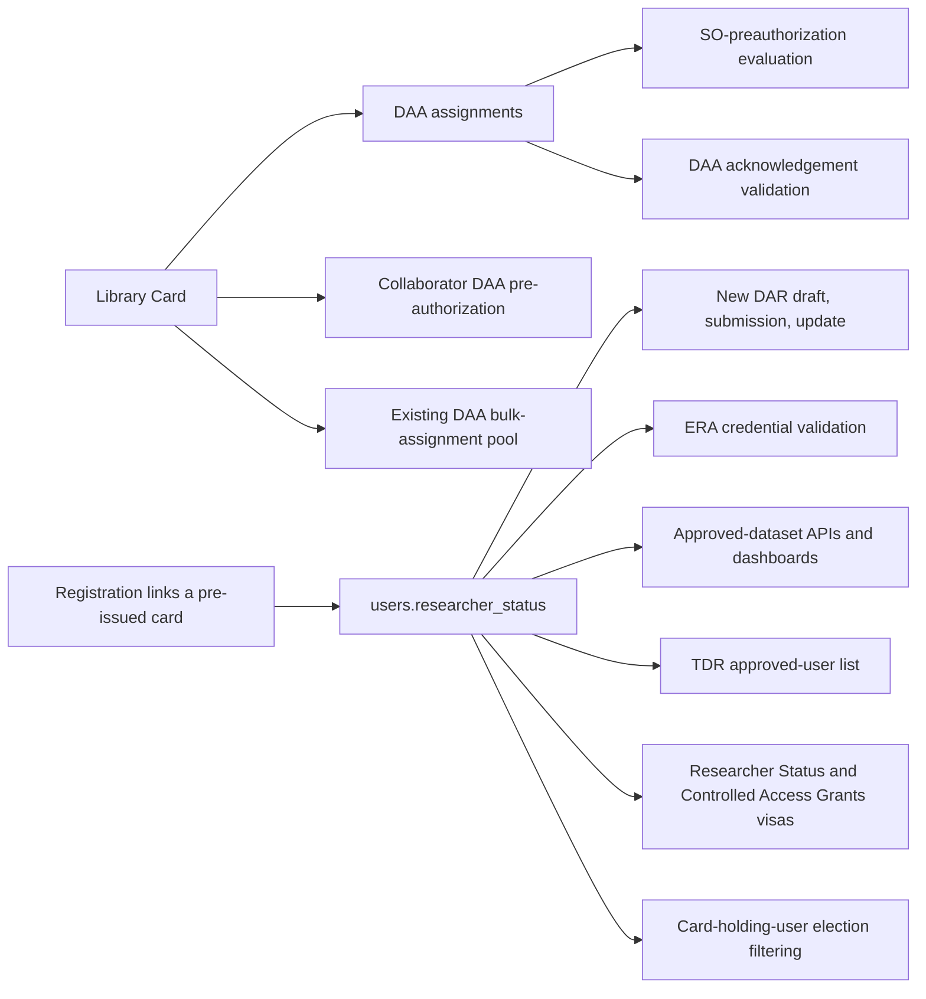
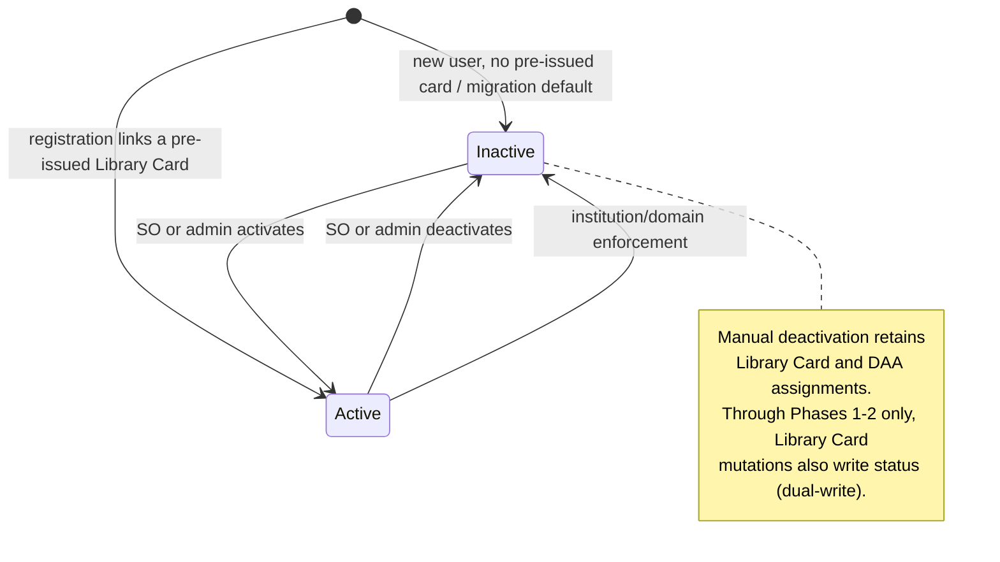

# Researcher Status Decoupling Plan

## Status

Proposed. Supersedes the initial draft design; revised after a repository-wide verification pass
that found four unclassified Library Card gates, a scope boundary error, and several factual
mistakes in the draft.

Revised a second time after an adversarial review of this plan found fifteen defects in it, all of
which were confirmed against source and are now resolved in the body below.

Revised a third time after a review found two further defects in the rollout mechanism: the
single-flag-row cutover was not actually atomic across backend and already-loaded browser clients, and
the Phase-3 reconciliation could not honestly reconstruct audit provenance for a hard-deleted Library
Card. Both are resolved in [Rollout and Compatibility](#rollout-and-compatibility). See
[Review-Driven Revisions](#review-driven-revisions) for the finding-to-section map.

## Changes from the Ticket

Reviewers who have already read the ticket only need this section to know how the plan differs. The
plan is a superset of the ticket's objectives; nothing the ticket asked for was dropped, but the
following was added, corrected, narrowed, or deliberately made less prescriptive.

**Added — gates the ticket did not classify.** The ticket swapped four Java gates only. Four
SQL-level Library Card gates (`DatasetDAO.getApprovedDatasets`, `ResearcherDashboardDAO`,
`SigningOfficialDashboardDAO`, `ElectionDAO`) plus `TDRService` and `PassportService` also gate
access on card presence. Without them an active card-less researcher would still be denied approved
data, defeating the ticket's own objective, and a deactivated researcher would keep dashboard,
election, TDR, and Passport access. See [Current Behavior](#current-behavior).

**Added — audit table and Passport provenance.** The ticket specified a bare column plus backfill.
Passport visas assert *when* a researcher was vouched for and *by whom*, which today is read from
Library Card creation; once status is independent, that provenance needs its own source. Hence
`researcher_status_audit`, the seeded backfill rows, and the deterministic latest-activation query.

**Added — three-phase feature-flagged rollout.** The ticket implied a single coordinated ship. Because
the old UI's deactivate arm deletes a Library Card while the new backend reads status, any deployment
skew would let one surface silently disagree with the other, so backend and UI gates flip together
behind a flag. See [Rollout and Compatibility](#rollout-and-compatibility).

**Added — endpoint contract and self-activation guard.** The ticket sketched the endpoint body only.
The plan pins 400/403/404 handling, institution scoping, idempotency, and stripping `researcherStatus`
from generic user-update payloads so a researcher cannot activate themselves.

**Corrected — mapper change is required.** The ticket asserted no mapper work was needed because JDBI
bean-mapping would pass the column through. `UserWithRolesMapper` sets fields explicitly
(`setEmailPreference`, `setEraCommonsId`), so it must set `researcherStatus` too.

**Narrowed — deactivation does not revoke already-granted external access.** Deactivation removes the
researcher from the TDR approved-user list and withholds Passport visas going forward, but does not
claw back access already granted in TDR/Terra. The Signing Official table's existing copy ("suspend
their access to any data approved by a DAC") therefore overstates the immediate effect for
already-provisioned data. Revocation is listed under
[Explicitly Out of Scope](#explicitly-out-of-scope).

**Genericized — UI work is specified by behavior, not by line number.** The ticket named exact files
and lines (`ResearcherInfo` loading tri-state, the Library Card support link, the three access-button
tooltips, the `ResearcherStatus.tsx` state split, per-spec-file fixture edits, a `checkIsAdmin`
helper on `UserResource`). Those are all still in scope and are reached through the classification
sweep in [Library Card Reference Disposition](#library-card-reference-disposition); they are not
re-listed by line because the line numbers drift and the sweep is the guarantee of completeness.

**Unchanged from the ticket.** Collaborator Library Card validation, the DAA bulk-assignment
eligibility pool, "no renames in this change", and leaving the contractual Library Card Agreement
text and PDF filenames alone all carry over exactly as the ticket specified.

**Added after review — five items in neither the ticket nor the first revision.** Activation when
registration links a pre-issued Library Card; flag-gated dual-write of researcher status on every
Library Card mutation path through Phases 1-2, plus a flag echo that makes stale browser clients fail
loudly instead of skewing silently; an admin researcher-status control on `AdminEditUser`, because
after Phase 3 deleting a Library Card no longer deactivates anyone; and alignment of the status
endpoint's Signing Official scoping and failure code with the sibling SO-scoped endpoint on the same
resource. Each is marked as a decision in its own section so a reviewer can veto it.

## Review-Driven Revisions

Every row was confirmed against source before the plan was amended. Reviewers who read the first
revision only need this table plus the sections it points at.

| # | Defect in the previous revision | Resolved in |
| --- | --- | --- |
| 1 | `UserServiceDAO.createUser` links an SO's pre-issued card to a newly registered user; neither the backfill nor any card path set status, so that researcher stayed permanently inactive | [Library Card creation, DAA assignment, and registration](#library-card-creation-daa-assignment-and-registration) |
| 2 | Status was backfilled once at Phase 1 while card CRUD stayed authoritative until Phase 3, so every card issued or deleted in that window produced exactly the skew the rollout forbids | [Rollout and Compatibility](#rollout-and-compatibility) |
| 3 | Replacing `hasLibraryCard` with status would NPE in `needsLibraryCardRemovedForUser`, which dereferences the card inside that guard — for precisely the active card-less users enforcement must cover | [Institution and domain enforcement](#institution-and-domain-enforcement) |
| 4 | The admin `Manage Library Cards` delete button was unclassified; after Phase 3 it would silently stop deactivating | [duos-ui Changes](#duos-ui-changes) |
| 5 | The prescribed duos-ui sweep regex could not match snake_case `library_cards`, missing the file that defines the route the Definition of Done requires proving unchanged | [Library Card Reference Disposition](#library-card-reference-disposition) |
| 6 | The prescribed consent sweep regex missed the camelCase OpenAPI surface, DI wiring, `lc_daa` joins, and all of `src/test` | [Library Card Reference Disposition](#library-card-reference-disposition) |
| 7 | The `so`/`system` provenance mapping was described as the "issuer" and attached to `asserted()`; it actually lives in the visa `by` claim, and `ResearcherStatus.by()` hardcodes `so` | [Passport](#passport) |
| 8 | `researcherStatus` is already taken on the consent API by `SigningOfficialDashboardSummary.ResearcherStatus`, and the SO-dashboard service/DTO layer was never classified | [Names already in use](#names-already-in-use) |
| 9 | `ResearcherStatusRequiredException` had no status code, message, or superclass, and `Resource.DISPATCH` is an exact-class map — an unregistered subclass returns 500 | [Status endpoint, exception, and service](#status-endpoint-exception-and-service) |
| 10 | Defining activation provenance as the latest `new_status = true` row without requiring current status makes a deactivated user's Affiliation-and-Role visa assert a revoked SO vouch | [Passport](#passport) |
| 11 | "Strip `researcherStatus` from generic user-update JSON" misdescribed the mechanism: `UserUpdateFields` is a typed allowlist, so the guard is *not adding* the field | [Migration, model, and audit](#migration-model-and-audit) |
| 12 | One of the three enforcement removal branches is a bare DAO call with no transaction, so the required transactional status write had nowhere to attach | [Institution and domain enforcement](#institution-and-domain-enforcement) |
| 13 | The endpoint's SO scoping and 403 contradicted `signingOfficialMeetsRequirements` on the same resource, which requires the SO's own institution and returns 400 | [Status endpoint, exception, and service](#status-endpoint-exception-and-service) |
| 14 | The rollout invented a "release coordinator" and never named the DB-backed feature-flag mechanism consent already ships, so no ticket defined the flag key | [Rollout and Compatibility](#rollout-and-compatibility) |
| 15 | `SigningOfficialDashboardDAO` has a second, independent `library_card` gate (`researchers_approved`) that no table classified, and the cited line number was wrong | [Current Behavior](#current-behavior) |
| 16 | "Because both sides read the same database row, the flip is already atomic" — it is not: duos-ui memoises the flag for the tab's lifetime, so a stale tab's legacy arm deletes a card post-flip and leaves the researcher active, and card CRUD keeps writing in the gap between reconciliation and the flag `UPDATE` | [Rollout and Compatibility](#rollout-and-compatibility) |
| 17 | Reconciliation attributed a card-deletion-derived deactivation to `SIGNING_OFFICIAL`, but `library_card` rows are hard-deleted, so there is no actor and no action time to attribute — and the deleter may have been an admin or the enforcement sweep | [Rollout and Compatibility](#rollout-and-compatibility), [Migration, model, and audit](#migration-model-and-audit) |

## Objective

Introduce a persisted `users.researcher_status` boolean that independently controls researcher
eligibility, and reduce the Library Card to what it already is structurally: a container for DAA
pre-authorization.

After this change:

- an active researcher may have no Library Card;
- an inactive researcher may retain a Library Card and DAA assignments;
- every authorization-sensitive check reads persisted status at request time rather than inferring
  eligibility from Library Card presence.

## Scope and Repository Boundary

This change spans two repositories, both present in this dev container:

| Repository | Path | Stack |
| --- | --- | --- |
| `consent` | `/workspaces/consent` | Java 25, Dropwizard, Jdbi, Liquibase, Maven wrapper (`./mvnw`) |
| `duos-ui` | `/workspaces/duos-ui` | React 19, TypeScript, Vite, pnpm; Vitest unit/browser tests, Playwright e2e |

`consent` holds no frontend source (no `package.json`, no JS/TSX). All user-interface work lives in
`duos-ui` and is specified in [duos-ui Changes](#duos-ui-changes).

Deployment uses the three feature-flag phases in [Rollout and Compatibility](#rollout-and-compatibility).
The backend and UI gates switch together; a consent-first behavior change is not safe on its own.

## Core Model





## Current Behavior

Verified against `develop` at `e20fe76c2`. Line references are current as of that commit.

### Library Card reads that this change touches

Java-level reads. The first eight are eligibility gates; the last three are not gates but derive
behavior from card presence and must be handled anyway:

| Location | Behavior |
| --- | --- |
| `service/DataAccessRequestService.java:182` | DAR draft creation; throws `LibraryCardRequiredException` |
| `service/DataAccessRequestService.java:525` | `validateCommonDarAndProgressReportElements`; throws `NIHComplianceRuleException` |
| `resources/DataAccessRequestResource.java:634` | `checkAuthorizedUpdateUser`; throws `LibraryCardRequiredException` |
| `service/UserService.java:387` | `validateActiveERACredentials`; throws `LibraryCardRequiredException` |
| `service/DataAccessRequestService.java:723` | `findCollaboratorsWithoutLibraryCards`; registration + card check, no DAA inspection |
| `service/UserService.java:242-243` | `findAllUsersWithInstitutionAndLibraryCard`, the DAA bulk "eligible users" pool |
| `service/TDRService.java:85` | `libraryCardDAO.findByUserEmails` defines the TDR approved-user list |
| `service/feature/InstitutionAndLibraryCardEnforcement.java:200` | `hasLibraryCard`, the trigger for all enforcement removal branches. **It is not substitutable:** `needsLibraryCardRemovedForUser:167` dereferences `user.getLibraryCard().getCreateUserId()` inside that guard. |
| `service/dao/UserServiceDAO.java:56-66` | `createUser` links a Library Card pre-issued by email (`user_id` NULL) to the newly registered user, inside the registration transaction. This is today's onboarding activation path and is invisible to a card-presence backfill. |
| `service/passport/ResearcherStatus.java:26,46` | `asserted()` reads the Library Card create date; `by()` hardcodes `so` |
| `service/passport/AffiliationAndRole.java:28,53` | `asserted()` reads the Library Card create date; `by()` returns `so` when a card exists and `system` otherwise |

SQL-level gates. **These were absent from the draft design and are the reason an active card-less
researcher would otherwise be denied access:**

| Location | Behavior |
| --- | --- |
| `db/DatasetDAO.java:619` | `getApprovedDatasets` — `INNER JOIN library_card` |
| `db/ResearcherDashboardDAO.java:125` | `EXISTS (SELECT 1 FROM library_card …)` |
| `db/SigningOfficialDashboardDAO.java:12,18` | `(lc.id IS NOT NULL) AS active` in the `institution_users` CTE (line 12), fed by the `LEFT JOIN library_card` at line 18 → `activeResearchers` / `inactiveResearchers` |
| `db/ElectionDAO.java:83` | `findElectionsWithCardHoldingUsersByElectionIds` — `INNER JOIN library_card` |

`DatasetDAO.getApprovedDatasets` is the single query behind three surfaces the draft treated as
independent: `GET /api/user/me/researcher/datasets` (`resources/UserResource.java:523` →
`service/DatasetService.java:459`) and the Passport Controlled Access Grants visas
(`service/passport/PassportService.java:50`).

`SigningOfficialDashboardDAO` contains a **second, independent** `library_card` gate that is not a
status gate and must not be touched: `researchers_approved` (lines 117-121) joins
`institution_users → library_card → lc_daa → assignable_daas` and feeds
`daaAssociations.researchersApproved`. It is genuine DAA pre-authorization counting. Changing the
`active` projection must not remove or re-scope the `lc` alias this second aggregate depends on.

### Names already in use

Three names collide with the obvious choice and must be disambiguated before implementation:

- `models/SigningOfficialDashboardSummary.java:7` already exposes `researcherStatus`, an object —
  `record ResearcherStatus(long active, long inactive)` — required by
  `assets/schemas/SigningOfficialDashboardSummary.yaml`. Adding a boolean `User.researcherStatus`
  is safe in Java but collides in generated clients and docs, so both must be documented; the
  dashboard record's name and shape stay as they are.
- `service/passport/ResearcherStatus.java` is a visa claim type, unrelated to either.
- The SO dashboard response is shaped by `SigningOfficialDashboardService` and
  `SigningOfficialDashboardSummary`, not by the DAO alone. Both are in scope for the `active` /
  `inactive` source change even though only the DAO holds SQL.

## Implementation Design

### Migration, model, and audit

Create a registered date-named Liquibase changeset with strictly ordered change sets:

1. Create `researcher_status_audit`, its foreign keys to `users`, a source check constraint for
   `SIGNING_OFFICIAL`, `ADMIN`, and `INSTITUTION_ENFORCEMENT`, and index
   `(user_id, action_date DESC, researcher_status_audit_id DESC)`.
2. Add `users.researcher_status BOOLEAN NOT NULL DEFAULT false`.
3. Backfill `true` for users with a Library Card.
4. Seed a `false → true` audit row for every backfilled user, using the Library Card creation time,
   creator, and `SIGNING_OFFICIAL` source.

The table must exist before any audit seed. Audit rows are transition-only.

Audit `source` keeps exactly the three values `SIGNING_OFFICIAL`, `ADMIN`, and
`INSTITUTION_ENFORCEMENT`. The general rule: every row is written by the transactional status
transition helper as part of the transaction that performs the transition, with `source` derived from
the **actual authenticated actor** of that transaction — the `checkIsAdmin` distinction the Library
Card delete endpoint already makes (`LibraryCardResource:118`) for SO versus admin, and
`INSTITUTION_ENFORCEMENT` for the sweep. No source is guessed, which is why three values remain
sufficient: do not add a fourth, and do not let the check constraint be discovered by a failing insert.

Two cases take their actor and timestamp from the Library Card instead of from a live request, and both
are sound only because the card is still present to read them from:

- **The backfill seed** uses the Library Card's own `create_date` and `create_user_id`, and `source`
  `SIGNING_OFFICIAL`. Admin-created cards are seeded `SIGNING_OFFICIAL` too. That is deliberate and not
  a guess: it exactly reproduces today's Passport behavior, where `ResearcherStatus.by():46` hardcodes
  `VisaBy.SO` for every carded user regardless of who issued the card. The seed therefore changes no
  visa, and the creator column still records who actually issued the card.
- **Registration-time card linkage** (`UserServiceDAO.createUser`) uses `SIGNING_OFFICIAL`, the linked
  card's creator, and the card's `create_date` as the action date — the moment the SO actually vouched,
  which is what Passport `asserted()` needs. Same justification: the card exists, so its issuer and
  issue time are known.

By contrast, a *deactivation* inferred from a **missing** card has no recoverable actor and no
recoverable action time — `library_card` rows are hard-deleted
(`LibraryCardDAO:59`, `LibraryCardDAO:190`) — and the deletion may have come from an admin
(`LibraryCardResource:105` permits `ADMIN` and `SIGNINGOFFICIAL`) or from the enforcement sweep. Such a
row must never be attributed to `SIGNING_OFFICIAL`. The rollout removes the need to write one at all;
see [Rollout and Compatibility](#rollout-and-compatibility).

Add `researcherStatus` to `User`, `User.yaml`, all relevant User/DAR projections, and
`UserWithRolesMapper` — the mapper sets fields explicitly (`setEmailPreference`, `setEraCommonsId`)
and will not pick the column up on its own.

**Self-activation guard.** Both `PUT /api/user/{id}` and the `@PermitAll`
`PUT /api/user` (`updateSelf`) deserialize through `gson.fromJson(json, UserUpdateFields.class)`, a
typed allowlist of `displayName`, `emailPreference`, `userRoleIds`, `eraCommonsId`, `daaAcceptance`,
and `userData`. An unknown `researcherStatus` key is therefore already dropped and there is nothing
to strip. The guard is a prohibition, not an addition: **do not add `researcherStatus` to
`UserUpdateFields`**, or `updateSelf` becomes a self-activation hole. duos-ui's `User.ts` `unset()`
list needs no new entry for the same reason.

### Status endpoint, exception, and service

Add `PUT /api/user/{userId}/researcherStatus`, restricted to ADMIN and SIGNINGOFFICIAL, with exactly
`{ "researcherStatus": boolean }`. Reject malformed, missing, or non-boolean values with 400; return
404 for unknown users; and return the updated user on success. Idempotent writes return 200 without an
audit row.

**Signing Official scoping — decision, previously specified as 403.** `api/user` already carries an
SO-scoped endpoint, `UserResource.signingOfficialMeetsRequirements:302-309`, which requires the
*acting* SO to have a non-null `institutionId`, permits a *target* whose `institutionId` is null, and
returns **400** on any failure. To avoid two contradictory SO-scoping rules and two failure codes on
one resource, this endpoint reuses that predicate's shape and returns **400**, superseding the 403 in
the previous revision. It diverges from the sibling in one respect, deliberately: the target's
institution must match the acting SO's, rather than being allowed to be null. Activating a user with
no institution would immediately be undone by
[institution and domain enforcement](#institution-and-domain-enforcement), so permitting it would
only produce a confusing round trip. A reviewer who prefers strict parity with the sibling endpoint
should say so before ticket 3.

**Exception contract.** `ResearcherStatusRequiredException extends UnprocessableEntityException` with
a `MESSAGE` telling the researcher their status is inactive and to contact their Signing Official —
not to obtain a Library Card. `Resource.createExceptionResponse:252` does `DISPATCH.get(e.getClass())`
on a `HashMap` with no superclass walk, so an unregistered subclass of `UnprocessableEntityException`
falls through to `Response.serverError()` and returns **500** with the message leaked. Registering the
new class in `DISPATCH` for **422** is therefore load-bearing, not bookkeeping, and needs its own test.
duos-ui keys an element on `id="libraryCardRequired"` (`ResearcherInfo.tsx:129`); if that id is renamed
with the copy, its specs move in the same commit.

Implement persistence-backed `UserService.isActiveResearcher` and `requireActiveResearcher`, plus a
transactional status transition helper that writes the audit row with the appropriate source. Add the
OpenAPI path and register it in `api-docs.yaml`.

### Authorization Gate Changes

Behind the Phase-3 backend flag, replace Library Card eligibility conditions with persisted status for
DAR draft creation, authorized update, ERA credential validation, the shared
`validateCommonDarAndProgressReportElements` condition (retaining `NIHComplianceRuleException`), the
approved-dataset API, researcher dashboard, Signing Official active/inactive dashboard projection,
election filtering, TDR lookup, and Passport. `DatasetDAO` remains the shared source for the
approved-dataset API and Passport grants. Institution enforcement is a status *writer*, not a simple
condition swap; its `hasLibraryCard` trigger stays as it is, for the reasons in
[Institution and domain enforcement](#institution-and-domain-enforcement).

Collaborator validation remains its existing registered-user and Library Card validation. DAA bulk
assignment retains its existing Library Card-based eligibility pool. These are deliberately excluded
from the status substitutions. Retain genuine DAA joins and all Library Card APIs, entities, tables,
routes, page/component files, and identifiers.

`isUserPreAuthorizedForAllDaas` must return false for a missing Library Card so active card-less users
fall back to the existing SO-approval flow instead of throwing.

### Passport

- Reload persisted status before issuing visas. Inactive researchers receive Affiliation-and-Role only;
  withhold Researcher Status and Controlled Access Grants visas.
- Passport activation provenance applies **only while the user is currently active**, and is exactly
  the latest audit row for the user with `new_status = true`, ordered by
  `action_date DESC, researcher_status_audit_id DESC`.
- Two distinct visa fields are involved, and the previous revision conflated them. `source()` returns
  `PassportService.ISS` and does not change. The `so` / `system` value is the **`by()`** claim:
  `ResearcherStatus.by():46` currently hardcodes `VisaBy.SO`, and `AffiliationAndRole.by():53`
  currently branches on `getLibraryCard() == null`. Both must instead derive from the activation row:
  `SIGNING_OFFICIAL` maps to `so`; `ADMIN` and `INSTITUTION_ENFORCEMENT` map to `system`. Editing only
  `asserted()` leaves the mapping inert.
- `ResearcherStatus.asserted():26` and `AffiliationAndRole.asserted():28` use the activation timestamp
  instead of `LibraryCard::getCreateDate`.
- For a currently **inactive** user, Affiliation-and-Role is still issued but must not assert a
  revoked vouch: use `by = system` and the user creation timestamp, never the timestamp of an
  activation that has since been reversed. The same fallback applies to an active user with no
  activation row at all.

### Institution and domain enforcement

Enforcement writes status; it does not read it as a gate. Three constraints, all of which the previous
revision got wrong or left open:

- **`hasLibraryCard` stays.** It guards `needsLibraryCardRemovedForUser:165-181`, which dereferences
  `user.getLibraryCard().getCreateUserId()` to find the issuing SO's institution. Substituting
  persisted status there would NPE on exactly the active card-less users this plan creates. Card
  removal remains keyed on card presence.
- **Status deactivation keys on the institution/domain mismatch itself,** independently of card
  presence, so an active card-less user whose domain no longer matches is deactivated by the
  asynchronous sweep. That code path must not dereference the Library Card.
- **Both removal branches become transactional.** `handleUserWithInstitutionInMap:154` and
  `dropLCAndInstitutionForUser:212` already route through
  `UserServiceDAO.updateInstitutionAndClearLibraryCardForUser`, which is a `jdbi.useTransaction`
  block — extend it to write status and the audit row inside that transaction. The branch at
  `handleUserWithInstitutionInMap:158` is a bare `libraryCardDAO.deleteAllLibraryCardsByUser(userId)`
  with no transaction at all; it needs a new `UserServiceDAO` method, e.g.
  `clearLibraryCardAndDeactivateResearcherTxn(userId)`, so the card delete and the status/audit write
  cannot half-apply. Deactivation-only (no card to remove) needs the same treatment via the
  transactional transition helper.

Audit rows here use source `INSTITUTION_ENFORCEMENT` and remain transition-only. Existing Library
Card-removal behavior is otherwise unchanged. These branches also need the Phase-1 dual-write, which
ships with Phase 1 rather than with this ticket; and `deleteAllLibraryCardsByUser`'s collateral deletion
of cards the user *issued for others* is classified in
[Flag-gated dual-write](#flag-gated-dual-write-phase-1-required).

### Library Card creation, DAA assignment, and registration

`LibraryCardService.createLibraryCard`, `DaaServiceDAO` bulk assignment, and the DAA resource retain
their current Library Card creation behavior. **With `RESEARCHER_STATUS_GATING` on**, they must not
write `researcher_status` or create a researcher-status audit row, so assignment can create a card for
an inactive user without reactivating that user. That is the end-state rule, not the Phase-1-2 rule:
while the flag is off these cards still gate access under the old semantics, so they must activate
through the dual-write described in
[Flag-gated dual-write](#flag-gated-dual-write-phase-1-required). The distinction is the flag, read
inside the same transaction as the card write.

**Registration is the one carve-out — decision.** `UserServiceDAO.createUser:56-66` looks up a
Library Card previously issued against the user's email (`user_id` NULL) and links it to the new
`user_id` inside the registration transaction. That is how a researcher whose SO pre-issued a card
becomes able to submit today. A card-presence backfill cannot reach those rows, and a blanket "card
paths never write status" rule would leave every such researcher permanently inactive after Phase 3.
So when — and only when — `createUser` finds and links a pre-issued card, it also sets
`researcher_status = true` and writes a `false → true` audit row with source `SIGNING_OFFICIAL`, in
that same transaction. The alternative considered was requiring the SO to re-toggle after the
researcher registers; it was rejected because it silently breaks an onboarding flow that works today
and gives the SO no signal that action is needed.

## Library Card Reference Disposition

Every existing Library Card reference must be classified before implementation:

| Reference class | Disposition |
| --- | --- |
| DAR draft/update, ERA, shared DAR/progress-report validator | Switch to status in Phase 3; the shared validator keeps `NIHComplianceRuleException`. |
| `DatasetDAO`, researcher and SO dashboards, `ElectionDAO`, TDR, Passport, institution enforcement | Apply the status changes described above, behind the backend Phase-3 flag. |
| Collaborator validation and DAA bulk assignment eligibility | Unchanged Library Card behavior. |
| `LibraryCardDAO.deleteAllLibraryCardsByUser` (`:190`) | Dual-writes deactivation for the named user while the flag is off; its collateral deletion of cards that user issued for others is deliberately not chased and the `OR` clause is not narrowed. |
| DAA assignment, acknowledgement, `LibraryCardService`, resource, DAO, models, API, entity, and table | Unchanged DAA-container behavior, plus flag-gated dual-write of researcher status while `RESEARCHER_STATUS_GATING` is off, and the flag-echo 409 on card create/delete — see [Rollout and Compatibility](#rollout-and-compatibility). |
| `isUserPreAuthorizedForAllDaas` | Retain the DAA comparison and add only a null-card guard. |
| User and DAR projections | Continue hydrating Library Card data and add `researcherStatus`. |
| `service/dao/UserServiceDAO.createUser` | Card linkage is retained **and** activates the user with an audit row — the single card-to-status coupling that remains *after* the flip. |
| `SigningOfficialDashboardDAO.researchers_approved` (lines 117-121) | Unchanged DAA pre-authorization counting; keep the `lc` alias the aggregate depends on. |
| `SigningOfficialDashboardService`, `SigningOfficialDashboardSummary` | In scope for the `active` / `inactive` source change; record name and shape unchanged. |
| `UserUpdateFields` | Unchanged, deliberately. `researcherStatus` must never be added to it. |
| `AdminManageLC.tsx`, `LibraryCardTable.tsx:137` | Stays Library Card management (DAA pre-authorization). Copy must stop reading as deactivation, admins get a status control on `AdminEditUser` instead, and the delete call sends the flag echo header and handles 409. |
| `service/passport/ResearcherStatus.by()`, `AffiliationAndRole.by()` | Switch from card presence to audit-derived provenance; `source()` unchanged. |
| `LibraryCardRequiredException` | All three throw sites move to `ResearcherStatusRequiredException`, leaving the class unused. Keep it and its 422 registration through Phases 1-2 so a flag rollback still returns 422, then delete the class, its import, and its registration in the Phase 3 cleanup. |

Re-run this classification sweep in both repositories before implementation and classify any new hit:

```text
# consent: case-insensitive so camelCase, PascalCase and snake_case all match; resources cover
# api-docs.yaml and the schemas; src/test is included because the Test Matrix depends on it.
rg -ni "librarycard|library_card|lc_daa|librarycardrequired" src/main src/test

# duos-ui: no glob filter — the route-defining file contains only the snake_case literal
# (signingOfficialConsoleRoutes.ts), and .css/.json hits were previously invisible.
rg -ni "librarycard|library_card" src test
```

The previous revision's commands could not reproduce its own verification pass. The consent regex was
case-sensitive and scoped to `src/main`, so it missed the `/api/libraryCards*` OpenAPI paths and
`LibraryCard.yaml` in `assets/api-docs.yaml`, `LibraryCardService` wiring in `ConsentModule`,
`User.setLibraryCard`, the `lc_daa` joins, and every test. The duos-ui regex could not match
`library_cards`, so it returned nothing for
`pages/signing_official_console/signingOfficialConsoleRoutes.ts` — the file that defines the very
route the Definition of Done requires proving unchanged.

## duos-ui Changes

### Types, status display, and toggle

- Add `researcherStatus` to `DuosUser`, and add `User.setResearcherStatus(userId, researcherStatus)`
  for `PUT /api/user/{userId}/researcherStatus`. Do not add the field to any generic user-update
  payload type; the backend allowlist already drops it, and the status endpoint is the only writer the
  UI may call. (Server-side, enforcement, registration, and the Phase-1-2 dual-write also write status;
  none of them is client-driven.)
- The existing Signing Official `library_cards` route, page file, component, action identifiers, and
  Library Card implementation names remain unchanged. Its displayed switch state and copy use
  `researcherStatus`.
- In Phase 3 both existing toggle arms call the status endpoint and update the local status value;
  neither invokes Library Card creation or deletion. Deactivation leaves the row, its Library Card,
  and DAA assignments intact. Remove Library Card Agreement copy from the activation confirmation;
  retain it for actual DAA assignment.
- Researcher profile, access buttons, DAR UI, voting restriction, controlled-access-grants handling,
  and admin status display use `researcherStatus`. Keep Library Card/DAA display and management where
  it is genuinely pre-authorization behavior. Update copy to distinguish active researcher status
  from DAA pre-authorization.
- Do not rename the `library_cards` route or introduce redirects, file/component renames, frontend
  type renames, Library Card API/entity/table renames, or other identifier renames.

### Admin surfaces

The SO console is not the only place a Library Card is deleted. `pages/AdminManageLC.tsx` renders
`components/library_card_table/LibraryCardTable.tsx`, whose delete button calls
`LibraryCardAPI.deleteLibraryCard(id)` (`:137`). After Phase 3 that call no longer deactivates
anyone, so an admin would delete a card, watch the row disappear, and leave the researcher with full
DAR, approved-dataset, and Passport access.

- Keep the delete behavior — under the new model it correctly removes DAA pre-authorization only —
  and change the surrounding copy so it cannot be read as deactivation.
- **Decision, new scope:** give admins a researcher-status control on `pages/AdminEditUser.tsx`
  (route `/admin_edit_user/:userId`), the existing per-user admin surface for roles and institution.
  The endpoint already permits ADMIN, and `AdminManageLC` is a card-oriented list, not a user editor.
  Without this, Phase 3 removes the only admin deactivation path in the product.

### Session freshness

After an operator changes their own status, refresh stored current-user state. Client state is a hint;
backend gates reload persisted status.

## Rollout and Compatibility

Use the feature-flag mechanism consent already ships: `FeatureFlagService` / `FeatureFlagDAO` /
`FeatureFlag`, exposed by `PublicFeatureFlagResource` at `GET /feature/{key}` and consumed by duos-ui
through `libs/ajax/FeatureFlag.ts getFeatureFlag` (precedent: `NHGRI_RESTRICTED_DAC`). Use a single
key, `RESEARCHER_STATUS_GATING`. Note that `/feature` is `@PermitAll`, so the key and its value are
publicly readable; that leaks only the existence of the feature, which is acceptable here. No
deployment window may expose a Library Card operation as a researcher-status operation.

**One database row is not a synchronized cutover.** The previous revision claimed that because both
sides read the same flag row the flip "is already atomic". That is false, and it was load-bearing. A
shared row makes the *intent* single-sourced; it does not make the *transition* atomic. Two gaps
follow:

- **Stale browser clients.** duos-ui reads the flag over HTTP and holds the value for the life of the
  tab — the very precedent this plan cites is memoised at module scope
  (`FeatureFlag.ts`, `nhgriDacIdPromise ??= getFeatureFlag('NHGRI_RESTRICTED_DAC')`). An SO whose tab
  loaded before the flip still believes `flag = false`, so its legacy toggle arm calls
  `LibraryCard.deleteLibraryCard` (`SigningOfficialTable.tsx:396`; the admin table does the same at
  `LibraryCardTable.tsx:137`) while the backend has already switched to status gating. The card is hard
  deleted, the row leaves the SO's list, the SO believes the researcher is deactivated — and
  `researcher_status` is still `true`, so that researcher keeps DAR submission, approved-dataset, and
  Passport access. Silent, and in the more dangerous direction.
- **The window around reconciliation.** A reconciliation script and a flag-row `UPDATE` are two
  statements, not one. Library Card CRUD keeps serving traffic between them, so any card written in that
  interval reintroduces exactly the skew reconciliation just removed. "Runs in the same window" is not
  a synchronization mechanism.

The mechanism below closes both. It has two halves: **flag-gated dual-write**, so no card mutation can
leave status behind; and a **flag echo**, so a client acting on a stale flag value fails loudly instead
of skewing silently.

### Flag-gated dual-write (Phase 1, required)

This supersedes the previous revision's "card paths must never write status" invariant, which was the
root cause of the accumulated skew. From Phase 1, while the flag is **off**, every Library Card
mutation path performs its card write and the corresponding researcher-status transition **in the same
transaction**:

| Path | Flag off (Phases 1-2) | Flag on (Phase 3+) |
| --- | --- | --- |
| `LibraryCardService.createLibraryCard` | card write **and** activation + audit row | card write only |
| `LibraryCardService.deleteLibraryCardById` | card delete **and** deactivation + audit row | card delete only |
| `DaaServiceDAO` bulk assignment and the DAA resource | card write **and** activation + audit row | card write only; an inactive user stays inactive |
| Institution/domain enforcement card removal | card delete **and** deactivation + audit row | same — this one is permanent behavior |
| `UserServiceDAO.createUser` pre-issued card linkage | card link **and** activation + audit row | same — this one is permanent behavior |

Three points make this work:

- **Provenance is honest by construction.** Each transition is written by the transactional status
  transition helper at the moment it happens, with the real authenticated actor, the real transaction
  timestamp, and `source` from that actor: `SIGNING_OFFICIAL` or `ADMIN` per the `checkIsAdmin`
  distinction `LibraryCardResource:118` already makes, `INSTITUTION_ENFORCEMENT` on the sweep. Nothing
  is reconstructed after the card is gone, so the three-value source constraint holds unchanged.
- **The flag must be read inside the mutation transaction**, uncached — a `SELECT … FOR SHARE` on the
  flag row is sufficient — and the Phase-3 flip must be an `UPDATE` of that row. The database then
  serialises the cutover: every card mutation that commits before the flip dual-wrote, every one that
  commits after it did not, and there is no interleaving. This is the transactional cutover the previous
  revision assumed it already had. Do not read the flag through a cached service value on these paths.
- **The enforcement dual-write cannot wait for the enforcement ticket.** Ticket 9 changes enforcement's
  permanent behavior; the Phase-1 dual-write for those same paths is part of the Phase-1 deliverable and
  ships with it.

**`deleteAllLibraryCardsByUser` — newly classified.** `LibraryCardDAO:190` deletes
`WHERE user_id = :userId OR create_user_id = :userId OR update_user_id = :userId`, so it also
hard-deletes cards the named user *issued for other users*. Its only callers are the two enforcement
paths (`UserServiceDAO.updateInstitutionAndClearLibraryCardForUser:32`,
`InstitutionAndLibraryCardEnforcement:158`). **Decision:** dual-write deactivation for the named user
only; do not chase the collaterally-deleted researchers, and do not narrow the `OR` clause (out of
scope — narrowing it changes enforcement semantics that predate this plan). Cover the collateral
deletion with a test that records today's behavior, so the Phase-3 change is visible: after the flip
those other researchers keep active status while losing their DAA cards, which is the intended new
model rather than a regression.

### Flag echo (Phase 2, required)

Dual-write removes durable skew, but a stale tab can still express "deactivate" as a card deletion
*after* the flip — the card write no longer carries a status write, so the operator's intent is
silently dropped. So the client's **believed flag value** travels with every Library Card
create/delete request as a header, `X-Researcher-Status-Gating: true|false`. The backend compares it
with the flag value it read in the same transaction and returns **409** with a reload instruction on
mismatch; an absent header is read as `false`.

- Scope the check to the two endpoints the toggle uses, `POST /api/libraryCards` and
  `DELETE /api/libraryCards/{id}`, not to DAA assignment — a stale client assigning a DAA still gets
  the DAA assigned correctly.
- It must be a flag **echo**, not a "new client" marker. A marker meaning *I am new code* would pass
  exactly the client that needs rejecting: a Phase-2 client holding a cached `false`. The echo rejects
  both stale populations — pre-Phase-2 clients (no header) and Phase-2 clients with a stale value.
- duos-ui sends it from `SigningOfficialTable.tsx:396` and `LibraryCardTable.tsx:137`, and surfaces the
  409 as a reload prompt rather than a generic failure.
- **Lifetime — decision.** The echo is temporary, not a permanent API guard. It exists only to catch
  clients that still read a card mutation as a status action, and once the flip has settled there is no
  status intent left to protect: card CRUD is pure DAA management. Remove the header check, and the
  header itself, in the same Phase-3 cleanup that deletes `LibraryCardRequiredException`. Leaving it in
  would 409 every header-less caller — scripts, Swagger, future clients — forever.

```mermaid
sequenceDiagram
  participant C as Consent
  participant U as duos-ui
  participant F as Feature flag

  C->>C: Deploy schema, endpoint, projections, audit, flag-gated dual-write
  Note over C: Library Card gates authoritative; every card write also writes status
  U->>U: Deploy status-capable UI, toggle disabled, sending the flag echo
  C->>C: Verify zero skew (both queries return no rows)
  F->>C: Flip flag row: status gates on, dual-write off
  F->>U: Newly loaded clients enable the status toggle
  Note over U,C: Stale tabs get 409 on card mutations, not silent skew
```

1. **Phase 1 — compatibility backend.** Deploy the audit table then status column/backfill/audit seed,
   endpoint, projections, Passport support, compatibility fields, and flag-gated dual-write on every card
   mutation path. The current Library Card eligibility gates remain authoritative. The new endpoint is
   available but no UI exposes a status-changing action.
2. **Phase 2 — disabled UI.** Deploy duos-ui status-capable code behind a disabled feature flag,
   sending the flag echo on Library Card create/delete. The existing Library Card CRUD toggle remains
   authoritative while disabled, and its writes carry status with them through the backend dual-write.
3. **Phase 3 — coordinated enablement.** Verify zero skew, then flip `RESEARCHER_STATUS_GATING`. The
   one `UPDATE` turns the backend status gates on, turns dual-write off, enables the status toggle for
   newly loaded clients, and starts 409-ing stale ones. The old UI can still call Library Card deletion,
   but it can no longer do so *as a status action*: it is either dual-written or rejected.

### Skew verification at the flip (replaces bidirectional reconciliation)

With dual-write in place from Phase 1 there is no accumulated skew to repair, so the previous revision's
reconciliation becomes a **verification gate**. Both queries must return zero rows immediately before
the flip:

```sql
-- must be empty: status false but a card exists
SELECT u.user_id FROM users u
WHERE u.researcher_status = false
  AND EXISTS (SELECT 1 FROM library_card lc WHERE lc.user_id = u.user_id);

-- must be empty: status true but no card
SELECT u.user_id FROM users u
WHERE u.researcher_status = true
  AND NOT EXISTS (SELECT 1 FROM library_card lc WHERE lc.user_id = u.user_id);
```

Any row is a **dual-write defect**, not expected drift: stop, log the users, and fix the path that
missed. If the decision is nonetheless to proceed, each repair goes through the same transactional
status transition helper — never a direct `UPDATE users`, which produces an unaudited transition — with
the cutover operator as the actor and source `ADMIN`, an honest record of who actually made the change.
Do **not** attribute a repair to `SIGNING_OFFICIAL`: for the second population the card is already hard
deleted, so there is no actor and no action time to attribute, and the deletion may have come from an
admin or the enforcement sweep. Repairs are idempotent and re-runnable, and the first query's population
must be repaired before the flip rather than after, because after the flip it silently strips access.

The second query is expected to be non-empty **by design** after Phase 3 — active researchers whose DAA
cards were removed are the whole point of this change — so it is a pre-flip gate only and must not be
left running as an alert.

**Phase 1-2 writes through the status endpoint.** The endpoint is live from Phase 1 with no UI exposing
it. Under dual-write a card-less activation made through it shows up in the pre-flip verification as
apparent skew; treat manual endpoint use before Phase 3 as testing only, and expect to clear it before
the flip rather than having it silently reverted.

## Jira-Ready Tickets

| # | Ticket | Depends on |
| --- | --- | --- |
| 1 | Audit table first, then status column, card backfill, and audit seed | — |
| 2 | Model, projections, JSON write guard, schema | 1 |
| 3 | Transactional status transition helper and status endpoint/OpenAPI | 1, 2 |
| 4 | Java/SQL gates, Passport, TDR, and institution enforcement reading `RESEARCHER_STATUS_GATING` (the flag row itself is seeded by 5a) | 2, 3, 5a |
| 5 | Preserve collaborator and DAA-bulk Library Card behavior; add null-card preauthorization guard | 2 |
| 5a | `RESEARCHER_STATUS_GATING` flag row seeded off; flag-gated dual-write on every Library Card mutation path (create, delete, DAA bulk, both enforcement branches — registration linkage is ticket 8, whose activation is unconditional), reading the flag transactionally; flag-echo 409 on the Library Card create/delete endpoints | 3 |
| 6 | duos-ui status transport and feature-flagged status UI, including the `AdminEditUser` status control, `AdminManageLC` copy, the `X-Researcher-Status-Gating` echo header on Library Card create/delete, and the 409 reload prompt | 2, 3, 5a released |
| 7 | Pre-flip skew verification queries, the transactional `RESEARCHER_STATUS_GATING` flip, and regression verification | 4, 5a, 6 |
| 8 | Registration-time activation in `UserServiceDAO.createUser` | 1, 2 |
| 9 | Transactional enforcement branches (new `UserServiceDAO` method) and card-independent status deactivation | 3; the Phase-1 dual-write for these paths lands in 5a, not here |
| 10 | Passport `by()` / `asserted()` provenance from the audit table, including the inactive-user fallback | 1, 2 |

## Test Matrix

Migration and audit:

- prove `researcher_status_audit` exists, including FKs, source constraint, and the
  `(user_id, action_date DESC, researcher_status_audit_id DESC)` index, before audit seeding;
- prove carded users backfill active, card-less users remain inactive, and seeds are correct;
- prove Passport selects the latest `new_status = true` audit row, including tied timestamps, and
  applies the specified `by` value and no-audit fallback;
- prove dual-write while the flag is off: creating a Library Card activates and deleting one
  deactivates, each in one transaction, with the audit row carrying the acting user, the transaction
  timestamp, and `source` from the actor — `SIGNING_OFFICIAL` for an SO, `ADMIN` for an admin,
  `INSTITUTION_ENFORCEMENT` for the sweep — and every row satisfying the `source` check constraint;
- prove dual-write is flag-gated: with the flag on, the same card create/delete leaves status and the
  audit table untouched, and a DAA bulk assignment does not reactivate an inactive user;
- prove the dual-write flag read is transactional: a card mutation that commits before the flip
  dual-wrote and one that commits after did not, with no interleaved case;
- prove a rollback in the card transaction leaves neither the card nor the status change applied;
- prove the flag echo: a mismatched or absent `X-Researcher-Status-Gating` header on
  `POST /api/libraryCards` or `DELETE /api/libraryCards/{id}` returns 409 and writes nothing, a matching
  header succeeds, and DAA assignment is unaffected by the header;
- prove both pre-flip skew-verification queries return zero rows after a Phases 1-2 workload of card
  creates and deletes, and that a repair applied through the transition helper is audited with the
  cutover operator and source `ADMIN`;
- prove registration with a pre-issued card ends with the card linked, status active, and one
  `false → true` audit row, all committed in the same transaction — and that registration with no
  pre-issued card leaves the user inactive.

Status and authorization:

- endpoint authorization, validation, institution scope (acting SO without an institution, target in
  another institution, target with no institution, admin unrestricted), the 400 failure code,
  idempotency, transaction rollback, and transition-only audit writes;
- `ResearcherStatusRequiredException` returns 422 with its own message through
  `Resource.createExceptionResponse` — a registration miss must fail this test, not surface as 500;
- `PUT /api/user` (`updateSelf`) with a `researcherStatus` key in the body leaves status unchanged;
- all listed Java and SQL status gates, including inactive users receiving the existing
  `NIHComplianceRuleException` outcome through the shared validator for DARs, progress reports, and
  closeouts;
- inactive Passport users retain Affiliation-and-Role only; active users receive the withheld visas.

DAA and Library Card regression:

- **with `RESEARCHER_STATUS_GATING` on**, creating a Library Card or assigning a DAA does not activate
  an inactive researcher and creates no activation audit row (with the flag off, the dual-write cases
  above are the expected behavior instead);
- **after the flip**, the status toggle is the only manual activation/deactivation path; toggling
  preserves Library Cards and DAA assignments;
- collaborator checks remain Library Card-based and the existing DAA bulk-assignment eligibility
  behavior remains unchanged;
- an active card-less user falls back to SO approval without a null-pointer failure;
- the enforcement sweep handles an active card-less user with a mismatched domain: status is
  deactivated, no Library Card is dereferenced, and no `NullPointerException` occurs;
- the untransactioned enforcement branch is covered: a failure between card removal and the status
  write leaves neither applied;
- `SigningOfficialDashboardSummary.daaAssociations.researchersApproved` is unchanged by the `active` /
  `inactive` source change;
- **with the flag on**, an admin deleting a Library Card does not change researcher status, and the
  `AdminEditUser` control does; with the flag off, that same delete dual-writes a deactivation with
  source `ADMIN`.

Rollout and UI:

- Phase 1 preserves old UI Library Card behavior while backend Library Card gates remain authoritative;
- Phase 2 hides/disables status changes; Phase 3 enables backend and UI status gates together and
  verifies neither toggle arm creates or deletes a Library Card;
- a stale client simulation: a duos-ui instance holding `flag = false` after the flip receives 409 on
  its legacy deactivate arm, shows a reload prompt, and leaves neither the card nor status changed —
  the researcher is never left card-less and still active;
- UI status surfaces use `researcherStatus`, while Library Card/DAA surfaces remain pre-authorization
  behavior;
- prove no route, component, frontend type, Library Card API, entity, table, or identifier rename is
  introduced; specifically `/signing_official_console/library_cards` remains the route.

Run the relevant consent Maven tests, duos-ui type check and Vitest/browser tests, and a cross-repository
smoke test covering Phase 1, Phase 3 deactivation/reactivation, and DAA assignment after deactivation.

## Explicitly Out of Scope

- Revoking already-granted external access (TDR, Terra) on deactivation.
- Status-change notification emails.
- A researcher-status history endpoint. The audit table supports one later.
- Renaming the Library Card implementation to `DaaAuthorization`. A later rename-only effort may do
  this; contractual Library Card Agreement text and PDF filenames stay unchanged regardless.

## Definition of Done

- The ordered audit migration, backfill, and seed are complete and status changes are audited only on
  transitions.
- Researcher eligibility gates use persisted status only after coordinated Phase 3 enablement; Phase 1
  retains the existing Library Card gates.
- Collaborator checks and DAA bulk-assignment eligibility retain their existing Library Card behavior.
- After the flip, DAA assignment never changes researcher status and explicit status endpoint actions
  are the manual activation/deactivation path. Before it, card mutations change status only through the
  flag-gated dual-write, never incidentally.
- Passport uses the precise latest-activation audit query and preserves only Affiliation-and-Role for
  inactive researchers.
- Phase 3 toggles preserve Library Cards and DAAs, and no status action calls the Library Card deletion
  flow.
- Registration with a pre-issued Library Card yields an active researcher; after the flip, no other
  card path writes status.
- Every Library Card mutation path dual-writes researcher status while `RESEARCHER_STATUS_GATING` is
  off, reading the flag inside its own transaction, so the flip is a transactional cutover rather than
  a coordinated pair of deploys.
- Both pre-flip skew-verification queries return zero rows before the flip, and any repair is audited
  through the transition helper with a real actor — no status transition is ever attributed to an actor
  the system cannot name.
- Library Card create/delete rejects a stale flag echo with 409, so no client can express deactivation
  as a card deletion the backend no longer honors; `RESEARCHER_STATUS_GATING` is the single flag both
  repositories read.
- Enforcement branches write status and their audit row transactionally, and no code path dereferences
  a Library Card that may be absent.
- Admins retain a deactivation path (`AdminEditUser`), and `AdminManageLC` no longer reads as
  deactivation.
- The `library_cards` route and Library Card implementation names remain unchanged; only displayed
  status behavior and copy change.
