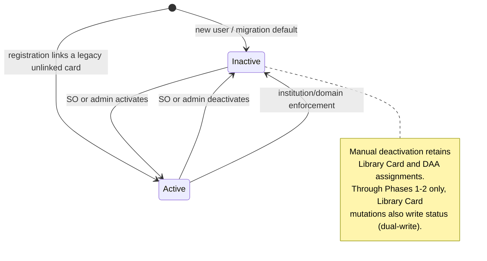

# Researcher Status Decoupling Plan

## Status

Proposed. The design has been through a repository-wide verification pass and eleven rounds of
adversarial review; every code reference below was confirmed against `consent` `develop` at
`e20fe76c2` and `duos-ui` at `09f51d51`.

**How to read this document.** The sections are authoritative. The
[tickets](#jira-ready-tickets), the [disposition table](#library-card-reference-disposition), and the
[Definition of Done](#definition-of-done) are indexes into them: they state obligations and link to the
section that owns each mechanism, rather than restating it. If you find a mechanism specified in two
places, the section wins and the duplicate is a defect worth reporting.

## Changes from the Ticket

Reviewers who have already read the ticket only need this section to know how the plan differs. The
plan is a superset of the ticket's objectives; nothing the ticket asked for was dropped, but the
following was added, corrected, narrowed, or deliberately made less prescriptive. Items marked
**decision** in the body are the ones a reviewer is most likely to want to veto.

**Added — gates the ticket did not classify.** The ticket swapped four Java gates only. Four
SQL-level Library Card gates (`DatasetDAO.getApprovedDatasets`, `ResearcherDashboardDAO`,
`SigningOfficialDashboardDAO`, `ElectionDAO`) plus `TDRService` and `PassportService` also gate
access on card presence. Without them an active card-less researcher would still be denied approved
data, defeating the ticket's own objective, and a deactivated researcher would keep dashboard,
election, TDR, and Passport access. See [Current Behavior](#current-behavior).

**Added — audit table and Passport provenance.** The ticket specified a bare column plus backfill.
Passport visas assert *when* a researcher was vouched for and *by whom*, which today is read from
Library Card creation; once status is independent, that provenance needs its own source. Hence
`researcher_status_audit`, the seeded backfill rows, and the deterministic latest-activation query.

**Added — three-phase feature-flagged rollout.** The ticket implied a single coordinated ship. Because
the old UI's deactivate arm deletes a Library Card while the new backend reads status, any deployment
skew would let one surface silently disagree with the other, so backend and UI gates flip together
behind a flag — with a dual-write that keeps status and card presence consistent until the flip, and a
flag echo that makes stale browser clients fail loudly instead of skewing silently. See
[Rollout and Compatibility](#rollout-and-compatibility).

**Added — endpoint contract and self-activation guard.** The ticket sketched the endpoint body only.
The plan pins 400/404 handling (400 rather than 403 for scope failures, matching the sibling SO-scoped
endpoint), a 409 while `RESEARCHER_STATUS_GATING` is off so the endpoint cannot record a status change
the gates do not yet honor, institution scoping, idempotency, and two self-activation guards — keeping
`researcherStatus` out of generic user-update payloads, and forbidding an SO from targeting their own
`userId`.

**Added — writers and surfaces the ticket did not reach.** Activation when registration links a legacy
unlinked Library Card; `redactUser`, which must deactivate and remove the card or a redacted identity
keeps full access after the flip; an ADMIN-only, explicitly invoked, idempotent post-deployment
redaction-remediation endpoint that closes the *redaction* half of the rolling-deployment gap after old
instances drain — the ordinary-card-mutation half is closed by the required post-drain reconciliation
in [Post-drain reconciliation](#post-drain-reconciliation-then-skew-verification-at-the-flip), and both
are prerequisites for the flip; the
CORS allowlist, without which the new echo header is blocked by the browser before it reaches consent;
and an admin researcher-status control on `AdminEditUser`,
because after Phase 3 deleting a Library Card no longer deactivates anyone.

**Added — the permanent echo header is a breaking API change, with the process that implies.** The
ticket did not contemplate a required request header. `CONTRIBUTING.md` requires Comms review, written
migration instructions, and advance notice to `api-users@firecloud.org` for breaking API changes, and
the flip makes `X-Researcher-Status-Gating` mandatory on both Library Card mutation operations. Those
obligations, plus the pre-flip telemetry that measures the affected caller population, are rollout
prerequisites on ticket 7 rather than documentation. See
[Flag echo](#flag-echo-phase-2-required).

**Corrected — mapper change is required, and must be guarded.** The ticket asserted no mapper work was
needed because JDBI bean-mapping would pass the column through. `UserWithRolesMapper` sets fields
explicitly (`setEmailPreference`, `setEraCommonsId`), so it must set `researcherStatus` too — inside a
`hasColumn` guard, as it already does for `user_data` and `era_commons_id`, because not every query
feeding the mapper selects the column. The field it populates is for display only; gates read
persisted status. See [Migration, model, and audit](#migration-model-and-audit).

**Narrowed — deactivation does not revoke already-granted external access.** Deactivation removes the
researcher, when they are a DAR submitter, from the TDR approved-user list — lab collaborators stay
card-based, see [Authorization Gate Changes](#authorization-gate-changes) — and withholds Passport
visas going forward, but does not claw back access already granted in TDR/Terra. The Signing
Official table's existing copy ("suspend
their access to any data approved by a DAC") therefore overstates the immediate effect for
already-provisioned data. Revocation is listed under
[Explicitly Out of Scope](#explicitly-out-of-scope).

**Genericized — UI work is specified by behavior, not by line number.** The ticket named exact files
and lines (`ResearcherInfo` loading tri-state, the Library Card support link, the three access-button
tooltips, the `ResearcherStatus.tsx` state split, per-spec-file fixture edits, a `checkIsAdmin`
helper on `UserResource`). Those are all still in scope and are reached through the classification
sweep in [Library Card Reference Disposition](#library-card-reference-disposition); they are not
re-listed by line because the line numbers drift and the sweep is the guarantee of completeness.

**Unchanged from the ticket.** Collaborator Library Card validation, the DAA bulk-assignment
eligibility pool, "no renames in this change", and leaving the contractual Library Card Agreement
text and PDF filenames alone all carry over exactly as the ticket specified.

## Objective

Introduce a persisted `users.researcher_status` boolean that independently controls researcher
eligibility, and reduce the Library Card to what it already is structurally: a container for DAA
pre-authorization.

After this change:

- an active researcher may have no Library Card;
- an inactive researcher may retain a Library Card and DAA assignments;
- every authorization-sensitive check resolves persisted status from the database, once per request,
  rather than inferring eligibility from Library Card presence.

## Scope and Repository Boundary

This change spans two repositories:

| Repository | Path | Stack |
| --- | --- | --- |
| `consent` | `/workspaces/consent` | Java 25, Dropwizard, Jdbi, Liquibase, Maven wrapper (`./mvnw`) |
| `duos-ui` | `/workspaces/duos-ui` | React 19, TypeScript, Vite, pnpm; Vitest unit/browser tests, Playwright e2e |

`consent` holds no frontend source (no `package.json`, no JS/TSX). All user-interface work lives in
`duos-ui` and is specified in [duos-ui Changes](#duos-ui-changes).

Deployment uses the three feature-flag phases in [Rollout and Compatibility](#rollout-and-compatibility).
The backend and UI gates switch together; a consent-first behavior change is not safe on its own.

## Core Model




## Current Behavior

Verified against `consent` `develop` at `e20fe76c2` and `duos-ui` at `09f51d51`. Line references are
current as of those commits; re-check them before implementation, since duos-ui in particular moves.

### Library Card reads that this change touches

Java-level reads. The first eight are eligibility gates; the last three are not gates but derive
behavior from card presence and must be handled anyway:

| Location | Behavior |
| --- | --- |
| `service/DataAccessRequestService.java:182` | DAR draft creation; throws `LibraryCardRequiredException` |
| `service/DataAccessRequestService.java:525` | `validateCommonDarAndProgressReportElements`; throws `NIHComplianceRuleException` |
| `resources/DataAccessRequestResource.java:634` | `checkAuthorizedUpdateUser`; throws `LibraryCardRequiredException` |
| `service/UserService.java:387` | `validateActiveERACredentials`; throws `LibraryCardRequiredException` |
| `service/DataAccessRequestService.java:723` | `findCollaboratorsWithoutLibraryCards`; registration + card check, no DAA inspection |
| `service/UserService.java:242-243` | `findAllUsersWithInstitutionAndLibraryCard`, the DAA bulk "eligible users" pool |
| `service/TDRService.java:79-88` | `libraryCardDAO.findByUserEmails` filters the TDR approved-user list. Note the input is a **union**: lab collaborator emails (free text on the DAR, not necessarily registered users) plus DAR-submitter emails. Only the submitter half is substitutable. |
| `service/feature/InstitutionAndLibraryCardEnforcement.java:200` | `hasLibraryCard`, the trigger for all enforcement removal branches. **It is not substitutable:** `needsLibraryCardRemovedForUser:167` dereferences `user.getLibraryCard().getCreateUserId()` inside that guard. |
| `service/dao/UserServiceDAO.java:58-66` | `createUser` looks up `findLibraryCardByUserEmail` and, if a card matches, re-points it at the new `user_id` inside the registration transaction. **The lookup is `WHERE user_email = :email` with no `user_id IS NULL` predicate**, and no live path creates an unlinked card — `LibraryCardService.processUserOnNewLC:263-268` throws `BadRequestException` on a null `userId`, and `DaaServiceDAO.findOrCreateLibraryCardId:175-188` always supplies one. So this reaches legacy rows only. See the [registration carve-out](#library-card-creation-daa-assignment-and-registration). |
| `service/passport/ResearcherStatus.java:26,46` | `asserted()` reads the Library Card create date; `by()` hardcodes `so` |
| `service/passport/AffiliationAndRole.java:28,53` | `asserted()` reads the Library Card create date; `by()` returns `so` when a card exists and `system` otherwise |

SQL-level gates. **These were absent from the draft design and are the reason an active card-less
researcher would otherwise be denied access:**

| Location | Behavior |
| --- | --- |
| `db/DatasetDAO.java:619` | `getApprovedDatasets` — `INNER JOIN library_card` |
| `db/ResearcherDashboardDAO.java:125` | `EXISTS (SELECT 1 FROM library_card …)` |
| `db/SigningOfficialDashboardDAO.java:12,18` | `(lc.id IS NOT NULL) AS active` in the `institution_users` CTE (line 12), fed by the `LEFT JOIN library_card` at line 18 → `activeResearchers` / `inactiveResearchers` |
| `db/ElectionDAO.java:83` | `findElectionsWithCardHoldingUsersByElectionIds` — `INNER JOIN library_card` |

`DatasetDAO.getApprovedDatasets` is the single query behind three surfaces the draft treated as
independent: `GET /api/user/me/researcher/datasets` (`resources/UserResource.java:523` →
`service/DatasetService.java:459`) and the Passport Controlled Access Grants visas
(`service/passport/PassportService.java:50`).

`SigningOfficialDashboardDAO` contains a **second, independent** `library_card` gate that is not a
status gate and must not be touched: `researchers_approved` (lines 117-121) joins
`institution_users → library_card → lc_daa → assignable_daas` and feeds
`daaAssociations.researchersApproved`. It is genuine DAA pre-authorization counting.

**It does not depend on the CTE's join**, despite appearances. `researchers_approved` is
a scalar subquery that re-joins `library_card` under its *own* `lc` alias; the `institution_users` CTE
exposes only `user_id`, `active`, and `data_submitter`, so the CTE's `lc` alias is out of scope inside
that subquery and cannot be referenced by it. So once `active` reads `u.researcher_status`, the
`LEFT JOIN library_card` at line 18 has no remaining consumer; leaving it in place is dead code that
invites a future reader to reconstruct a dependency that never existed. `researchers_approved` is
unchanged either way.

**It is dropped in the Phase-3 cleanup, not when the status variant is written.** Because the gate is
flag-paired (see [Authorization Gate Changes](#authorization-gate-changes)), the card-based variant
survives through Phases 1-2 and still needs the join for its own `(lc.id IS NOT NULL) AS active`. The
status variant simply never has one; the join disappears when the card-based variant is deleted.

### Names already in use

The name collides in **both** repositories and must be disambiguated before implementation. The
duos-ui collisions are the more confusing, because there the clash is inside a single import graph:

- `models/SigningOfficialDashboardSummary.java:7` already exposes `researcherStatus`, an object —
  `record ResearcherStatus(long active, long inactive)` — required by
  `assets/schemas/SigningOfficialDashboardSummary.yaml`. Adding a boolean `User.researcherStatus`
  is safe in Java but collides in generated clients and docs, so both must be documented; the
  dashboard record's name and shape stay as they are.
- `service/passport/ResearcherStatus.java` is a visa claim type, unrelated to either.
- The SO dashboard response is shaped by `SigningOfficialDashboardService` and
  `SigningOfficialDashboardSummary`, not by the DAO alone. Both are in scope for the `active` /
  `inactive` source change even though only the DAO holds SQL.
- **duos-ui already uses the identifier for the dashboard object.** `libs/ajax/SigningOfficial.ts:7`
  declares `researcherStatus: { active: number, inactive: number }`, read by
  `SigningOfficialDashboard.tsx:22-23`. Adding `researcherStatus: boolean` to `DuosUser` produces no
  type error — the two live on different types — but the same identifier then means an object in one
  import and a boolean in the next. Both must be commented at their declaration sites so a reader who
  meets one is told the other exists; neither is renamed, per the no-renames rule.
- **The SO console tab is already named for the new concept.** `signingOfficialConsoleRoutes.ts:4` is
  already `{ label: 'Researcher Status', link: '/signing_official_console/library_cards' }`. The copy
  work in [duos-ui Changes](#duos-ui-changes) is therefore reconciling a surface whose *label* already
  says researcher status while its route, page, and semantics still say Library Card — not renaming a
  Library Card tab. The route stays as it is.

## Implementation Design

### Migration, model, and audit

Create a registered date-named Liquibase changeset with strictly ordered change sets:

1. Create `researcher_status_audit`, its foreign keys to `users`, a source check constraint for
   `SIGNING_OFFICIAL`, `ADMIN`, and `INSTITUTION_ENFORCEMENT`, and index
   `(user_id, action_date DESC, researcher_status_audit_id DESC)`. **The actor column is nullable; the
   `user_id` column is not.** See below.
2. Add `users.researcher_status BOOLEAN NOT NULL DEFAULT false`.
3. Backfill `true` for users with a Library Card, **excluding any user with a `user_redaction_audit`
   row**.
4. Seed a `false → true` audit row for every backfilled user, using the Library Card creation time,
   creator, and `SIGNING_OFFICIAL` source. Excluded users get no seed.
5. One-time remediation: delete surviving `lc_daa` and `library_card` rows for users with a
   `user_redaction_audit` row, so redacted accounts are consistent rather than invisible to the
   verification gates.
6. Seed the `RESEARCHER_STATUS_GATING` feature-flag row, value `false`. Ticket 3's endpoint and the
   dual-write both read this row, and `FeatureFlagService.getFeatureFlagValue` returns `null` for a
   missing row which `isFeatureEnabled` reads as `false` — so an unseeded flag fails silently in the
   safe direction and would go unnoticed.

The table must exist before any audit seed. Audit rows are transition-only. Steps 3 and 5 exist because
of [User redaction](#user-redaction) — read that section before writing them; without both, previously
redacted accounts backfill **active** into a state neither verification query can detect.

**The actor column must be nullable, and `INSTITUTION_ENFORCEMENT` is why — decision.** Every other
rule in this section assumes a named actor, but the enforcement sweep has none to offer.
`asyncEnforceInstitutionAndLibraryCardRulesForAllUsers` (`InstitutionAndLibraryCardEnforcement:62-93`)
submits work to a detached `ExecutorService` with no request context and no reference to whoever edited
the institution; the per-user path is triggered by **the target's own authentication**
(`AuthorizationHelper:59`), so the only identity in scope is the person being deactivated — who is
emphatically not the actor. A `NOT NULL` actor column would make the audit insert throw and abort the
entire enforcement transaction, taking the card delete with it.

So: **`INSTITUTION_ENFORCEMENT` rows carry a NULL actor, and the `source` column is what conveys
provenance for them.** This does not weaken the "no source is guessed" rule — it is the opposite of
guessing. Naming a user who did not perform the action would be the violation; recording that the
system did it, with no user attached, is the honest record. `SIGNING_OFFICIAL` and `ADMIN` rows always
carry an actor, and that is enforceable in review even though the column permits NULL. The same
applies to the collateral deactivations written during the enforcement dual-write.

Audit `source` keeps exactly the three values `SIGNING_OFFICIAL`, `ADMIN`, and
`INSTITUTION_ENFORCEMENT`. The general rule: every row is written by the transactional status
transition helper as part of the transaction that performs the transition, with `source` derived from
the **actual authenticated actor** of that transaction — the `checkIsAdmin` distinction the Library
Card delete endpoint already makes (`LibraryCardResource:118`) for SO versus admin, and
`INSTITUTION_ENFORCEMENT` for the sweep. No source is guessed, which is why three values remain
sufficient: do not add a fourth, and do not let the check constraint be discovered by a failing insert.

Two cases take their actor and timestamp from the Library Card instead of from a live request, and both
are sound only because the card is still present to read them from:

- **The backfill seed** uses the Library Card's own `create_date` and `create_user_id`, and `source`
  `SIGNING_OFFICIAL`. Admin-created cards are seeded `SIGNING_OFFICIAL` too. That is deliberate and not
  a guess: it exactly reproduces today's Passport behavior, where `ResearcherStatus.by():46` hardcodes
  `VisaBy.SO` for every carded user regardless of who issued the card. The seed therefore changes no
  visa, and the creator column still records who actually issued the card.
- **Registration-time card linkage** (`UserServiceDAO.createUser`) uses `SIGNING_OFFICIAL`, the linked
  card's creator, and the card's `create_date` as the action date — the moment the SO actually vouched,
  which is what Passport `asserted()` needs. Same justification: the card exists, so its issuer and
  issue time are known. This path reaches legacy unlinked rows only; see the
  [registration carve-out](#library-card-creation-daa-assignment-and-registration).

By contrast, a *deactivation* inferred from a **missing** card has no recoverable actor and no
recoverable action time — `library_card` rows are hard-deleted
(`LibraryCardDAO:59`, `LibraryCardDAO:190`) — and the deletion may have come from an admin
(`LibraryCardResource:105` permits `ADMIN` and `SIGNINGOFFICIAL`) or from the enforcement sweep. Such a
row must never be attributed to `SIGNING_OFFICIAL`. The rollout removes the need to write one at all;
see [Rollout and Compatibility](#rollout-and-compatibility).

Add `researcherStatus` to `User`, `User.yaml`, and the User/DAR projections enumerated below, and set it in
`UserWithRolesMapper` — the mapper sets fields explicitly (`setEmailPreference`, `setEraCommonsId`) and
will not pick the column up on its own.

**The mapper addition must be `hasColumn`-guarded.** `UserWithRolesMapper:33-40` already wraps
`user_data` and `era_commons_id` in `if (hasColumn(r, …))` for exactly this reason: not every query
feeding the mapper selects every column. An unguarded
`user.setResearcherStatus(r.getBoolean("researcher_status"))` throws `SQLException` on every such
query. `UserWithRolesReducer` needs no change — it bean-maps via `rowView.getRow(User.class)`.

**Decision — the `User` field is for display, never for gating.** Once `User` carries the field, any
projection that omits the column yields `false` (or null), so a gate written as
`if (!user.getResearcherStatus())` would deny an active researcher, or NPE on an unboxed `Boolean`,
depending on which query happened to load that `User`. That is a second and unreliable source of
truth for the most authorization-sensitive value in this plan. **Every gate resolves status from
persistence, never from the bean field** — Java gates through
`UserService.isActiveResearcher` / `requireActiveResearcher`, resolved once per request as described
below; the four SQL gates through the status predicate in their own query, per
[Authorization Gate Changes](#authorization-gate-changes) — as the
[Passport](#passport) section already requires — and never from the `researcherStatus` field on a
`User` instance it was handed. The field exists so responses can carry status to the UI; that is its
whole job. Reviewers should treat any gate that reads it as a defect.

**Resolve once per request, not once per gate.** "At request time" is the right instinct at the wrong
granularity; taken literally it is a performance regression:
`DataAccessRequestService.validateCommonDarAndProgressReportElements:525` gates, then four lines later
at `:529` calls `userService.validateActiveERACredentials` (`UserService:386-388`), which this plan
also converts — so one DAR submission issues two identical
`SELECT researcher_status FROM users WHERE user_id = ?` round trips where the card-based code, reading
an already-hydrated `User`, cost **zero**. `DataAccessRequestResource.checkAuthorizedUpdateUser:634`
adds a third on the update path. Resolve status **once per request** and pass the resolved value down
to the gates that need it. The invariant that matters is that the value comes from persistence rather
than from a projection-dependent bean field, not that every call site re-queries.

**Most of the projection work is one line.** `UserWithRolesReducer` bean-maps via
`@RegisterBeanMapper(value = User.class, prefix = "u")`, so a query surfaces the new column only if its
select list carries `u.researcher_status AS u_researcher_status`. `User.java:27-35` already defines the
eight `u_`-prefixed aliases as one constant, `User.QUERY_FIELDS_WITH_U_PREFIX`, composed by
`DarCollectionDAO:30,128` and `DacDAO:104,337,351`. **Adding the alias to that constant covers all five
of those queries in a single line**, and is the surface that does not drift. Only the queries that
spell their select list out by hand need individual edits.

**Sweep with `rg -n "u_user_id|QUERY_FIELDS_WITH_U_PREFIX" src/main`.** The constant's name must be in
the pattern: `DacDAO` composes it and contains no literal `u_user_id`, so a `u_user_id`-only sweep
misses all three of its queries silently. Note also that these projections are *not* invisible to the
Library Card sweep the way one might assume — `UserDAO.findUsersWithLCsAndInstitution:345-386` contains
`LEFT JOIN library_card lc` at `:374`, and `DarCollectionDAO:134` composes
`LibraryCard.QUERY_FIELDS_WITH_LC_PREFIX` — so neither sweep alone is a completeness guarantee here.
Because the field is display-only a miss is not an authorization defect, but a user whose status
silently reads `false` in an admin list is a support ticket.

**Self-activation guard.** Both `PUT /api/user/{id}` and the `@PermitAll`
`PUT /api/user` (`updateSelf`) deserialize through `gson.fromJson(json, UserUpdateFields.class)`, a
typed allowlist of `displayName`, `emailPreference`, `userRoleIds`, `eraCommonsId`, `daaAcceptance`,
and `userData`. An unknown `researcherStatus` key is therefore already dropped and there is nothing
to strip. The guard is a prohibition, not an addition: **do not add `researcherStatus` to
`UserUpdateFields`**, or `updateSelf` becomes a self-activation hole. duos-ui's `User.ts` `unset()`
list needs no new entry for the same reason.

### Status endpoint, exception, and service

Add `PUT /api/user/{userId}/researcherStatus`, restricted to ADMIN and SIGNINGOFFICIAL, with exactly
`{ "researcherStatus": boolean }`. Reject malformed, missing, or non-boolean values with 400; return
404 for unknown users; and return the updated user on success. Once the flag is on, idempotent writes
return 200 without an audit row.

**Signing Official scoping — decision.** `api/user` already carries an
SO-scoped endpoint, `UserResource.signingOfficialMeetsRequirements:302-309`, which requires the
*acting* SO to have a non-null `institutionId`, permits a *target* whose `institutionId` is null, and
returns **400** on any failure. To avoid two contradictory SO-scoping rules and two failure codes on
one resource, this endpoint reuses that predicate's shape and returns **400**. It diverges from the
sibling in one respect, deliberately: the target's
institution must match the acting SO's, rather than being allowed to be null. Activating a user with
no institution would immediately be undone by
[institution and domain enforcement](#institution-and-domain-enforcement), so permitting it would
only produce a confusing round trip. A reviewer who prefers strict parity with the sibling endpoint
should say so before ticket 3.

**Self-activation — decision, closing a gap the `UserUpdateFields` guard does not cover.** The
self-activation guard elsewhere in this plan is about the *generic user-update* payload. It says
nothing about this endpoint, which permits SIGNINGOFFICIAL and scopes by institution — and an SO's own
`institutionId` trivially matches itself. An SO who also holds the RESEARCHER role could therefore
`PUT /api/user/<their own id>/researcherStatus {"researcherStatus": true}`, producing an audit row
sourced `SIGNING_OFFICIAL` and, through [Passport](#passport), a `by = so` visa asserting that a
Signing Official vouched for them. The sibling `signingOfficialMeetsRequirements:302-309` avoids this
only incidentally, through `isValidSoAdjustableRoleId`.

This is arguably parity with today — an SO can already self-issue a Library Card — but this plan states
"so a researcher cannot activate themselves" as an objective, and an audit table whose whole purpose is
honest provenance should not record a self-vouch as an SO vouch. **Decision: an SO may not target their
own `userId`; the request returns 400 like any other scope failure.** An admin remains unrestricted,
including on themselves, because `ADMIN` maps to `by = system` and asserts no vouch. A reviewer who
prefers strict parity with card issuance should say so before ticket 3; if they do, the mapping must
change too, so that a self-targeted SO transition is recorded as something other than `SIGNING_OFFICIAL`.

**Exception contract.** `ResearcherStatusRequiredException extends UnprocessableEntityException` with
a `MESSAGE` telling the researcher their status is inactive and to contact their Signing Official —
not to obtain a Library Card. `Resource.createExceptionResponse:252` does `DISPATCH.get(e.getClass())`
on a `HashMap` with no superclass walk, so an unregistered subclass of `UnprocessableEntityException`
falls through to `Response.serverError()` and returns **500** with the message leaked. Registering the
new class in `DISPATCH` for **422** is therefore load-bearing, not bookkeeping, and needs its own test.
duos-ui keys an element on `id="libraryCardRequired"` (`ResearcherInfo.tsx:129`); if that id is renamed
with the copy, its specs move in the same commit.

**The endpoint must not be writable before status is authoritative.** From Phase 1 the endpoint is
deployed while the Library Card gates are still the real gates, so a status change made through it
would return 200 and change nothing that matters: an operator could deactivate a researcher who then
keeps DAR submission, approved-dataset, and Passport access. "No UI exposes it" is not protection — a
documented endpoint is reachable from Swagger, a script, or curl by any ADMIN or SIGNINGOFFICIAL.
**Decision:** the resource delegates to a dedicated `UserService` method that opens one transaction,
reads `RESEARCHER_STATUS_GATING` with the same uncached `SELECT … FOR SHARE` the
[dual-write](#flag-gated-dual-write-phase-1-required) uses, and, only when the flag is on, invokes the
status transition helper using DAOs attached to that same transaction handle. While the flag is off,
the service returns a distinct flag-off outcome without writing anything — including for requests that
would be no-ops, so there is one rule rather than a value-dependent one. The resource maps that outcome
directly to **409**, with a message naming Library Card issuance and removal as the status path in
force, and opening with its own stable sentinel token, `RESEARCHER_STATUS_GATING_OFF`; it does not
access `Jdbi`, `FeatureFlagDAO`, or any other persistence API. A sentinel is
needed here for the same reason the echo has one: `ErrorResponse` carries only `message` and `code`,
`code` is the HTTP status, and a caller cannot otherwise distinguish this 409 from any other. It is a
*different* token from the echo's `RESEARCHER_STATUS_GATING_MISMATCH` — different condition, different
caller remedy (wait for the flip versus reload) — and both are documented in `api-docs.yaml`. The 409 is
produced by throwing the already-registered `ConsentConflictException` (`Resource:103-107`), not by
hand-building
a response. Integration tests exercise the endpoint by seeding the flag row on,
so the gate costs no coverage.

This gate is on the **client-facing service method only**. The lower-level transactional status
transition helper stays callable while the flag is off — the Phase 1-2 dual-write and the
[pre-flip repairs](#post-drain-reconciliation-then-skew-verification-at-the-flip) both go
through it, and neither is a client-driven status change.

Implement persistence-backed `UserService.isActiveResearcher` and `requireActiveResearcher`, plus a
transactional status transition helper that writes the audit row with the appropriate source. Add the
OpenAPI path to `api-docs.yaml`, including the flag-off 409.

### Authorization Gate Changes

**How a static `@SqlQuery` is flag-gated — decision, previously unspecified.** Four of the gates are
string literals inside Jdbi SQL-object annotations — `DatasetDAO:619`, `ResearcherDashboardDAO:125`,
`ElectionDAO:83`, and `SigningOfficialDashboardDAO:12/18` — and an annotation cannot read a feature
flag. "Java/SQL gates reading `RESEARCHER_STATUS_GATING`" left the mechanism to the implementer, who
would have to invent one. **Each gated query gets a second `@SqlQuery` method carrying the status
predicate, and the calling service picks between them on the flag.** Paired methods keep both SQL
variants readable and diffable, which Jdbi `<if>` templating does not; the cost is a service-level
branch per gate, deleted in the Phase-3 cleanup along with the card-based variant.

This is also why the `SigningOfficialDashboardDAO` `LEFT JOIN library_card` drop is **Phase-3 cleanup,
not ticket 4**. The flag-off variant of that query still computes `(lc.id IS NOT NULL) AS active` and
needs the join; dropping it in ticket 4 breaks the SO dashboard's active/inactive counts during
Phases 1-2, before the flip, while the old behavior is supposed to be untouched. The card-based variant
keeps its join until it is deleted whole.

**Read the flag once per request on these paths.** `FeatureFlagService.isFeatureEnabled` →
`getFeatureFlagValue` → `featureFlagDAO.findById` is an uncached round trip with no memoisation, and
ticket 4 gates six Java call sites plus four SQL ones. Left per-gate, one DAR submission issues a flag
query per gated call site *on top of* the status query — the defect-50 pattern, reproduced for the flag
instead of the status. Resolve the flag once per request alongside status and pass both down. **This
does not apply to the card-mutation paths**, which must keep their in-transaction
`SELECT … FOR SHARE` — there the uncached read is the correctness mechanism, not overhead. The
distinction is read-only gates versus mutations, and it needs stating because the two rules look
contradictory side by side.

Behind the Phase-3 backend flag, replace Library Card eligibility conditions with persisted status for
DAR draft creation, authorized update, ERA credential validation, the shared
`validateCommonDarAndProgressReportElements` condition (retaining `NIHComplianceRuleException`), the
approved-dataset API, researcher dashboard, Signing Official active/inactive dashboard projection,
election filtering, the TDR submitter population, and Passport. `DatasetDAO` remains the shared source for the
approved-dataset API and Passport grants. Institution enforcement is a status *writer*, not a simple
condition swap; its `hasLibraryCard` trigger stays as it is, for the reasons in
[Institution and domain enforcement](#institution-and-domain-enforcement).

Collaborator validation remains its existing registered-user and Library Card validation. DAA bulk
assignment retains its existing Library Card-based eligibility pool. These are deliberately excluded
from the status substitutions. Retain genuine DAA joins and all Library Card APIs, entities, tables,
routes, page/component files, and identifiers.

**TDR is a union of two populations and must not be swapped wholesale — decision.**
`TDRService:79-88` builds `allEmails` as lab collaborators **union** DAR-submitter emails, then filters
the whole set through `libraryCardDAO.findByUserEmails`. Replacing that one filter with a status query
would silently drop collaborators, because this plan keeps collaborator eligibility card-based on
purpose: a collaborator who holds a card but is not an active researcher would vanish from the
approved-user list, and a collaborator matched only by card email with no `users` row cannot be found
by a status query at all. Since this is the *source* feed rather than a revocation, "revoking
already-granted external access" being [out of scope](#explicitly-out-of-scope) does not cover it.

So the two halves resolve separately and are then unioned:

- **DAR submitters** — the users reached through `dars → userIds → findUsers` — are filtered by
  persisted researcher status, which is the substitution this change is for.
- **Lab collaborators** — free-text emails on the DAR, which need not correspond to a registered user —
  keep the existing `findByUserEmails` Library Card lookup, matching collaborator validation.

The result is the union of both, sorted as today, and an email appearing in both halves qualifies if
either half admits it.

**De-duplication must be case-insensitive, and the emitted value must have one source.** A plain
distinct union is not sufficient, because the two halves draw the string from *different columns*:
the submitter half resolves `users.email` through `userDAO.findUsers`, while
the collaborator half keeps `findByUserEmails` and returns `library_card.user_email`. Those columns are
only ever compared case-insensitively —`LibraryCardService.processUserOnNewLC:277` validates them with
`equalsIgnoreCase` — so the same person can legitimately hold `A@x.org` in one and `a@x.org` in the
other. A plain `distinct()` keeps both, and the same person appears twice in the TDR approved-user
list. **Key the union on the lower-cased email and emit `users.email` where a `users` row exists,
falling back to `library_card.user_email` for collaborators who have none.** Test with a submitter and
collaborator whose two columns differ only in case.

Test that a card-holding, status-inactive collaborator remains on the list while a status-inactive
*submitter* is removed.

`isUserPreAuthorizedForAllDaas` must return false for a missing Library Card so active card-less users
fall back to the existing SO-approval flow instead of throwing.

### Passport

- Reload persisted status before issuing visas. Inactive researchers receive Affiliation-and-Role only;
  withhold Researcher Status and Controlled Access Grants visas.
- Passport activation provenance applies **only while the user is currently active**, and is exactly
  the latest audit row for the user with `new_status = true`, ordered by
  `action_date DESC, researcher_status_audit_id DESC`.
- Two distinct visa fields are involved, and they are easily conflated. `source()` returns
  `PassportService.ISS` and does not change. The `so` / `system` value is the **`by()`** claim:
  `ResearcherStatus.by():46` currently hardcodes `VisaBy.SO`, and `AffiliationAndRole.by():53`
  currently branches on `getLibraryCard() == null`. Both must instead derive from the activation row:
  `SIGNING_OFFICIAL` maps to `so` and `ADMIN` maps to `system`. Editing only `asserted()` leaves the
  mapping inert.
- **`INSTITUTION_ENFORCEMENT` is deliberately absent from that mapping.** Enforcement only ever writes
  `new_status = false`, so no enforcement row can ever be the selected activation row
  (`new_status = true`). Mapping it would be unreachable code, and would imply enforcement can
  *activate* someone — which would in turn imply a card-independent reactivation path this plan does
  not create. Two source values map; the third cannot occur here. Users with no activation row at all
  are covered by the fallback below.
- `ResearcherStatus.asserted():26` and `AffiliationAndRole.asserted():28` use the activation timestamp
  instead of `LibraryCard::getCreateDate`.
- For a currently **inactive** user, Affiliation-and-Role is still issued but must not assert a
  revoked vouch: use `by = system` and the user creation timestamp, never the timestamp of an
  activation that has since been reversed. The same fallback applies to an active user with no
  activation row at all.

### Institution and domain enforcement

Enforcement writes status; it does not read it as a gate. Three constraints, all of which the previous
revision got wrong or left open:

- **`hasLibraryCard` stays.** It guards `needsLibraryCardRemovedForUser:165-181`, which dereferences
  `user.getLibraryCard().getCreateUserId()` to find the issuing SO's institution. Substituting
  persisted status there would NPE on exactly the active card-less users this plan creates. Card
  removal remains keyed on card presence.
- **Status deactivation keys on the institution/domain mismatch itself,** independently of card
  presence, so an active card-less user whose domain no longer matches is deactivated by the
  asynchronous sweep. That code path must not dereference the Library Card.
- **The branches that carry it were previously unnamed, and none of the named ones can — correcting
  the obvious ones.** The branches that look like the place to put it (`:154`, `:158`, `:212`) are each
  reached only when a card is present: `needsLibraryCardRemovedForUser:166-181` initialises
  `needsLCRemoved = false` and
  enters its body only `if (hasLibraryCard(user))`, so it returns `false` for every card-less user, and
  `handleUserWithoutInstitutionInMap:186` calls `dropLCAndInstitutionForUser` only under the same
  guard. An active card-less researcher whose domain no longer matches therefore reaches **neither**.
  The two branches they actually land in are:
  - `handleUserWithInstitutionInMap:156` — the bare `userDAO.updateInstitutionId(user.getUserId(),
    institutionId)` taken when the institution changed but no card needs removing;
  - `handleUserWithoutInstitutionInMap:191` — the bare
    `userDAO.updateInstitutionId(user.getUserId(), null)` taken when the user has no card and no
    mapped institution.

  Both are untransactioned `userDAO` calls, so like the `:158` branch they have nowhere for a status
  and audit write to attach.
- **Bolting deactivation onto those two branches is still not enough.**
  `handleUserWithoutInstitutionInMap:191` is itself guarded by `if (user.getInstitutionId() != null)`,
  so a card-less user whose `institution_id` is **already NULL** and whose domain maps to no
  institution executes *nothing*: `hasLibraryCard` is false, the inner guard is false, the method
  returns false. There is no branch to attach to, and adding one to `:191` would only cover users who
  still have an institution to clear.

  **Decision: status evaluation is a separate step, not a rider on the card/institution branches.**
  Ticket 9 gives the sweep an explicit per-user status decision — *is this user's domain still
  consistent with their institution?* — evaluated for every user it visits, independently of whether
  any card or institution mutation is needed, and written through the transactional transition helper.
  The existing branches keep doing what they do. This is the only shape that covers a card-less,
  institution-less, unmapped-domain user, and it is why ticket 9 cannot be described as "modify these
  three branches".

  Note the dependency this creates: the [status endpoint](#status-endpoint-exception-and-service)
  justifies requiring a target institution on the grounds that activating an institution-less user
  "would immediately be undone by institution and domain enforcement". That is only true once ticket 9
  ships this step — under the code as it stands, nothing would undo it. The endpoint's rule holds
  either way, but its stated reason depends on this.

  **The evaluation is flag-gated and runs on post-update state — both were left open.** Ticket 9 ships
  in the Phase-1 release, where the flag is **off** and the Library Card gates are still authoritative,
  so an ungated per-user status evaluation would write deactivations the old semantics do not call for.
  Concretely: a user in institution A whose domain now maps to institution B, holding a card issued by
  an SO at B. `needsLibraryCardRemovedForUser` returns false (issuer institution matches the mapped
  one), so only the bare `:156` `updateInstitutionId` fires and the card survives — but an ungated
  evaluation reading the *pre-update* state would deactivate them, producing `researcher_status = false`
  with a card: a query-1 row at a gate that must be empty. **So: the new evaluation runs only when
  `RESEARCHER_STATUS_GATING` is on, and it evaluates the user's state *after* any institution
  reassignment in the same sweep pass.** While the flag is off, enforcement's status writes are exactly
  the [dual-write](#flag-gated-dual-write-phase-1-required) ones and no others. Both halves need
  stating: without the ordering rule, "before or after the reassignment" are equally conformant
  readings with opposite outcomes.
- **Both removal branches become transactional.** `handleUserWithInstitutionInMap:154` and
  `dropLCAndInstitutionForUser:212` already route through
  `UserServiceDAO.updateInstitutionAndClearLibraryCardForUser`, which is a `jdbi.useTransaction`
  block — extend it to write status and the audit row inside that transaction. The branch at
  `handleUserWithInstitutionInMap:158` is a bare `libraryCardDAO.deleteAllLibraryCardsByUser(userId)`
  with no transaction at all; it needs a new `UserServiceDAO` method, e.g.
  `clearLibraryCardAndDeactivateResearcherTxn(userId)`, so the card delete and the status/audit write
  cannot half-apply. Deactivation-only (no card to remove) needs the same treatment via the
  transactional transition helper.

Audit rows here use source `INSTITUTION_ENFORCEMENT` and remain transition-only. Existing Library
Card-removal behavior is otherwise unchanged. These branches also need the Phase-1 dual-write, which
ships with Phase 1 rather than with this ticket — and because that dual-write must cover the cards
`deleteAllLibraryCardsByUser` deletes *on behalf of other researchers*, the new transactional method for
the bare `:158` branch is a Phase-1 (ticket 5a) deliverable rather than waiting for this ticket. See
[Flag-gated dual-write](#flag-gated-dual-write-phase-1-required).

### Library Card creation, DAA assignment, and registration

`LibraryCardService.createLibraryCard`, `DaaServiceDAO` bulk assignment, and the DAA resource retain
their current Library Card creation behavior. **With `RESEARCHER_STATUS_GATING` on**, they must not
write `researcher_status` or create a researcher-status audit row, so assignment can create a card for
an inactive user without reactivating that user. That is the end-state rule, not the Phase-1-2 rule:
while the flag is off these cards still gate access under the old semantics, so they must activate
through the dual-write described in
[Flag-gated dual-write](#flag-gated-dual-write-phase-1-required). The distinction is the flag, read
inside the same transaction as the card write.

**Registration is the one carve-out — decision.** `UserServiceDAO.createUser:58-66` calls
`findLibraryCardByUserEmail(user.getEmail())` and, if a card comes back, re-points it at the new
`user_id` inside the registration transaction. When that happens **and the matched card's `user_id` was
NULL**, `createUser` also sets `researcher_status = true` and writes a `false → true` audit row with
source `SIGNING_OFFICIAL`, in that same transaction. This is the single card-to-status coupling that
survives the flip.

**The `user_id IS NULL` condition is load-bearing, and the lookup does not provide it.**
`LibraryCardDAO:186-187` is `SELECT * FROM library_card WHERE user_email = :email` — matching on email
alone, with no `user_id` predicate — so it also returns cards **already linked to a different user**.
A live path produces exactly that: `UserRedactionAuditDAO.redactUser` rewrites `users.email` to
`redacted_<base64>` but leaves the `library_card` row's original `user_email` and `user_id` intact. The
same person re-registering with their real email is matched to that still-linked card, and without the
condition the new account would be activated with a `SIGNING_OFFICIAL` audit row **back-dated to the old
card's `create_date`** — a redacted account silently reactivated with fabricated provenance, through the
one coupling that survives the flip. Evaluate the condition on the row as read *before* the update.

When the matched card was already linked, the linkage still happens and no status is written. Leaving
the linkage behavior alone is deliberate: narrowing the lookup itself would change who gets a card
re-pointed at them, which is a separate question this plan does not open.

**Scope: legacy rows only.** No live path creates an unlinked card —
`LibraryCardService.processUserOnNewLC:263-268` throws `BadRequestException` when
`card.getUserId() == null` and runs on every `createLibraryCard` call, and
`DaaServiceDAO.findOrCreateLibraryCardId:175-188` always passes `user.getUserId()`; those are the only
two `insertLibraryCard` call sites. So this reaches cards that predate the `processUserOnNewLC` guard,
or that were written directly. It is cheap and correct when it fires, and dropping it would leave any
such row permanently inactive after Phase 3 with no signal to anyone — but it is **not** load-bearing
for current onboarding and must not be cited as the reason any other decision holds.

**The non-activating branch is the one exception to the zero-skew guarantee, and must be declared
rather than discovered at the gate.** Re-pointing an already-linked card leaves the new account
`researcher_status = false` **with a card present** (verification query 1's population), and the
previous owner card-less, which puts them in query 2's population if they were active. Both gates call
that "a dual-write defect: stop". Two things resolve it, in order of preference:

- **The branch should be unreachable once ticket 11 ships**, because redaction then deletes the card,
  and redaction is the only identified way a live card retains an email its owner no longer uses. If it
  is genuinely unreachable, the gates stay absolute and this paragraph documents why.
- **If a row does appear**, it is the one query 1 row the
  [post-drain reconciliation](#post-drain-reconciliation-then-skew-verification-at-the-flip) must
  **not** blanket-activate, because the new account's owner was never vouched for: deactivate the
  re-pointed account's predecessor if still active, and leave the new account inactive, repairing
  through the transition helper as that section prescribes. Recognise it *by cause* — log the `user_id`
  pair and confirm it came from a re-pointed linkage — rather than either waving it through or sweeping
  it up with the drain-window residue.

Test the activating branch directly. **The non-activating branch cannot be driven through "redact a
carded user, then re-register"**, because ticket 11 removes the card and ships in the same release;
construct the already-linked card state directly in the fixture.

**After the flip, issuing a card no longer activates anyone — decision.** Since no SO can pre-issue a
card to an unregistered researcher, the real flow is the reverse: the researcher registers first, and
the SO then issues a card to an already-registered, card-less user. Today that card *is* the
activation. After the flip it is not — `createLibraryCard` writes no status by design, and registration
has already happened, so the carve-out never fires. **The status toggle is the answer**, and that is the
intended model rather than an oversight: issuing DAA pre-authorization and vouching for a researcher
become two deliberate acts. Two consequences are in scope:

- SO-facing copy must make the two-step explicit, so an SO who issues a card does not believe they have
  activated anyone. Part of the copy work in [duos-ui Changes](#duos-ui-changes).
- Through Phases 1-2 the [dual-write](#flag-gated-dual-write-phase-1-required) preserves today's
  one-step behavior, so the change in operator experience lands exactly at the flip and nowhere else.

### User redaction

**Newly classified — a status writer neither sweep can find.** `UserRedactionAuditDAO.redactUser`
rewrites `users.email` to `redacted_<base64>`, sets `display_name` to `redacted`, clears
`institution_id`, and disables `email_preference`, in one atomic statement with its audit insert. It
touches neither `library_card` nor `researcher_status`, and contains no Library Card token — so it is
listed in the disposition table by hand.

Today that is survivable by accident: the redacted email maps to no institution, so the follow-on
enforcement sweep reaches `handleUserWithoutInstitutionInMap`, deletes the Library Card, and access goes
with it. **After the flip that chain breaks at both links** — the card delete no longer deactivates
anyone, and the card-less deactivation branch is the one
[enforcement](#institution-and-domain-enforcement) had to be corrected to cover. Left alone,
`POST /api/user/redact` leaves an *active* researcher holding DAR submission, approved-dataset, and
Passport access under a redacted identity: the worst failure mode in this plan, where the users most
deliberately cut off are the ones who silently keep access.

**"It gets cleaned up later" is not true even today.** Enforcement is reachable from exactly two
places: `AuthorizationHelper:59`, keyed on **the target's own re-authentication** — which for a redacted
account never happens again by construction — and `InstitutionService:183`'s
`asyncEnforceInstitutionAndLibraryCardRulesForAllUsers`, fired only by institution create, update, or
delete. A redacted user's card can survive indefinitely; its eventual deletion is a coincidence of
institution administration, not a mechanism.

**Decision — redaction deactivates *and* removes the card, in one transaction.** `redactUser` sets
`researcher_status = false`, deletes the user's `lc_daa` rows and then their `library_card` row, and
writes a transition audit row with source `ADMIN` — the redacting admin is a real, named actor, so
nothing is guessed. Three reasons it must delete the card rather than only writing status:

- **Status alone guarantees a failing pre-flip gate.** A redacted carded user would be
  `researcher_status = false` **with a card present** — exactly verification query 1's population,
  which this plan declares "a dual-write defect, not expected drift: stop". Every redaction would train
  the cutover operator to wave the gate through.
- **A redacted user should not retain DAA pre-authorization either.** Under the new model the card is a
  DAA container; there is no reading of redaction under which a redacted identity should keep one.
- **It closes the re-registration path structurally.** With no surviving card, the
  [registration carve-out](#library-card-creation-daa-assignment-and-registration) has nothing to match
  by email, so the `user_id IS NULL` condition becomes a second line of defence rather than the only
  one.

**Delete via `LibraryCardDAO.deleteLibraryCardById:56-61` — never the bulk statement or its `targets`
CTE.** Two traps, the second destructive:

- **There is no FK cascade.** `fk_lc_id` is `onDelete="NO ACTION"`
  (`changelog-consent-2024-03-12-daa-lc.xml:17-27`), so a bare `DELETE FROM library_card` for a user
  whose card carries any DAA — the normal case — raises a constraint violation that rolls back the whole
  redaction: PII not redacted, no audit row, `POST /api/user/redact` returns 500.
- **Do not reach for the `targets` CTE** defined for `deleteAllLibraryCardsByUser`. It is keyed on
  `user_id = :userId OR create_user_id = :userId OR update_user_id = :userId`, so redacting a Signing
  Official would hard-delete every card that SO ever issued or last updated — researchers who are not
  the redaction target, whom nothing deactivates, left `researcher_status = true` with no card
  (verification query 2's population, and after the flip a silent loss of all DAA pre-authorization).
  `UserServiceDAO.createUser` also sets `update_user_id` to the registering user's own id on linkage,
  widening the blast radius further.

`deleteLibraryCardById` carries exactly the scalar-id
`WITH daa_deletes AS (DELETE FROM lc_daa WHERE lc_daa.lc_id = :libraryCardId)` CTE this case needs, and
`uk_lc_user_id` guarantees a redacted user has at most one card. Look the card up by `user_id`, and if
one exists delete it by id.

**The audit row goes through the transition helper, conditionally, from a new `UserServiceDAO`
method.** Hand-rolling an audit insert inside `redactUser`'s CTE would bypass the helper this plan makes
the sole writer everywhere else, and would emit a `false → false` row whenever the redacted user was
already inactive — violating the transition-only invariant. Instead the new composite method opens one
transaction and calls the redaction DAO, the card delete, and the transition helper within it; the
helper writes a row only if status actually changes. Atomicity comes from the transaction, not from one
statement. The method belongs on `UserServiceDAO`, not on `UserService`: `docs/ai/CLAUDE.md` places
transactional orchestration in a `service/dao` composite, the same convention that forbids bolting a
transaction inside `LibraryCardService`. `UserServiceDAO` already exists and is already injected into
`UserService` (`UserService:58,67,74`), so unlike the Library Card case no new composite is needed.

**Already-redacted users are a migration problem, and neither verification query can see them.** A user
redacted before this work ships still has their card, because the sweep never ran. Ticket 1 backfills
`researcher_status = true` for every carded user and seeds a `SIGNING_OFFICIAL` activation row from the
card's `create_date`. The account is then `status = true` **and** card-present — *consistent* under both
gates, since query 1 looks for false-with-card and query 2 for true-without-card, and this is neither.
**Both return zero rows and the flip proceeds**, leaving an account redacted precisely to cut off access
holding DAR submission, approved datasets, and Passport visas.

**Decision — ticket 1 excludes and remediates them.** The backfill's `WHERE` clause excludes any user
with a `user_redaction_audit` row, so they backfill inactive with no activation seed, and a one-time
remediation in the same changeset deletes any surviving `library_card` and `lc_daa` rows for redacted
users. Verify the count of affected users before and after; a non-zero count is expected, not a defect,
and this is the one place in the plan where the gates are satisfied by cleanup rather than by never
having drifted.

**A same-release deploy does not close the migration-to-code gap.** In a rolling deployment the
changeset can finish while an old application instance still serves `POST /api/user/redact`. Such an
instance can create a new redacted, carded user after the changeset's one-time remediation has passed
but before ticket 11's transactional redaction code is serving everywhere. That user is
`researcher_status = true` with a card present, so both skew-verification queries remain empty. Bundling
the migration and application change in one release narrows this window but does not make it atomic.

**The same window exists for ordinary card mutations**, where it is far more frequent and, unlike this
one, *visible* to the skew queries; it is closed by the required post-drain reconciliation in
[Post-drain reconciliation](#post-drain-reconciliation-then-skew-verification-at-the-flip). The two
remediations are separate because the populations are different: redaction's is invisible to the
queries and needs its own endpoint, which is why redaction remediation runs **first**.

**Decision — an ADMIN explicitly runs an idempotent post-deployment remediation after every old
instance has drained.** Add `POST /api/user/redaction-remediations`, authenticated and
`@RolesAllowed(ADMIN)`, to `UserResource`; document it in `api-docs.yaml`. This is an operational
resource, not part of the ordinary redaction path, and it is not exposed in duos-ui. The deployment
runbook verifies that no old application instance can still receive traffic, then an ADMIN invokes the
endpoint before the Phase-3 flag flip.

The resource delegates through `UserService` to a `UserServiceDAO` composite method; it does not issue
DAO calls itself. In one transaction, the composite selects every user with a
`user_redaction_audit` row who still has `researcher_status = true` or a linked Library Card, locks the
target user and card rows, deletes each target card's `lc_daa` rows and then the card, and invokes the
status transition helper with the authenticated ADMIN as actor and source `ADMIN`. It uses the same
scalar-card-id deletion rule as live redaction — never `deleteAllLibraryCardsByUser` — so remediating a
redacted Signing Official cannot delete cards they issued for other researchers. The helper writes an
audit row only for a true-to-false transition; an inactive target whose only residue is a card gets
cleanup but no false-to-false audit row.

The operation returns 200 with JSON counts for `usersMatched`, `usersDeactivated`, and `cardsDeleted`.
It is idempotent by state, not by a separate "has run" marker: after a successful run, invoking it again
returns all zeroes, writes no status audit rows, and deletes nothing. A transaction failure rolls back
all changes and returns 500 through the standard exception path; the operator must not flip the flag
until a retry succeeds and a subsequent verification run reports zero changes. The endpoint remains
available for a later recovery run, but normal post-deployment redactions are protected by ticket 11
and therefore should never create new work for it.

## Library Card Reference Disposition

Every existing Library Card reference must be classified before implementation:

| Reference class | Disposition |
| --- | --- |
| DAR draft/update, ERA, shared DAR/progress-report validator | Switch to status in Phase 3; the shared validator keeps `NIHComplianceRuleException`. |
| `DatasetDAO`, researcher and SO dashboards, `ElectionDAO`, Passport, institution enforcement | Apply the status changes described above, behind the backend Phase-3 flag. |
| `TDRService` (`:79-88`) | Split, not swapped: DAR submitters filter by status, lab collaborators keep the `findByUserEmails` card lookup, results unioned. See [Authorization Gate Changes](#authorization-gate-changes). |
| Collaborator validation and DAA bulk assignment eligibility | Unchanged Library Card behavior. |
| `LibraryCardDAO.deleteAllLibraryCardsByUser` (`:189-191`) | Becomes a `DELETE … RETURNING user_id` that also clears `lc_daa`, **without which it violates the `lc_daa` FK**. It cannot mirror `deleteLibraryCardById`'s CTE, which keys on a scalar card id this statement does not have — see [Flag-gated dual-write](#flag-gated-dual-write-phase-1-required) for the required `targets` CTE shape and the two test call sites. While the flag is off every returned researcher — the named user *and* anyone whose card that user issued — is deactivated in the same transaction. The `OR` clause is not narrowed. |
| DAA assignment, acknowledgement, `LibraryCardService`, resource, DAO, models, API, entity, and table | Unchanged DAA-container behavior, plus flag-gated dual-write of researcher status while `RESEARCHER_STATUS_GATING` is off, and the flag-echo 409 on card create/delete — see [Rollout and Compatibility](#rollout-and-compatibility). |
| `isUserPreAuthorizedForAllDaas` | Retain the DAA comparison and add only a null-card guard. |
| User and DAR projections | Continue hydrating Library Card data and add `researcherStatus`. |
| `service/dao/UserServiceDAO.createUser` | Card linkage is retained **and** activates the user with an audit row — the single card-to-status coupling that remains *after* the flip. Reaches legacy unlinked rows only; it is not the current onboarding path. |
| `SigningOfficialDashboardDAO.researchers_approved` (lines 117-121) | Unchanged DAA pre-authorization counting. It re-joins `library_card` under its own `lc` alias and does **not** read the CTE's, so the CTE's `LEFT JOIN library_card` (line 18) has no consumer once `active` reads `u.researcher_status` — but it is dropped with the card-based query variant in the Phase-3 cleanup, not in ticket 4, since the flag-off variant still needs it. |
| `SigningOfficialDashboardService`, `SigningOfficialDashboardSummary` | In scope for the `active` / `inactive` source change; record name and shape unchanged. |
| `UserUpdateFields` | Unchanged, deliberately. `researcherStatus` must never be added to it. |
| `UserRedactionAuditDAO.redactUser` / `UserService.redactUser` | **Newly classified — status writer.** Must also delete the user's `lc_daa` and `library_card` rows and set `researcher_status = false` with a helper-written transition row, in one transaction. See [User redaction](#user-redaction) for why status alone is not sufficient. |
| `u`-prefixed `User` bean-mapper projections | Each must surface `u.researcher_status AS u_researcher_status`. Most are covered by one line in `User.QUERY_FIELDS_WITH_U_PREFIX`; see [Migration, model, and audit](#migration-model-and-audit) for the method and the sweep command. |
| `config/site.conf` `Access-Control-Allow-Headers` (`:88`, `:117`) | Add `x-researcher-status-gating` to both blocks, shipped with or before Phase 2. See [Cross-origin preflight](#cross-origin-preflight-phase-2-required). |
| `AdminManageLC.tsx`, `LibraryCardTable.tsx` (`deleteOnClick`, `:128-146`) | Stays Library Card management (DAA pre-authorization). Copy must stop reading as deactivation, admins get a status control on `AdminEditUser` instead, and the delete call must be **awaited** before local state is mutated so the echo 409 is reachable at all. |
| `libs/ajax/LibraryCard.ts` (`createLibraryCard:21-25`, `deleteLibraryCard:32-36`) | The single place both mutation requests are constructed, and therefore where the `X-Researcher-Status-Gating` header is set. |
| `service/passport/ResearcherStatus.by()`, `AffiliationAndRole.by()` | Switch from card presence to audit-derived provenance; `source()` unchanged. |
| `LibraryCardRequiredException` | All three throw sites move to `ResearcherStatusRequiredException`, leaving the class unused. Keep it and its 422 registration through Phases 1-2 so a flag rollback still returns 422, then delete the class, its import, and its registration in the Phase 3 cleanup. |

Re-run this classification sweep in both repositories before implementation and classify any new hit:

```text
# consent: case-insensitive so camelCase, PascalCase and snake_case all match; resources cover
# api-docs.yaml and the schemas; src/test is included because the Test Matrix depends on it.
rg -ni "librarycard|library_card|lc_daa|librarycardrequired" src/main src/test

# duos-ui: no glob filter — the route-defining file contains only the snake_case literal
# (signingOfficialConsoleRoutes.ts), and .css/.json hits were previously invisible.
rg -ni "librarycard|library_card" src test
```

Both commands are deliberately broad. A case-sensitive regex scoped to `src/main` misses the
`/api/libraryCards*` OpenAPI paths and
`LibraryCard.yaml` in `assets/api-docs.yaml`, `LibraryCardService` wiring in `ConsentModule`,
`User.setLibraryCard`, the `lc_daa` joins, and every test. The duos-ui regex could not match
`library_cards`, so it returned nothing for
`pages/signing_official_console/signingOfficialConsoleRoutes.ts` — the file that defines the very
route the Definition of Done requires proving unchanged.

## duos-ui Changes

### Types, status display, and toggle

- Add `researcherStatus` to `DuosUser`, and add `User.setResearcherStatus(userId, researcherStatus)`
  for `PUT /api/user/{userId}/researcherStatus`. Do not add the field to any generic user-update
  payload type; the backend allowlist already drops it, and the status endpoint is the only writer the
  UI may call. (Server-side, enforcement, registration, and the Phase-1-2 dual-write also write status;
  none of them is client-driven.) Comment the declaration to distinguish it from the unrelated
  `researcherStatus` object on `SigningOfficial.ts:7` — see [Names already in use](#names-already-in-use).
- The existing Signing Official `library_cards` route, page file, component, action identifiers, and
  Library Card implementation names remain unchanged. Its displayed switch state and copy use
  `researcherStatus`. Note the tab is *already* labelled "Researcher Status"
  (`signingOfficialConsoleRoutes.ts:4`), so this is reconciling a surface whose label already leads the
  implementation, not renaming a Library Card tab.
- In Phase 3 both existing toggle arms call the status endpoint and update the local status value;
  neither invokes Library Card creation or deletion. Deactivation leaves the row, its Library Card,
  and DAA assignments intact. Remove Library Card Agreement copy from the activation confirmation;
  retain it for actual DAA assignment.
- Researcher profile, access buttons, DAR UI, voting restriction, controlled-access-grants handling,
  and admin status display use `researcherStatus`. Keep Library Card/DAA display and management where
  it is genuinely pre-authorization behavior. Update copy to distinguish active researcher status
  from DAA pre-authorization.
- **Card issuance is no longer activation, and the copy must say so.** After the flip, an SO who issues
  a Library Card to a registered, card-less researcher has granted DAA pre-authorization and has *not*
  activated them; the status toggle is the activation. The issuance surfaces
  (`LibraryCardFormModal.tsx`, `SigningOfficialTable.issueLibraryCards`) must state the two-step
  explicitly. See the [registration carve-out](#library-card-creation-daa-assignment-and-registration)
  for why this is the intended model rather than a regression.
- Do not rename the `library_cards` route or introduce redirects, file/component renames, frontend
  type renames, Library Card API/entity/table renames, or other identifier renames.

### Admin surfaces

The SO console is not the only place a Library Card is deleted. `pages/AdminManageLC.tsx` renders
`components/library_card_table/LibraryCardTable.tsx`, whose delete button calls
`LibraryCardAPI.deleteLibraryCard(id)` (`:137`). After Phase 3 that call no longer deactivates
anyone, so an admin would delete a card, watch the row disappear, and leave the researcher with full
DAR, approved-dataset, and Passport access.

- Keep the delete behavior — under the new model it correctly removes DAA pre-authorization only —
  and change the surrounding copy so it cannot be read as deactivation.
- **`deleteOnClick` must `await` the delete — which is a signature change, not an added keyword.** As
  written (`:128-146`) the call is *not* awaited inside its `try`/`catch`; the handler then
  unconditionally splices the card out of `libraryCards` and closes the confirmation modal. A rejected
  request can therefore never reach the `catch`. Post-flip, a stale admin tab would receive the echo
  409, the promise would reject unhandled, and the admin would watch the row disappear while the card
  still exists and status is unchanged — the precise silent-skew symptom the
  [flag echo](#flag-echo-phase-2-required) exists to eliminate. Sending the header without fixing this
  changes nothing on this surface.

  Three changes, because `deleteOnClick` is a **synchronous** `(…): void` arrow function and `await` in
  one is a syntax error: convert it to `async (…): Promise<void>`; update its caller — which is
  `ConfirmationModal`'s `onConfirm` at `LibraryCardTable.tsx:303`, already written as
  `async () => deleteOnClick(currentCard, libraryCards, setLibraryCards, setShowConfirmation)`, so it
  needs an `await` — and mutate local state only after that await resolves. (Not `DeleteRecordButton` at
  `:151-168`, which looks like the caller but is not: its `onClick` only sets `currentCard` and opens
  the confirmation.) Then the `catch` — which today calls `Notifications.showError({ text:
  extractError(error) })`
  — must **branch on the sentinel**: `RESEARCHER_STATUS_GATING_MISMATCH` shows the reload prompt, and
  everything else keeps the existing toast. Without that branch the sentinel surfaces as a generic
  error notification and the reload prompt never appears.
- **Decision, new scope:** give admins a researcher-status control on `pages/AdminEditUser.tsx`
  (route `/admin_edit_user/:userId`), the existing per-user admin surface for roles and institution.
  The endpoint already permits ADMIN, and `AdminManageLC` is a card-oriented list, not a user editor.
  Without this, Phase 3 removes the only admin deactivation path in the product.

### Session freshness

After an operator changes their own status, refresh stored current-user state. Client state is a hint;
backend gates reload persisted status.

**Flag freshness.** Do not memoise `RESEARCHER_STATUS_GATING` at module scope the way the
`NHGRI_RESTRICTED_DAC` precedent does (`FeatureFlag.ts`,
`nhgriDacIdPromise ??= getFeatureFlag('NHGRI_RESTRICTED_DAC')`). A tab that caches this flag for its
lifetime is the stale client the [flag echo](#flag-echo-phase-2-required) has to reject. Re-fetch it on
a bounded interval and on tab focus, and when the value changes force a reload before permitting the
next Library Card mutation — not mid-edit. This is what makes the stale-client population drain on its
own rather than persisting for as long as a tab stays open.

**Unknown is not false — decision.** `libs/ajax/FeatureFlag.ts getFeatureFlag` wraps its request in
`try { … } catch { return undefined }`, so the UI cannot distinguish "the flag is off" from "I could not
find out". Treating `undefined` as falsy is a trap post-flip: a transient `/feature` failure — and it is
fetched from `Config.getUpstreamApiUrl()`, a different origin from the BFF, so it can fail independently
of everything else on the page — makes the tab echo `X-Researcher-Status-Gating: false`, take the
sentinel 409, show the reload prompt, and reload straight back into the same failed state. A loop the
operator cannot escape and cannot diagnose.

So the UI carries three states, not two: `true`, `false`, and **unknown**. On unknown, do not send a
guessed value and do not offer the mutation: block Library Card create/delete with a distinct message
naming a connectivity problem, and retry the flag fetch. The reload prompt is for a *mismatch*; a
fetch failure is a different condition and must read differently. Cover the failure branch in the
stale-client self-heal test.

## Rollout and Compatibility

Use the feature-flag mechanism consent already ships: `FeatureFlagService` / `FeatureFlagDAO` /
`FeatureFlag`, exposed by `PublicFeatureFlagResource` at `GET /feature/{key}` and consumed by duos-ui
through `libs/ajax/FeatureFlag.ts getFeatureFlag` (precedent: `NHGRI_RESTRICTED_DAC`). Use a single
key, `RESEARCHER_STATUS_GATING`. Note that `/feature` is `@PermitAll`, so the key and its value are
publicly readable; that leaks only the existence of the feature, which is acceptable here. No
deployment window may expose a Library Card operation as a researcher-status operation.

**One database row is not a synchronized cutover.** It is tempting to assume that because both sides
read the same flag row, the flip is already atomic. A shared row makes the *intent* single-sourced; it
does not make the *transition* atomic. Two gaps follow:

- **Stale browser clients.** duos-ui reads the flag over HTTP and holds the value for the life of the
  tab — the very precedent this plan cites is memoised at module scope
  (`FeatureFlag.ts`, `nhgriDacIdPromise ??= getFeatureFlag('NHGRI_RESTRICTED_DAC')`). An SO whose tab
  loaded before the flip still believes `flag = false`, so its legacy toggle arm calls
  `LibraryCard.deleteLibraryCard` (`SigningOfficialTable.tsx:396`; the admin table does the same at
  `LibraryCardTable.tsx:137`) while the backend has already switched to status gating. The card is hard
  deleted, the row leaves the SO's list, the SO believes the researcher is deactivated — and
  `researcher_status` is still `true`, so that researcher keeps DAR submission, approved-dataset, and
  Passport access. Silent, and in the more dangerous direction.
- **The window around reconciliation.** A reconciliation script and a flag-row `UPDATE` are two
  statements, not one. Library Card CRUD keeps serving traffic between them, so any card written in that
  interval reintroduces exactly the skew reconciliation just removed. "Runs in the same window" is not
  a synchronization mechanism.

The mechanism below closes both. It has two halves: **flag-gated dual-write**, so no card mutation can
leave status behind; and a **flag echo**, so a client acting on a stale flag value fails loudly instead
of skewing silently.

### Flag-gated dual-write (Phase 1, required)

A "card paths must never write status" invariant would accumulate exactly the skew this section exists
to prevent, so the rule is the opposite. From Phase 1, while the flag is **off**, every Library Card
mutation path performs its card write and the corresponding researcher-status transition **in the same
transaction**:

| Path | Flag off (Phases 1-2) | Flag on (Phase 3+) |
| --- | --- | --- |
| `LibraryCardService.createLibraryCard` | card write **and** activation + audit row | card write only |
| `LibraryCardService.deleteLibraryCardById` | card delete **and** deactivation + audit row | card delete only |
| `DaaServiceDAO` bulk assignment and the DAA resource | card write **and** activation + audit row | card write only; an inactive user stays inactive |
| Institution/domain enforcement card removal | card delete **and** deactivation + audit row for **every** researcher whose card the delete removed | card delete; deactivation of the named user only, card-independently |
| `UserServiceDAO.createUser` legacy card linkage | card link, **and** activation + audit row **only when the matched card's `user_id` was NULL** | same — this one is permanent behavior (ships in ticket 8, ordered before 5a) |

**The create and delete paths have no transaction to dual-write into — decision, new scope.** "In the
same transaction" is the load-bearing phrase of this whole mechanism, and the two highest-traffic card
paths cannot honor it as they stand. `LibraryCardService:34-42` builds every DAO with
`jdbi.onDemand(...)`, so `createLibraryCard:45-67` and `deleteLibraryCardById:69-73` autocommit each
statement independently. There is no handle for the status write, the audit row, or the `FOR SHARE`
flag read to attach to. Implemented literally, an SO delete commits the card removal, then fails before
the status write, and leaves `researcher_status = true` with no card — exactly the pre-flip skew this
mechanism exists to prevent, and a guaranteed non-empty second verification query.

The same problem exists on the bare enforcement branch, which is addressed separately under
[Institution and domain enforcement](#institution-and-domain-enforcement).

- **Add a `LibraryCardServiceDAO` composite**, alongside the existing `UserServiceDAO` and
  `DaaServiceDAO`. `docs/ai/CLAUDE.md` is explicit that service DAOs are `jdbi.onDemand` and that
  transactional orchestration belongs in an `XxxServiceDAO` composite injected as a constructor
  parameter, so transactions must not be bolted inside `LibraryCardService` itself.
- Each of `createLibraryCard` and `deleteLibraryCardById` routes its mutation through that composite,
  which opens one transaction and inside it reads the flag with `SELECT … FOR SHARE`, performs the card
  **lookup and** write, and — while the flag is off — performs the status transition and audit row. The
  lookup belongs inside that transaction for the reason given under the
  [flag echo](#flag-echo-phase-2-required): one flag read per request, not two.
- **`deleteLibraryCardById` must take an actor; today it cannot name one.** `LibraryCardService:70` is
  `public void deleteLibraryCardById(Integer id)` — no `User` parameter — and `checkIsAdmin` is
  `private` on `LibraryCardResource:150`, short-circuited at `:118` behind `lcUser != null` so it is not
  even always evaluated. The dual-write's `source` rule cannot be satisfied from that signature, and an
  implementer following the plan literally would have to hardcode a value, violating "No source is
  guessed". Change the signature to `deleteLibraryCardById(Integer id, User actor, boolean isAdmin, Boolean
  echoedFlag)` (or pass the actor and compute `isAdmin` in the composite from their roles rather than
  from the resource's private helper — either is fine, but the plan requires one of them to be chosen).
  The resource already holds the `User` at `:107`.
- **Both signatures carry the echoed flag value, because the composite owns the echo comparison.** The
  [flag echo](#flag-echo-phase-2-required) requires the comparison to happen inside the flag-reading
  transaction, against the value that transaction read — so the header value has to reach the
  composite as an argument. `createLibraryCard` needs the same treatment. A signature without the echo
  parameter forces the check back into the resource and forfeits the single-read guarantee. `Boolean`
  rather than `boolean`: an absent header is a distinct state from a present `false`, and the composite
  applies the "absent reads as `false`" rule itself.
- **The delete dual-write needs the same null-owner skip as the bulk path.** `library_card.user_id` is
  nullable, so a card being deleted may have no linked researcher. Skip the status write in that case
  rather than failing — the same rule already stated for `deleteAllLibraryCardsByUser`.
- **The issuance email stays outside the transaction.** `createLibraryCard:60` currently sends it
  inline. `DaaServiceDAO`'s own comment (`:78-79`) states the "new card issued" email is deliberately
  left to the caller to send *after* commit; the new composite follows that precedent, returning enough
  for `LibraryCardService` to send the email once the transaction has committed. A rolled-back card
  creation must not have emailed anyone.
- This is a ticket 5a deliverable, for the same reason the bare `:158` branch is: the dual-write cannot
  ship without it.

Three points make this work:

- **Provenance is honest by construction.** Each transition is written by the transactional status
  transition helper at the moment it happens, with the real authenticated actor, the real transaction
  timestamp, and `source` from that actor. **Card creation is always `SIGNING_OFFICIAL`**: both create
  paths are SO-only — `POST /api/libraryCards` is `@RolesAllowed({SIGNINGOFFICIAL})`
  (`LibraryCardResource:89`) and the DAA link endpoint that auto-creates a card is too
  (`DaaResource:107`) — so there is no admin creation path and no `checkIsAdmin` branch to write on
  create. **`ADMIN` is reachable only on delete**, where `DELETE /api/libraryCards/{id}` is
  `@RolesAllowed({ADMIN, SIGNINGOFFICIAL})` (`:105`) and `checkIsAdmin` (`:118`) already makes the
  distinction. `INSTITUTION_ENFORCEMENT` on the sweep. Nothing is reconstructed after the card is gone,
  so the three-value source constraint holds unchanged.
- **The flag must be read inside the mutation transaction**, uncached — a `SELECT … FOR SHARE` on the
  flag row is sufficient — and the Phase-3 flip must be an `UPDATE` of that row. The database then
  serialises the cutover: every card mutation that commits before the flip dual-wrote, every one that
  commits after it did not, and there is no interleaving. This is the transactional cutover the previous
  revision assumed it already had. Do not read the flag through a cached service value on these paths.
- **The enforcement dual-write cannot wait for the enforcement ticket.** Ticket 9 changes enforcement's
  permanent behavior; the Phase-1 dual-write for those same paths is part of the Phase-1 deliverable and
  ships with it.

**`deleteAllLibraryCardsByUser` — newly classified.** `LibraryCardDAO:189-191` deletes
`WHERE user_id = :userId OR create_user_id = :userId OR update_user_id = :userId`, so it also
hard-deletes cards the named user *issued for other users*. Its only callers are the two enforcement
paths (`UserServiceDAO.updateInstitutionAndClearLibraryCardForUser:32`,
`InstitutionAndLibraryCardEnforcement:158`).

**Decision, revised — deactivate every affected researcher, not just the named one.** The previous
revision dual-wrote deactivation for the named user only and left the collaterally-deleted researchers
alone. That breaks the zero-skew guarantee this whole mechanism exists to provide: while the flag is
off those researchers keep `researcher_status = true` with no card, which is both a departure from
today's Library Card semantics (card gone means access gone) and a *guaranteed* non-empty second
pre-flip verification query — turning the gate that is supposed to prove correctness into a
known-failing check the operator learns to wave through.

So, while the flag is off, the deletion and every resulting deactivation commit together:

- Change `deleteAllLibraryCardsByUser` to a `@SqlQuery` returning the deleted rows' owners —
  `DELETE FROM library_card WHERE … RETURNING user_id` mapped to `List<Integer>`, which Jdbi supports
  on `@SqlQuery`. The `OR` clause itself is unchanged; only what the call reports back changes.
- **The rewrite must also clear `lc_daa`, which the current statement does not.**
  `changelog-consent-2024-03-12-daa-lc.xml:17-27` declares `fk_lc_id` on `lc_daa(lc_id) →
  library_card(id)` with `onDelete="NO ACTION"`. `deleteLibraryCardById:56-61` handles this with a
  `WITH daa_deletes AS (DELETE FROM lc_daa WHERE lc_daa.lc_id = …)` CTE; `deleteAllLibraryCardsByUser`
  (`:189-191`) has no such CTE and therefore throws a constraint violation for any card that carries a
  DAA. Under the new model a Library Card exists *precisely* as a DAA container, so DAA-carrying cards
  are the normal case, not an edge one — and the new collateral-deactivation test below targets exactly
  those rows, so the enforcement sweep would abort its whole transaction and apply neither the delete
  nor the deactivation. This is a latent defect in the current code that the rewrite must not inherit;
  `docs/ai/README.md` also prefers CTEs for multi-table DAO SQL.
- **The two statements cannot share a CTE form.** "Carry the same `lc_daa` CTE" is not
implementable: `deleteLibraryCardById` keys its CTE on a scalar it already has
  (`WHERE lc_daa.lc_id = :libraryCardId`), whereas `deleteAllLibraryCardsByUser` has **no card id** —
  it selects by three user columns. Its `lc_daa` delete must key on a subselect that repeats that
  predicate, e.g. `DELETE FROM lc_daa WHERE lc_id IN (SELECT id FROM library_card WHERE user_id =
  :userId OR create_user_id = :userId OR update_user_id = :userId)`. **The predicate is then written
  twice and must stay in sync**, or the FK violation returns for exactly the rows that drift. Bind it
  once in a leading `targets AS (SELECT id FROM library_card WHERE …)` CTE that both the `lc_daa`
  delete and the `library_card` delete reference, so there is one predicate and the sync problem cannot
  arise. Call this out in review: a rewrite with two copies of the `OR` clause is a defect even when it
  passes.
- **The `@SqlUpdate` → `@SqlQuery` conversion is a breaking interface change with call sites the
  disposition table does not list.** `UserServiceDAO:38` calls the method for effect and compiles
  either way, but `LibraryCardDAOTest:294` and
  `InstitutionAndLibraryCardEnforcementTest:230` (`verify(libraryCardDAO).deleteAllLibraryCardsByUser(…)`)
  compile against the `void` shape. Both are ticket 5a's to update; neither shows up in a Library Card
  grep of `src/main`.
- `library_card.user_id` is nullable (`changelog-consent-67.0.xml`), historically to allow pre-issuing a
  card by email before the researcher registered. No current path writes such a row — see the
  [registration carve-out](#library-card-creation-daa-assignment-and-registration) — but legacy rows may
  exist, so the returned list must still be null-filtered, and distinct-ed, before it is used.
  `uk_lc_user_id` guarantees at most one card per linked user, so each surviving id is one researcher.
- Pass each id through the transactional status transition helper inside the deletion's transaction,
  one audit row each, `source = INSTITUTION_ENFORCEMENT` — true for both callers, since both are the
  enforcement sweep regardless of whose cards were collaterally caught.
- `InstitutionAndLibraryCardEnforcement:158` is the bare, untransactioned DAO branch (revision defect
  12), and a dual-write has nowhere to attach there. **Ticket 9 makes it transactional**, along with
  every other branch in that file; ticket 5a then supplies the dual-write that rides on it, which is
  why 5a depends on 9. Assigning that plumbing to 5a instead would put two tickets in the same file,
  violating the ownership rule below.
- Do not narrow the `OR` clause. Narrowing it changes enforcement semantics that predate this plan and
  is out of scope; `RETURNING` gets the same guarantee without touching what gets deleted.

After the flip this collateral deactivation stops, by design: enforcement deactivates the named user
card-independently (ticket 9), and researchers whose issuer left the institution keep active status
while losing their DAA cards. That is the intended new model rather than a regression, and it is why
the second verification query is a pre-flip gate only. Test both sides — flag off, every affected
researcher deactivated with an audit row and both verification queries still empty; flag on, only the
named user's status changes.

### Cross-origin preflight (Phase 2, required)

**A custom request header is not free — decision, new scope.** `X-Researcher-Status-Gating` is not a
CORS-safelisted header, so the browser issues an `OPTIONS` preflight before every Library Card create
and delete that carries it, and the response must name the header in `Access-Control-Allow-Headers`.
consent's allowlist is a **fixed list**, not a reflection of the request:
`config/site.conf:88` and `:117` both set
`Access-Control-Allow-Headers "authorization,content-type,accept,origin,x-app-id"`, and `:117` is the
`<Location /api>` block that serves `/api/libraryCards`.

**Which topology is in force is a per-environment runtime flag, not a phase.** `apiProxy.ts:26`'s
"Phase 4" comment reads as though the browser always talks to consent directly today; it does not.
`config.ts:116-119` is
`getApiUrl = async () => { … return config.bffEnabled === true ? BFF_API_PREFIX : config.apiUrl }`,
and `auth.ts:5` states both flows coexist behind `Config.isBffEnabled()`. `libs/ajax/LibraryCard.ts`
builds both mutation URLs from `getApiUrl()`, so **whether `/api/libraryCards` is cross-origin at
Phase 2 differs per environment**. Both topologies are live and both must be covered:

- **`bffEnabled === false`** — the browser calls consent directly, the preflight applies, and without
  the `site.conf` change **every SO card issuance and every card deletion is blocked by the browser
  before it reaches consent**, with a CORS error rather than a 409, while the Library Card toggle is
  still the authoritative activation and deactivation path. A full outage of the feature this plan is
  trying to preserve.
- **`bffEnabled === true`** — the request is same-origin to the BFF, the `site.conf` change is inert,
  and the surface that matters instead is `upstreamProxy.ts rewriteRequestHeaders`. That is a denylist
  (it strips only `cookie`, `authorization`, and `x-csrf-token`), so it forwards the header today —
  but "it happens to forward it" is an assumption to test, not one to rely on. Do not dismiss this leg
  as out of force; in a `bffEnabled` environment it is the only leg.

Ship the `site.conf` change regardless, since it is required wherever `bffEnabled` is false and
harmless where it is true.

- Add `x-researcher-status-gating` to `Access-Control-Allow-Headers` in **both** blocks of
  `config/site.conf`, and ship it **before or with** the Phase-2 duos-ui deploy that starts sending the
  header. This is ticket 5a scope, alongside the `api-docs.yaml` change, for the same reason: the
  contract is not usable until the transport permits it.
- Verify **both topologies** in the cross-repository smoke test: with `bffEnabled` false, an actual
  `OPTIONS` preflight to `/api/libraryCards` returning the header in `Access-Control-Allow-Headers`;
  with `bffEnabled` true, a real card mutation through the BFF confirming `rewriteRequestHeaders`
  forwards it. Testing one topology proves nothing about the other, and reading the config proves
  nothing about either — a missing allowlist entry fails identically to a network error in the browser
  console, which is exactly how this class of defect survives a staging pass.
- Confirm each environment's `bffEnabled` value before the Phase-2 deploy, so it is known which of the
  two failure modes applies where.

### Flag echo (Phase 2, required)

Dual-write removes durable skew, but a stale tab can still express "deactivate" as a card deletion
*after* the flip — the card write no longer carries a status write, so the operator's intent is
silently dropped. So the client's **believed flag value** travels with every Library Card
create/delete request as a header, `X-Researcher-Status-Gating: true|false`. The backend compares it
with the flag value it read in the same transaction and returns **409** with a reload instruction on
mismatch; an absent header is read as `false`.

- Scope the check to the two endpoints the toggle uses, `POST /api/libraryCards` and
  `DELETE /api/libraryCards/{id}`. **DAA assignment is a deliberate and imperfect exemption — see
  below.**
- **The create path needs the same ordering as the delete path, and for a sharper reason.**
  `LibraryCardService.createLibraryCard:45-49` runs `throwIfNull` → `checkIfCardExists:47` →
  `processUserOnNewLC:48` → `checkForValidInstitution:49` before any mutation, and
  `checkIfCardExists:240-259` throws `ConsentConflictException("Library card already exists for this
  user.")` — **a 409 with no sentinel**. Post-flip, a stale tab re-issuing a card for a researcher who
  already has one receives that generic conflict instead of `RESEARCHER_STATUS_GATING_MISMATCH`;
  duos-ui keys the reload prompt on the token, so the operator sees "card already exists" and the stale
  tab never drains. The echo comparison must precede `checkIfCardExists`, not merely precede the
  insert. Note the Test Matrix case asserting the payload-conflict 409 carries no sentinel passes either
  way — it is not a test for this, and this ordering needs its own.
- **The echo comparison is evaluated before the card lookup, and against the same flag read — one read,
  not two.** "Compared against the flag value read in the same transaction" and "evaluated before any
  card lookup" are jointly satisfiable in only one arrangement. Reading the flag once in the resource
  for the echo and again inside the `LibraryCardServiceDAO` transaction for the dual-write is **two
  reads**: if the Phase-3 `UPDATE` commits between them, a stale tab's `false` echo passes the resource
  check against the pre-flip value and the transaction then commits a card delete with no status write
  — precisely the silent skew the echo exists to remove.

  **So the card lookup moves inside the flag-reading transaction.** The composite opens the
  transaction, does the `SELECT … FOR SHARE`, compares the echo header against *that* value and fails
  fast on mismatch, and only then looks the card up and mutates it. There is one flag read per request
  and no window. This also fixes the ordering problem that motivated "before any card lookup" in the
  first place: `LibraryCardResource:108` calls `libraryCardService.findLibraryCardById(id)` *outside*
  the method's `try` (`:115`), so its `NotFoundException` escapes unmapped and a stale tab retrying a
  delete of an already-removed card would get that instead of the sentinel 409. With the lookup moved
  inside, the resource no longer looks anything up before the guard runs. The header value is passed
  into the composite as a parameter; the resource still does not touch `Jdbi` or `FeatureFlagDAO`.

  **The SO institution-scope check moves with it — it is the lookup's other consumer.** This is easy to
  drop silently, because the plan describes the lookup as if its only purpose were finding the card to
  delete. It is not: `LibraryCardResource:108`'s `card` is the sole source of `lcUser` (`:111`), which
  feeds the authorization branch at `:117-120` —
  `if (lcUser != null && !checkIsAdmin(user) && !lcUser.getInstitution().equals(user.getInstitution()))
  throw new ForbiddenException`. Remove the resource lookup without relocating that comparison and
  **any Signing Official can delete any institution's Library Card**. So the composite performs, in
  order: flag read, echo comparison, card lookup, owner lookup, institution-scope check, then the
  mutation — and the `ForbiddenException` still surfaces through `createExceptionResponse` as it does
  today. An implementer who keeps the check in the resource has kept the second flag read and forfeited
  the guarantee this section exists to establish.

  **The owner lookup's deliberate `NotFoundException` swallow moves too.** In the resource,
  `userService.findUserById(card.getUserId())` sits in its own `try`/`catch` with the comment
  `// LC User can be null - do not need to error here`, and a null `lcUser` short-circuits the
  authorization branch. `NotFoundException` **is** registered in `Resource.DISPATCH` (`:173`), so a
  relocated lookup that does not replicate the swallow turns a working 204 into a **404** for exactly
  the null-owner and orphaned-owner cards the delete dual-write is separately told to tolerate — two
  instructions that would then contradict each other, one skipping the status write for a null owner
  while the other rejects the request outright. Preserve the swallow: a missing owner means no
  authorization check and no status write, not an error.
- **The DAA-assignment exemption is a known gap, not a clean boundary.** The stated justification —
  "a stale client assigning a DAA still gets the DAA assigned correctly" — is true about the DAA and
  silent about status. The [dual-write table](#flag-gated-dual-write-phase-1-required) makes DAA bulk
  assignment an **activation path** while the flag is off (`DaaServiceDAO.findOrCreateLibraryCardId`
  creates a card inside the bulk transaction), so an SO has been trained that assigning a DAA to a
  card-less researcher activates them. Post-flip the same action creates the card, assigns the DAA,
  returns 200, and writes no status: no 409, no reload prompt, no signal — the silent-skew symptom the
  echo exists to remove, on the path the echo exempts. **Decision: keep the exemption but close the
  expectation gap in the UI**, since 409-ing a bulk DAA assignment would fail work that is otherwise
  entirely correct and would punish the collaborator flow for a status concern. The DAA assignment
  surfaces must state that assignment grants pre-authorization and does not activate a researcher —
  the same copy obligation as card issuance, listed in [duos-ui Changes](#duos-ui-changes). A reviewer
  who would rather extend the echo to DAA assignment should say so before ticket 5a; the trade is
  correctness signal against failing valid bulk work.
- It must be a flag **echo**, not a "new client" marker. A marker meaning *I am new code* would pass
  exactly the client that needs rejecting: a Phase-2 client holding a cached `false`. The echo rejects
  both stale populations — pre-Phase-2 clients (no header) and Phase-2 clients with a stale value.
- **duos-ui sets the header in the ajax layer, not per component.** `libs/ajax/LibraryCard.ts` is the
  single place both mutation requests are constructed — `createLibraryCard:21-25` and
  `deleteLibraryCard:32-36` — so adding the header there covers every call site by construction, and
  components are left with only the 409 to handle. Naming components instead is how the previous
  revision missed a call site: it listed `SigningOfficialTable.tsx:396` and `LibraryCardTable.tsx:137`,
  **both of which are deletes**. Card *creation* runs through `utils/LibraryCardUtils.ts:24`
  (`processLibraryCards` → `LibraryCard.createLibraryCard`), driven by
  `components/modals/LibraryCardFormModal.tsx:219` (`createLibraryCards`) and
  `SigningOfficialTable.issueLibraryCards:329`. That
  path would have sent no header, the backend would have read it as `false`, and after the flip **every
  SO card issuance would 409** with nothing anywhere handling the sentinel — the activate arm broken
  outright, in the arm the plan is least worried about.
- **`processLibraryCards` swallows the sentinel and must be taught not to.** Setting the header in the
  ajax layer is necessary but not sufficient, and "components are left with only the 409 to handle" is
  wrong for this path — `processLibraryCards` is not a component, and it is the only creation path.
  `LibraryCardUtils.ts:16-33` loops over the cards and wraps each `createLibraryCard` in
  `try { … } catch (error) { failedCards.push({card, error: extractError(error)}) }`, continuing on
  failure. Post-flip a stale tab issuing cards for five researchers gets five 409s, each flattened into
  a per-card error string, and `SigningOfficialTable.issueLibraryCards:334` renders "five cards
  failed" — the generic-failure outcome this section exists to prevent, reached through the one path it
  did not name. **A `RESEARCHER_STATUS_GATING_MISMATCH` response must abort the batch and propagate as
  the reload condition**, not be collected as a per-card failure: the flag is wrong for the whole
  request, not for that card. Ticket 6 owns this and the disposition table lists the file.
- The call sites surface the sentinel 409 as a reload prompt rather than a generic failure. On the
  admin table that also requires awaiting the delete before mutating local state; see
  [Admin surfaces](#admin-surfaces).
- **The 409 collides with an existing one.** `POST /api/libraryCards` already documents 409 for
  "Library Card payload conflicts with an existing record", and `ErrorResponse` carries only `message`
  and `code`, where `code` is the HTTP status — so status alone cannot tell a stale client from a
  duplicate card. The echo mismatch therefore returns 409 with a stable sentinel token opening
  `ErrorResponse.message` (`RESEARCHER_STATUS_GATING_MISMATCH`), and duos-ui keys the reload prompt on
  that token, not on the bare status.

  **Throw `ConsentConflictException`; do not hand-build the response.** `Resource.createExceptionResponse:252`
  dispatches on exact class, so a *new* exception class would surface as a 500 — but building the
  response by hand is not the remedy. `ConsentConflictException` is **already registered** for
  `CONFLICT` at `Resource:103-107`, already produces `new Error(message, 409)`, and is already thrown by
  `LibraryCardService.processUserOnNewLC:278`. Throwing it with the sentinel leading the message gets
  the right 409 through the normal path, with no new class and no hand-rolled `ErrorResponse` diverging
  from every other error path in the resource layer. The same applies to the
  [status endpoint's flag-off 409](#status-endpoint-exception-and-service). A
  reviewer who would rather disambiguate by status code can use 412 instead — that *would* need a
  registered exception or a direct response, and the sentinel becomes redundant.
- **Lifetime — decision: the echo is permanent.** Removing the header check in Phase-3 cleanup once the
  flip has "settled" would reopen precisely the hole the echo closes. A browser tab can hold the
  pre-flip bundle indefinitely — nothing in duos-ui bounds a tab's lifetime — so "settled" is a hope,
  not a drain condition, and the day after removal a surviving tab can delete a card and leave the
  researcher active. The header check and the header stay. The Phase-3 cleanup that
  deletes `LibraryCardRequiredException` proceeds as planned; only the echo is excluded from it.
- **The cost of keeping it is a breaking API change — corrected.** An earlier revision called this
  "documentation, not breakage". That is wrong. At the flip, every existing script, Swagger caller,
  service account, and integration that calls `POST /api/libraryCards` or
  `DELETE /api/libraryCards/{id}` without the header starts receiving 409. Their code stops working on
  a date we choose, which is the definition of a breaking change under
  `CONTRIBUTING.md` § *Breaking API changes* — documenting the header makes the break *discoverable*,
  not absent. The remedy for a caller is genuinely one line (send
  `X-Researcher-Status-Gating: true`), but a one-line remedy is still a remedy someone has to ship, and
  they cannot ship it if nobody tells them.

  **The breaking event is the flip, not the Phase-1 release.** While the flag is off, an absent header
  matches `false` and succeeds, so Phases 1-2 break nobody. Every obligation below therefore attaches to
  **ticket 7** and its dates are measured against the flip release, not against Phase 1.

  **Rollout prerequisites, blocking the flip:**

  1. **Consumer inventory, measured rather than assumed.** Ticket 5a's rejection counter only counts
     *rejections*, which is post-flip and too late to plan with. 5a additionally ships a **pre-flip
     observation counter** on both card-mutation operations: every request is tallied by
     header-present/absent and by browser vs. non-browser user agent, with the non-browser,
     header-absent bucket also recording the calling identity, so the affected population is a list of
     accounts rather than a number. Review that bucket over a window long enough to catch weekly and
     monthly jobs before scheduling the flip; a bucket that is non-empty at flip time is a list of
     integrations about to break, and each one is either migrated or knowingly accepted.
  2. **Written migration instructions.** The `api-docs.yaml` entries ticket 5a adds are the reference;
     the notice must additionally state the header name, that the value is the current
     `RESEARCHER_STATUS_GATING` value readable at `GET /feature/RESEARCHER_STATUS_GATING`, that
     post-flip the correct value is `true`, and that a mismatch returns 409 with
     `RESEARCHER_STATUS_GATING_MISMATCH` opening `ErrorResponse.message`.
  3. **Comms check-in and sign-off**, per `CONTRIBUTING.md` step 2 — on the fact of the change, its
     user impact, and the wording of the notice.
  4. **Advance notification.** Someone Suitable emails `api-users@firecloud.org` at least several days
     **before the flip release**, with Comms sign-off on the wording. Identified non-browser callers from
     (1) are notified directly as well; a broadcast to a list is not evidence a specific integration
     was reached.
  5. **PO sign-off**, since the change is user-facing (`CONTRIBUTING.md` PR checklist item 2).

  Ticket 7 does not flip the flag until 1 through 5 are done. These are the same class of gate as the
  post-drain reconciliation: operational prerequisites, not documentation tasks.
- **Phase-2 clients must self-drain**, per [Flag freshness](#session-freshness), which owns that
  mechanism. The consequence that matters here: stale Phase-2 clients drain within the poll interval
  instead of never, so the echo is a backstop rather than the only defence.
- **The flag row must never be deleted — invariant.** A permanent echo compares against a row that
  remains deletable: `FeatureFlagDAO.deleteById` and `FeatureFlagService.deleteFeatureFlag` are live
  and exposed through `FeatureFlagResource`, and `FeatureFlagService.getFeatureFlagValue` returns
  `null` for a missing row, which `isFeatureEnabled` reads as `false`. Deleting a long-since-flipped
  flag row is a routine post-rollout cleanup, and nothing else in this plan forbids it. The day it
  happens, the backend reads `false` while every client and every documented script sends `true`, and
  **every `POST /api/libraryCards` and `DELETE /api/libraryCards/{id}` returns
  `RESEARCHER_STATUS_GATING_MISMATCH`** — Library Card management dead product-wide, with a 409 that
  blames the client. Because the echo is permanent, the row is permanent: record the invariant in the
  [Definition of Done](#definition-of-done), and have ticket 5a's echo read treat a *missing* row as an
  error condition worth alerting on rather than as `false`, so the failure is legible if it happens
  anyway.
- **If the team later wants the check gone**, removal requires a demonstrated drain condition, not a
  waiting period: (a) the Phase-2 self-reload above shipped and verified; (b) the pre-Phase-2 bundle
  population provably gone, bounded by a *measured* session/token expiry rather than an assumed one;
  and (c) a counter of rejected card mutations — header-less and mismatched, split by browser and
  non-browser user agent — reading zero across a window longer than that bound. Ticket 5a ships that
  counter, so the condition is measurable rather than rhetorical. Absent (a) through (c), keep the
  guard.

```mermaid
sequenceDiagram
  participant C as Consent
  participant U as duos-ui
  participant F as Feature flag

  C->>C: Deploy schema, endpoint, projections, audit, flag-gated dual-write
  Note over C: Library Card gates authoritative; card writes also write status; status endpoint 409s
  U->>U: Deploy status-capable UI, toggle disabled, flag echo sent, flag re-fetched not memoised
  C->>C: Confirm every pre-Phase-1 instance has drained
  C->>C: Remediate redactions, then reconcile drain-window card skew (ADMIN endpoints)
  C->>C: Verify zero skew (both queries return no rows) and rerun repairs nothing
  Note over C: Breaking-change process complete before this line: telemetry, Comms, api-users notice
  F->>C: Flip flag row: status gates on, dual-write off
  F->>U: Newly loaded clients enable the status toggle
  Note over U,C: Stale tabs get 409 on card mutations, not silent skew
```

1. **Phase 1 — compatibility backend.** Deploy the audit table then status column/backfill/audit seed,
   endpoint, projections, Passport support, compatibility fields, and flag-gated dual-write on every card
   mutation path. The current Library Card eligibility gates remain authoritative, so the new endpoint
   **rejects every status change with 409 while the flag is off** — it is deployed, documented, and
   inert. Nothing weaker would do: the endpoint is reachable from Swagger and scripts whether or not a
   UI exposes it, and a 200 from it during Phase 1 would be a status change the gates do not honor.
2. **Phase 2 — disabled UI.** Deploy duos-ui status-capable code behind a disabled feature flag,
   sending the flag echo on Library Card create/delete and re-fetching the flag rather than memoising it,
   so a tab that survives the flip reloads itself. The existing Library Card CRUD toggle remains
   authoritative while disabled, and its writes carry status with them through the backend dual-write.
3. **Phase 3 — coordinated enablement.** Drain, reconcile, and verify zero skew — the three-step
   runbook below, both remediation endpoints included — and complete the
   [breaking-change process](#flag-echo-phase-2-required) for the now-mandatory echo header, then flip
   `RESEARCHER_STATUS_GATING`. The
   one `UPDATE` turns the backend status gates on, turns dual-write off, opens the status endpoint,
   enables the status toggle for newly loaded clients, and starts 409-ing stale ones. The old UI can
   still call Library Card deletion, but it can no longer do so *as a status action*: it is either
   dual-written or rejected. The echo check survives the Phase-3 cleanup — see its
   [lifetime decision](#flag-echo-phase-2-required).

After the Phase-1 rollout, but before Phase 3, the operator must verify that every pre-Phase-1
application instance has drained, and then run **two** remediation steps in order. First, invoke
`POST /api/user/redaction-remediations` as an ADMIN; the invocation must succeed, and an immediate
second invocation must report zero matched users and zero changes. This one comes first because the
ordinary skew queries below cannot detect a redacted user who is both active and carded. Second, run
the [post-drain reconciliation](#post-drain-reconciliation-then-skew-verification-at-the-flip) over
ordinary card mutations — `POST /api/user/researcher-status-reconciliations`, which repairs the skew
that old instances created by serving Library Card creates and deletes without dual-writing — and
re-verify both queries to zero, with a second invocation reporting zero changes. Both are cutover
prerequisites; neither is optional.

### Post-drain reconciliation, then skew verification at the flip

**The dual-write does not eliminate reconciliation; it bounds it.** An earlier revision claimed that
"with dual-write in place from Phase 1 there is no accumulated skew to repair", so this step could be a
pure verification gate. That is true only of instances *running the Phase-1 code*. Ticket 1's backfill
completes when the changeset runs, but a rolling deployment keeps pre-Phase-1 instances serving
ordinary Library Card traffic until they drain, and those instances dual-write nothing:

| Old-instance action in the drain window | Resulting state | Verification query |
| --- | --- | --- |
| SO or admin issues a Library Card | card present, `researcher_status = false` | query 1 |
| SO or admin deletes a Library Card | no card, `researcher_status = true` | query 2 |
| Enforcement sweep removes a card | no card, `researcher_status = true` | query 2 |
| DAA bulk assignment creates a card | card present, `researcher_status = false` | query 1 |

This is the **same gap** the plan already recognises for redaction, on the far more frequent ordinary
paths — and unlike the redaction case it is *visible* to the queries, which is worse rather than
better, because the gate then reports a "dual-write defect: stop" for states that are the expected
arithmetic of a rolling deploy. A gate that is expected to fail is not a gate, by this plan's own
standard.

**Decision — a required post-drain reconciliation, not an optional repair.** The cutover runbook is
therefore *drain, reconcile, verify*, in that order, and each step is a prerequisite for the next:

1. **Drain.** Confirm no pre-Phase-1 application instance can still receive traffic — the same
   condition [redaction remediation](#user-redaction) already requires, checked once and satisfying
   both gates.
2. **Reconcile.** Run [redaction remediation](#user-redaction) first — its population is invisible to
   the queries below, and once it has run those users are card-less and inactive, so they fall out of
   both populations rather than being reconciled twice. Then repair every row the two queries return.
   Pre-flip there is **no legitimate divergence** — the status endpoint 409s while the flag is off, and
   the dual-write covers every card path — so each row is unambiguously an un-dual-written legacy
   mutation, and the repair is exactly the status transition the old instance would have performed:
   query 1's population is **activated**, query 2's is **deactivated**.

   **The repair needs a mechanism, not a runbook instruction — new scope.** "Goes through the
   transition helper" names a Java internal with no invocable surface: the status endpoint 409s while
   the flag is off by design, so no client can drive these repairs, and a required repair with no
   interface is the same reliance on operator discipline this section refuses one paragraph above.
   **Ticket 11 ships a sibling to its redaction endpoint:**
   `POST /api/user/researcher-status-reconciliations`, ADMIN-only, explicitly invoked, idempotent,
   documented in `api-docs.yaml`, not exposed in duos-ui. It copies the redaction remediation's shape
   exactly — resource delegating through `UserService` to a transactional `UserServiceDAO` composite,
   never DAO calls in the resource — and adds no new semantics: in one transaction it selects both
   query populations, locks the target rows, and invokes the same status transition helper for each,
   with the authenticated ADMIN as actor and source `ADMIN`. It returns 200 with `usersMatched`,
   `usersActivated`, and `usersDeactivated`; a failure rolls everything back; a second invocation after
   success returns all zeroes and writes no audit rows. It is idempotent by state, not by a "has run"
   marker.

   **One operator pre-check, because the endpoint deliberately cannot make this judgement.** The
   [registration carve-out](#library-card-creation-daa-assignment-and-registration)'s non-activating
   branch — a card re-pointed to a new account whose owner was never vouched for — also lands
   card-present and inactive, and activating it would vouch for someone no SO ever vouched for. Nothing
   in the persisted state distinguishes it from a drain-window create, so the operator runs both queries
   *before* invoking the endpoint and confirms no row came from a re-pointed linkage. That branch
   should be unreachable once ticket 11 ships, so the expected finding is none; if a row does appear,
   resolve it by hand first — leave the new account inactive and deactivate the predecessor — and
   confirm the endpoint's `usersMatched` then matches the remaining row count.
3. **Verify.** Re-run both queries. **They must return zero rows, and a rerun immediately after the
   reconciliation must repair nothing** — the same zero-on-immediate-rerun proof the redaction
   remediation gate uses. Only then may ticket 7 flip the flag.

Because reconciliation runs only after the drain is confirmed, no instance capable of reintroducing
skew is still serving when it runs, and any row appearing *after* step 3 is a genuine dual-write
defect in Phase-1 code: stop, log the users, and fix the path that missed. The hazard this section's
predecessor named — [a reconciliation script and a flag-row `UPDATE` are two
statements](#rollout-and-compatibility) — does not reopen here, because every path that could write a
card between reconciliation and flip is now Phase-1 code that dual-writes, so a card written in that
interval carries its status with it.

**Attribution is `ADMIN`, never `SIGNING_OFFICIAL`.** The reconciliation is the cutover operator's act,
not the original actor's. Even where an original actor is recoverable — query 1's cards carry
`library_card.create_user_id` and `create_date`, which is exactly the provenance
[Passport](#passport) reads today — writing a `SIGNING_OFFICIAL` audit row would assert that an SO
performed a status transition they never performed, and back-date it. For query 2's population there is
nothing to recover at all: the card is hard deleted, and the deletion may have come from an SO, an
admin, or the enforcement sweep. An honest `ADMIN` row naming the operator who really made the change
beats a plausible one naming someone who did not.

**Accepted consequence on the visa.** A user activated by reconciliation has an `ADMIN` activation row,
which [Passport](#passport) maps to `by = system` with the reconciliation timestamp — not `by = so` at
card issuance. That is identical to what any admin activation through the status endpoint produces, so
it is the already-accepted repair semantics rather than a new loss, and it is the truthful claim: the
system, at cutover, is what vouched for that row. Operators who want SO provenance on a specific
researcher can have the SO re-assert through the status endpoint after the flip.

**Query 1 before query 2 if they must be split.** Query 1's population is card-present and inactive;
after the flip that state silently *strips* access from a researcher an SO believes they vouched for,
so it must be repaired before the flip rather than after. Query 2's population keeps access it already
had, which is the pre-flip status quo.

The two queries must both return zero rows immediately before the flip:

```sql
-- must be empty: status false but a card exists
SELECT u.user_id FROM users u
WHERE u.researcher_status = false
  AND EXISTS (SELECT 1 FROM library_card lc WHERE lc.user_id = u.user_id);

-- must be empty: status true but no card
SELECT u.user_id FROM users u
WHERE u.researcher_status = true
  AND NOT EXISTS (SELECT 1 FROM library_card lc WHERE lc.user_id = u.user_id);
```

Before the drain is confirmed these queries are **not** a defect signal — they are the drain window's
expected residue, and reading them early will teach the operator to wave them through. Run them for the
first time as step 2's work list, and for the second time as step 3's gate. After step 3, any row is a
**dual-write defect**: stop, log the users, and fix the path that missed.

The second query is expected to be non-empty **by design** after Phase 3 — active researchers whose DAA
cards were removed are the whole point of this change — so it is a pre-flip gate only and must not be
left running as an alert.

**Phase 1-2 writes through the status endpoint are impossible by construction.** Leaving the endpoint
writable and asking operators to clear any resulting skew before the flip would put the burden of the
guarantee on discipline. The endpoint instead
[409s while the flag is off](#status-endpoint-exception-and-service), so no caller — UI, script, or
Swagger — can introduce apparent skew through it. That is what makes the reconciliation above safe to
automate: with the endpoint sealed and the status gates not yet reading status, every row the queries
return has exactly one cause — a card mutation served by an instance that did not dual-write — and
"realign status to card presence" is therefore a correct repair rather than a guess. Pre-flip repairs
still run through the transition helper directly; the client-facing service gate does not block them.

## Jira-Ready Tickets

**These rows name obligations and link to the section that owns each mechanism; they deliberately do
not restate it.** Anyone scoping a ticket must read the sections it links to; the row alone is not a
specification. Where a mechanism appears in two places, the section is authoritative.

| # | Ticket | Depends on |
| --- | --- | --- |
| 1 | Audit table first (actor column nullable, `user_id` not), then status column, card backfill, and audit seed; `RESEARCHER_STATUS_GATING` flag row seeded off (moved here from 5a — ticket 3's endpoint reads the flag, so the row must exist before it). **The backfill excludes users with a `user_redaction_audit` row and seeds them no activation, and a one-time remediation deletes any surviving `library_card` / `lc_daa` rows for redacted users** — without both, previously-redacted accounts backfill *active* into a state both verification queries are blind to | — |
| 2 | Model, projections, JSON write guard, schema. Projections per [Migration, model, and audit](#migration-model-and-audit): add the alias to `User.QUERY_FIELDS_WITH_U_PREFIX` first (this covers the `DacDAO` and `DarCollectionDAO` queries that compose it and are invisible to a `u_user_id` sweep), then edit only the queries that spell their select list out, found with `rg -n "u_user_id|QUERY_FIELDS_WITH_U_PREFIX" src/main`; the `UserWithRolesMapper` set is `hasColumn`-guarded | 1 |
| 3 | Transactional status transition helper; dedicated client-facing `UserService` method that reads `RESEARCHER_STATUS_GATING` and performs the permitted transition in one transaction; status endpoint mapping the flag-off outcome to 409; `api-docs.yaml` path including that 409 | 1, 2 |
| 4 | Java/SQL gates and TDR reading `RESEARCHER_STATUS_GATING`, plus the request-scoped status resolution the gates share (the flag row itself is seeded by ticket 1). **Passport and `InstitutionAndLibraryCardEnforcement` are carved out** — they belong to 10 and 9, which edit the same files | 1, 2, 3 |
| 5 | Preserve collaborator and DAA-bulk Library Card behavior; add null-card preauthorization guard | 2 |
| 5a | Flag-gated dual-write on **every** Library Card mutation path (create, delete, DAA bulk, both enforcement branches, and registration linkage — the last delivered by ticket 8, which is why it is a dependency rather than scope here), reading the flag transactionally. The enforcement paths' *transactional plumbing* comes from ticket 9, which owns those files; 5a supplies only the dual-write that rides on it. Requires two pieces of plumbing of its own: a new `LibraryCardServiceDAO` composite — which also means a `ConsentModule` provider and a `LibraryCardService` constructor change (`ConsentModule:649-653` currently builds it with three arguments), following the `docs/ai/CLAUDE.md` conventions for `@Provides` singletons and for composite ordering in the parameter list — so `createLibraryCard` / `deleteLibraryCardById` have a transaction at all (with the issuance email moved after commit), and `deleteAllLibraryCardsByUser` converted to a `DELETE … RETURNING user_id` with a shared `targets` CTE that also clears `lc_daa`, updating `LibraryCardDAOTest:294` and `InstitutionAndLibraryCardEnforcementTest:230` for the `@SqlUpdate`→`@SqlQuery` change, and every returned researcher deactivated in the same transaction. `deleteLibraryCardById` also gains an actor parameter so its audit `source` is not guessed — **five call sites**: `LibraryCardResource:122`, `LibraryCardResourceTest:206`, `:219`, `:227`, and `LibraryCardServiceTest:298`. Plus the flag-echo 409, thrown as `ConsentConflictException` with the `RESEARCHER_STATUS_GATING_MISMATCH` sentinel, compared against the same in-transaction flag read the dual-write uses and evaluated before the card lookup; the rejection counter split by browser/non-browser user agent, **plus the pre-flip observation counter** that tallies every card mutation by header-present/absent and browser/non-browser and records the calling identity for the non-browser header-absent bucket — the consumer inventory ticket 7's breaking-change notice is built from, per [Flag echo](#flag-echo-phase-2-required); **`x-researcher-status-gating` added to `Access-Control-Allow-Headers` in both blocks of `config/site.conf`, without which the browser preflight blocks every card mutation from Phase 2**; and `src/main/resources/assets/api-docs.yaml` updated to document the `X-Researcher-Status-Gating` header and the 409 on `POST /api/libraryCards` and `DELETE /api/libraryCards/{id}` — the POST 409 description must enumerate both the existing payload conflict and the echo mismatch | 1, 3, **8, 9** |
| 6 | duos-ui status transport and feature-flagged status UI, including the `AdminEditUser` status control, `AdminManageLC` copy, the `X-Researcher-Status-Gating` echo header on Library Card create/delete, the reload prompt keyed on the 409 sentinel, and non-memoised flag re-fetch with a forced reload before the next card mutation when the value changes | 2, 3, 5a released |
| 7 | The post-drain reconciliation and skew-verification gate, the transactional `RESEARCHER_STATUS_GATING` flip, and regression verification. **Three operational prerequisites block the flip and are part of this ticket's Definition of Done, not preamble to it:** (a) every pre-Phase-1 instance has drained; (b) `POST /api/user/redaction-remediations` has run to success with a zero-change idempotency rerun, and `POST /api/user/researcher-status-reconciliations` (built by ticket 11) has repaired every row both [verification queries](#post-drain-reconciliation-then-skew-verification-at-the-flip) returned, with a re-verification returning zero rows and a second invocation reporting zero changes; (c) the breaking-change process for the now-mandatory `X-Researcher-Status-Gating` header is complete — pre-flip observation telemetry reviewed and the non-browser header-absent bucket triaged, migration instructions written, Comms sign-off obtained, the notice sent to `api-users@firecloud.org` several days ahead of the flip release with identified callers contacted directly, and PO sign-off recorded. See [Flag echo](#flag-echo-phase-2-required) | 4, 5a, 6, **9, 10, 11** |
| 8 | Registration-time activation in `UserServiceDAO.createUser`. Ordered **before** 5a: the dual-write table lists this path, so leaving it unshipped guarantees the first pre-flip verification query returns rows and the gate reports a "dual-write defect" that is really an unshipped ticket | 1, 2 |
| 9 | Enforcement's status behavior end to end. Adds the **separate per-user status evaluation step** described in [Institution and domain enforcement](#institution-and-domain-enforcement) — not a rider on the existing branches, which cannot cover a card-less, institution-less user — and makes every branch it touches transactional, including the bare `:158` call and the two bare `userDAO.updateInstitutionId` branches at `:156` and `:191`. **Owns `InstitutionAndLibraryCardEnforcement` and its test outright**: tickets 4 and 5a do not touch either. The new evaluation is flag-gated and runs on post-reassignment state — see the section | 3, 8 |
| 10 | Passport `by()` / `asserted()` provenance from the audit table, including the inactive-user fallback. **Owns `ResearcherStatus.java` and `AffiliationAndRole.java` outright**, so ticket 4 does not touch them | 1, 2 |
| 11 | Redaction deactivates: per [User redaction](#user-redaction), `UserService.redactUser` deletes the user's `lc_daa` and `library_card` rows, sets `researcher_status = false`, and writes an `ADMIN` transition row **through the transition helper** (not hand-rolled SQL, and only when status actually changes) — all in one transaction. The same ticket adds the ADMIN-only, explicitly invoked, idempotent `POST /api/user/redaction-remediations` resource, its result model, `UserService` delegation, transactional `UserServiceDAO` implementation, resource/service/DAO tests, and `api-docs.yaml` contract. It ships in the Phase-1 release with ticket 1; after all old instances drain, the endpoint cleans any redactions created in the rolling-deployment window and must report zero changes on an immediate rerun before ticket 7 may flip the flag. Both live redaction and remediation use scalar card ids, never the issuer-wide bulk delete. **The same ticket ships its sibling, `POST /api/user/researcher-status-reconciliations`** — ADMIN-only, explicitly invoked, idempotent, `usersMatched` / `usersActivated` / `usersDeactivated` counts, same resource → `UserService` → transactional `UserServiceDAO` layering, same `api-docs.yaml` obligation, no duos-ui exposure — which is the mechanism the required [post-drain reconciliation](#post-drain-reconciliation-then-skew-verification-at-the-flip) invokes; without it that gate is a runbook instruction with nothing to run. It is grouped here rather than in ticket 7 because it is the same endpoint shape, the same composite, and the same tests, and because ticket 7 must be able to *invoke* it, not build it | 1, 3, 8 |

**Three ordering constraints are load-bearing.**

*Nothing may flip the flag before 9 and 10 ship.* Flipping without **9** leaves
`InstitutionAndLibraryCardEnforcement` keying deactivation on `hasLibraryCard` (`:199-200`) while the
dual-write is off, so an active card-less researcher whose email domain no longer matches their
institution is never deactivated by the sweep at all — a hole opened by this change and closed by
nothing. Flipping without **10** leaves `ResearcherStatus.asserted():26-30` and
`AffiliationAndRole.by():53-58` reading `user.getLibraryCard()`, so every active card-less researcher
this change creates gets `by = system` and the user create date instead of `so` and the activation
timestamp — a wrong vouch on a live GA4GH visa, asserted to external consumers.

*File ownership is exclusive where tickets overlap.* Tickets 4, 9 and 10 would otherwise all edit
`InstitutionAndLibraryCardEnforcement`, `ResearcherStatus.java` and `AffiliationAndRole.java`, and
tickets 8, 9 and 11 would all edit `UserServiceDAO.java` — so whoever landed second would conflict or
silently revert the other's flag-gating. Rather than adding edges that would serialise unrelated work,
the files are assigned: 9 owns `InstitutionAndLibraryCardEnforcement` and its test, 10 owns
`ResearcherStatus.java`
and `AffiliationAndRole.java`, **8 owns `UserServiceDAO.java`** (so 9 and 11 each depend on 8, which is
the smallest of the three and ships earliest), and 4 owns everything else. Ticket 7 still depends on
9, 10 and 11. Adding a method to a composite is not conflict-free just because the methods differ: the
constructor, field list, and import block are shared.

**When applying this rule, re-derive the dependency graph afterwards.** Assigning a file changes which
tickets must serialise, and an ownership rule that is not followed by a dependency pass will move the
collision rather than remove it.

The first statement of that rule promptly violated it: ticket 5a also edits
`InstitutionAndLibraryCardEnforcement` (the bare `:158` branch) and its test, with no edge to 9 either
way — the same collision the rule was written to stop, one ticket over. **Resolved by giving 9 all
enforcement file changes, including the transactional plumbing 5a's dual-write needs, and making 5a
depend on 9.** An exclusive-ownership rule only works if the dependency graph is re-derived after it is
applied; that is the check this revision missed and the next reviewer should repeat.

*Phase 1 is one release, not a sequence of deploys.* Tickets 1 through 5a are ordered internally, but
nothing said they ship together — and the DAG permits 1 → 2 → 3 → {4, 5, 8} → 5a as separate
deployments. Ticket 1 backfills status from card presence; **ticket 5a is what makes card mutations
write status**. In any gap between them, every card issuance leaves `status = false` with a card and
every deletion leaves `status = true` with none, so both verification queries fill up by shipping the
tickets exactly as ordered — the same two populations the drain window produces, from a second cause,
and at a volume a deploy sequence could sustain for days rather than minutes. This is the same
reasoning that forces ticket 8 ahead of 5a, and it was never applied to ticket 1. **Phase 1 is a single release containing 1, 2, 3, 5, 8, 9, 5a, and 11**;
ticket 4 may ship in it or
later, since it changes nothing until the flag flips.

Two of those are easy to omit. **Ticket 9 is in the release** because 5a depends on it — 9 owns the
enforcement files and supplies the
transactional plumbing the collateral dual-write rides on, so a release containing 5a without 9 cannot
be built. (The DAG sketch above predates that edge; it is retained as the illustration of the hazard,
not as a current ordering.) **Ticket 11 is in the release** because ticket 1's migration cleanup is
one-time: any old instance that redacts a user after that cleanup creates exactly the `status = true` +
card-present state [both verification queries are blind to](#user-redaction).

***One release is not a synchronized cutover either — and the gap is not confined to redaction.*** The
paragraph above closes ordering gaps *between* tickets; it does not close the gap between the migration
and the code, because a rolling deployment has no atomic boundary. Ticket 1's backfill completes as
soon as the changeset runs, while pre-Phase-1 instances keep serving `POST /api/libraryCards`,
`DELETE /api/libraryCards/{id}`, DAA bulk assignment, and the enforcement sweep without dual-writing
any of them. An earlier revision recognised this window for redaction only and treated ordinary card
mutations as covered by "one release". They are not: **every card created in the drain window lands
`status = false` with a card present, and every card deleted in it lands `status = true` with none** —
both populations of the pre-flip verification queries, accumulated after the backfill and by ordinary
traffic, not by any defect in Phase-1 code.

**Both gaps are therefore closed by the same post-drain step, and neither repair is optional.** After
the Phase-1 release, the operator confirms every pre-Phase-1 instance has drained, then (a) invokes
`POST /api/user/redaction-remediations` to success with a zero-change idempotency rerun, because that
population is invisible to the queries, and (b) runs the
[post-drain reconciliation](#post-drain-reconciliation-then-skew-verification-at-the-flip) that repairs
every row the two queries return through the transition helper, and re-verifies both to zero. **Ticket
7 depends on both operational gates**, not merely on the ticket 11 code having been deployed. Treating
(b) as an "if the decision is nonetheless to proceed" repair — as an earlier revision did — would make
the flip gate a check the operator is expected to fail and then override, which is the exact failure
mode this plan invokes elsewhere to justify the collateral dual-write.

*Registration activation must precede the dual-write, not trail it.* Ticket 8 is listed in the
[dual-write table](#flag-gated-dual-write-phase-1-required) as a Phase-1-2 path. If it ships after 5a,
then during the gap every registration that links a card leaves `researcher_status = false` with a card
present, and pre-flip verification query 1 is *guaranteed* to return rows. The gate catches it, but it
reports a dual-write defect whose real cause is an unshipped ticket — which is precisely the
"known-failing check the operator learns to wave through" failure mode this plan invokes to justify the
collateral dual-write in the first place. A gate that is expected to fail is not a gate.

## Test Matrix

Migration and audit:

- prove `researcher_status_audit` exists, including FKs, source constraint, and the
  `(user_id, action_date DESC, researcher_status_audit_id DESC)` index, before audit seeding;
- prove carded users backfill active, card-less users remain inactive, and seeds are correct;
- prove `UserWithRolesMapper` sets `researcherStatus` when the column is selected and does **not**
  throw when it is absent — run it against a projection that omits the column, which is the case the
  `hasColumn` guard exists for;
- prove every `u`-prefixed projection carries the status alias, **including the three `DacDAO` queries
  and the two `DarCollectionDAO` queries that compose `User.QUERY_FIELDS_WITH_U_PREFIX`** rather than
  spelling their aliases out — these are invisible to an `rg -n "u_user_id"` sweep and were missing from
  a `u_user_id`-only sweep entirely;
- prove Passport selects the latest `new_status = true` audit row, including tied timestamps, and
  applies the specified `by` value and no-audit fallback;
- prove dual-write while the flag is off: creating a Library Card activates and deleting one
  deactivates, each in one transaction, with the audit row carrying the acting user, the transaction
  timestamp, and `source` from the actor — `SIGNING_OFFICIAL` on **every** create (both create
  endpoints are SO-only, so there is no admin create case to test), `SIGNING_OFFICIAL` or `ADMIN` on
  delete per `checkIsAdmin`, `INSTITUTION_ENFORCEMENT` for the sweep — and every row satisfying the
  `source` check constraint;
- prove the SO institution-scope check survives the card lookup moving into the transaction: a
  Signing Official from another institution is refused, and an admin is not. This is an authorization
  regression test, not a refactor test — the check's only input is the relocated lookup;
- prove a card whose owner cannot be found still deletes with 204 rather than 404 — the relocated owner
  lookup must keep the resource's deliberate `NotFoundException` swallow, since `NotFoundException` is
  registered in `Resource.DISPATCH` and would otherwise surface;
- prove the status endpoint's flag-off 409 carries `RESEARCHER_STATUS_GATING_OFF` and the echo's
  carries `RESEARCHER_STATUS_GATING_MISMATCH`, that the two are distinguishable by a caller, and that
  both are documented in `api-docs.yaml`;
- prove the echo precedes `checkIfCardExists` on the create path: a stale client re-issuing a card for a
  researcher who already has one receives `RESEARCHER_STATUS_GATING_MISMATCH`, **not** the
  "Library card already exists" conflict. The existing assertion that the payload-conflict 409 carries
  no sentinel passes regardless of ordering and does not cover this;
- prove ticket 9's per-user status evaluation is flag-gated and ordered: with the flag **off** it writes
  nothing beyond the dual-write, and specifically a user reassigned from institution A to B who keeps a
  B-issued card is **not** deactivated; with the flag on it evaluates post-reassignment state;
- prove the flag-paired SQL gates: each of `DatasetDAO`, `ResearcherDashboardDAO`, `ElectionDAO`, and
  `SigningOfficialDashboardDAO` returns card-based results with the flag off and status-based results
  with it on, and the SO dashboard's active/inactive counts are **unchanged** during Phases 1-2 —
  the regression an unconditional `LEFT JOIN` drop would have caused before the flip;
- prove the gating flag is read once per request on the read-only gate paths, while the card-mutation
  paths still read it transactionally with `FOR SHARE`;
- prove dual-write is flag-gated: with the flag on, the same card create/delete leaves status and the
  audit table untouched, and a DAA bulk assignment does not reactivate an inactive user;
- prove the dual-write flag read is transactional: a card mutation that commits before the flip
  dual-wrote and one that commits after did not, with no interleaved case;
- prove there is exactly **one** flag read per card mutation: the echo comparison and the dual-write
  decision use the same in-transaction value, so a flip committing mid-request cannot let a stale echo
  pass and then skip the status write;
- prove the delete dual-write derives `source` from a real actor through the new signature, and skips
  the status write without failing when the deleted card has a null `user_id`;
- prove `deleteAllLibraryCardsByUser` deletes `lc_daa` rows through a single shared `targets` CTE — a
  rewrite carrying two copies of the three-way predicate fails review even when it passes — and that
  `LibraryCardDAOTest` and `InstitutionAndLibraryCardEnforcementTest` are updated for the
  `@SqlUpdate` → `@SqlQuery` signature change;
- prove a rollback in the card transaction leaves neither the card nor the status change applied, on
  the `LibraryCardServiceDAO` create and delete paths specifically — these had no transaction before
  ticket 5a, so a test that passes against the old `jdbi.onDemand` wiring proves nothing;
- prove the issuance email is sent only after the card transaction commits: a rolled-back
  `createLibraryCard` emails nobody;
- prove the collateral dual-write: with the flag off, an enforcement removal that deletes cards the
  named user issued for other researchers deactivates *every* affected researcher in the same
  transaction, one `INSTITUTION_ENFORCEMENT` audit row each, with both verification queries still empty
  afterwards; unlinked pre-issued cards (null `user_id`) are skipped without error; a failure anywhere in
  that transaction leaves no card deleted and no status changed; and with the flag on only the named
  user's status changes. **Every card in this fixture must carry at least one `lc_daa` row** — that is
  the normal case under the new model, and it is the case the current statement cannot delete without
  violating `fk_lc_id`, so a fixture of DAA-less cards would pass while the real path throws;
- prove the echo fails safe when the flag row is **missing**: the read raises the documented alert
  condition rather than silently reading `false` and 409-ing every card mutation;
- prove the flag echo: a header whose value does not match the flag — including an absent header once
  the flag is on, and excluding an absent header while it is off, which matches `false` and succeeds — on
  `POST /api/libraryCards` or `DELETE /api/libraryCards/{id}` returns 409 whose `ErrorResponse.message`
  opens with `RESEARCHER_STATUS_GATING_MISMATCH` and writes nothing, that the existing POST payload-conflict
  409 does *not* carry that sentinel, that a matching header succeeds, that the rejection counter
  increments, and that DAA assignment is unaffected by the header;
- prove the header survives **both** topologies, since `config.bffEnabled` selects between them per
  environment: with `bffEnabled` false, an actual `OPTIONS` to `/api/libraryCards` returns
  `Access-Control-Allow-Headers` containing `x-researcher-status-gating` and a real cross-origin card
  create and delete succeed; with `bffEnabled` true, the same mutations succeed through the BFF,
  proving `upstreamProxy.ts rewriteRequestHeaders` forwards the header. Reading `site.conf` is not this
  test — a missing entry fails identically to a network error in the console, which is how this class
  of defect survives a staging pass;
- prove `api-docs.yaml` documents the `X-Researcher-Status-Gating` header parameter and the 409 on both
  `POST /api/libraryCards` and `DELETE /api/libraryCards/{id}`, that the POST 409 description names both
  causes, that the status endpoint's flag-off 409 is documented, and that the spec still bundles and
  serves through `OpenAPIBundler` / `SwaggerResource`;
- prove both pre-flip skew-verification queries return zero rows after a Phases 1-2 workload of card
  creates, card deletes, and an enforcement sweep that removes collaterally-issued cards, and that a
  repair applied through the transition helper is audited with the cutover operator and source `ADMIN`;
- prove registration that finds an unlinked legacy card by email ends with the card linked, status
  active, and one `false → true` audit row, all committed in the same transaction — and that
  registration with no matching card leaves the user inactive;
- prove the post-flip consequence of that carve-out being legacy-only: an SO issuing a Library Card to
  an already-registered, card-less researcher does **not** activate them, and the status endpoint does;
- prove the carve-out's `user_id IS NULL` condition on both branches: a matched card that was unlinked
  activates the new user, and a matched card **already linked to another `user_id`** is still
  re-pointed but writes no status and no audit row. **Construct the already-linked state directly in
  the fixture** — seed a `library_card` row whose `user_id` points at an existing user and whose email
  is the one about to register — and assert the new account is inactive with no back-dated
  `SIGNING_OFFICIAL` row. Do **not** drive this case by redacting a carded user and re-registering:
  ticket 11 ships in the same release and deletes the card during redaction, so that sequence leaves no
  card to re-point and would silently exercise the no-match path instead, per
  [Library Card creation, DAA assignment, and registration](#library-card-creation-daa-assignment-and-registration);
- prove `redactUser` deactivates **and** removes the card: after `POST /api/user/redact` the target has
  `researcher_status = false`, no `library_card` or `lc_daa` rows, and one `ADMIN` audit row, all in one
  transaction, without depending on the enforcement sweep; both verification queries stay empty after a
  redaction; and with the flag on, a redacted user is denied DAR submission, approved datasets, and
  Passport visas;
- prove the redaction audit row is transition-only and helper-written: redacting an **already inactive**
  user writes no audit row at all, and no code path hand-rolls an audit insert inside `redactUser`'s SQL;
- prove the backfill excludes previously-redacted users: seed a user with a `user_redaction_audit` row
  and a surviving Library Card, run ticket 1, and assert they backfill **inactive** with no activation
  seed, that the one-time remediation removed their card and `lc_daa` rows, and that both verification
  queries return zero rows afterwards. A test that only covers never-redacted users cannot detect this
  state, because it is consistent under both queries;
- prove `POST /api/user/redaction-remediations` is ADMIN-only: an ADMIN receives 200 and the documented
  `usersMatched`, `usersDeactivated`, and `cardsDeleted` counts, while every other role receives 403 and
  no state changes;
- simulate the rolling-deployment gap: run ticket 1, create a redaction through the old status/card-
  preserving behavior, invoke the endpoint as an ADMIN, and assert the target becomes inactive, its
  `lc_daa` rows and card are removed, and its transition audit names the invoking ADMIN with source
  `ADMIN`;
- prove remediation is idempotent by invoking it again after success: all three counts are zero, no
  audit row is added, and no delete is attempted; also cover an already-inactive redacted user whose
  only residue is a card, which increments `usersMatched` and `cardsDeleted` but not
  `usersDeactivated` and writes no false-to-false audit row;
- prove remediation is atomic: a forced failure after at least one target has been processed rolls back
  every status, audit, `lc_daa`, and card change, and a retry processes the same targets successfully;
- prove remediating a redacted Signing Official preserves every card they issued or updated for other
  researchers, because the endpoint deletes only cards selected by the redacted owner's `user_id`;
- prove a redacted user re-registering with their original email is not reactivated, now that no card
  survives to be matched;
- prove redaction succeeds for a user whose card carries DAAs — the `lc_daa` rows are deleted first, no
  FK violation occurs, and the redaction is not rolled back. A fixture with a DAA-less card cannot
  detect this;
- prove redacting a **Signing Official who has issued cards for other researchers** deletes only that
  SO's own card: every card they issued for someone else survives, and no other researcher's status
  changes. This is the destructive misreading the `targets` CTE would have produced;
- simulate the rolling-deployment gap for **ordinary card mutations**: run ticket 1's backfill, then
  produce the four drain-window states without dual-write — a card created leaving `status = false`, a
  card deleted leaving `status = true`, an enforcement-sweep removal leaving `status = true`, and a DAA
  bulk assignment leaving `status = false` — and assert that verification query 1 returns exactly the
  two card-present-inactive users and query 2 exactly the two card-less-active users. Then run the
  `POST /api/user/researcher-status-reconciliations` as an ADMIN and assert it returns
  `usersMatched = 4`, `usersActivated = 2`, `usersDeactivated = 2`, that every repair went through the
  transition helper with source `ADMIN` and the invoking ADMIN as actor, that **no** repair is
  attributed to `SIGNING_OFFICIAL`, and that both queries return zero rows afterwards. A test that only
  exercises Phase-1 code paths cannot detect this state, because dual-write never produces it;
- prove the reconciliation endpoint is ADMIN-only (every other role receives 403 with no state change),
  idempotent (an immediate second invocation returns all zeroes, writes no audit rows, and changes no
  status), and atomic (a forced failure after at least one target has been processed rolls back every
  status and audit change, and a retry processes the same targets successfully) — the same three
  properties proven for the redaction remediation, on the sibling endpoint;
- prove the reconciliation endpoint's populations are disjoint from redaction's when the runbook order
  is followed: after `POST /api/user/redaction-remediations` has run, a previously-redacted user is
  card-less and inactive, so the reconciliation reports them in neither count and writes them no audit
  row;
- prove `api-docs.yaml` documents `POST /api/user/researcher-status-reconciliations` and its 200
  response counts;
- prove Passport's reading of a reconciliation-activated user: the `ADMIN` activation row yields
  `by = system` and the reconciliation timestamp rather than `by = so` and the card create date, and a
  subsequent SO assertion through the status endpoint moves it back to `so`;
- prove the pre-flip observation counter: a card mutation with the header and one without each
  increment their bucket, browser and non-browser user agents are counted separately, and the
  non-browser header-absent bucket records the calling identity — while the flag is off, the
  header-absent request still **succeeds**, so the counter observes rather than rejects;
- prove the `RESEARCHER_STATUS_GATING` row is seeded by the migration, since a missing row reads as
  `false` and would otherwise fail silently.

Status and authorization:

- endpoint authorization, validation, institution scope (acting SO without an institution, target in
  another institution, target with no institution, admin unrestricted), the 400 failure code,
  idempotency, transaction rollback, and transition-only audit writes;
- prove an SO cannot target their own `userId` — 400, no status change, no audit row — including an SO
  who also holds the RESEARCHER role, while an admin targeting themselves succeeds;
- prove the flag-off 409 and the echo 409 both arrive through `ConsentConflictException` and the
  existing `createExceptionResponse` path, carrying their sentinel, rather than a hand-built response;
- prove the endpoint is inert while the flag is off: an authorized ADMIN and an authorized SIGNINGOFFICIAL
  each receive 409 with no status change and no audit row, including for a request whose value matches
  current status, and the same request succeeds with the flag on —;
- prove the client-facing service gate does not block server-side writers: with the flag off, the
  dual-write and a repair applied directly through the transition helper both still commit and audit;
- `ResearcherStatusRequiredException` returns 422 with its own message through
  `Resource.createExceptionResponse` — a registration miss must fail this test, not surface as 500;
- `PUT /api/user` (`updateSelf`) with a `researcherStatus` key in the body leaves status unchanged;
- all listed Java and SQL status gates, including inactive users receiving the existing
  `NIHComplianceRuleException` outcome through the shared validator for DARs, progress reports, and
  closeouts;
- inactive Passport users retain Affiliation-and-Role only; active users receive the withheld visas;
- prove TDR de-duplication is case-insensitive: a person who is both a DAR submitter and a lab
  collaborator, whose `users.email` and `library_card.user_email` differ only in case, appears exactly
  once, and the emitted value is the `users.email` form;
- prove the TDR split: a status-inactive **DAR submitter** is removed from the approved-user list; a
  lab collaborator holding a Library Card remains on it whether or not they are an active researcher;
  a collaborator email with no `users` row at all still resolves through the card lookup; and an email
  appearing in both halves appears exactly once;
- prove Passport activation provenance never selects an `INSTITUTION_ENFORCEMENT` row: a user
  deactivated by the sweep and later reactivated by an SO asserts `by = so` with the SO's timestamp.

DAA and Library Card regression:

- **with `RESEARCHER_STATUS_GATING` on**, creating a Library Card or assigning a DAA does not activate
  an inactive researcher and creates no activation audit row (with the flag off, the dual-write cases
  above are the expected behavior instead);
- **after the flip**, the status toggle is the only manual activation/deactivation path; toggling
  preserves Library Cards and DAA assignments;
- collaborator checks remain Library Card-based and the existing DAA bulk-assignment eligibility
  behavior remains unchanged;
- an active card-less user falls back to SO approval without a null-pointer failure;
- the enforcement sweep handles an active card-less user with a mismatched domain: status is
  deactivated, no Library Card is dereferenced, and no `NullPointerException` occurs. Exercise **both**
  card-less branches — the mapped-institution path through `handleUserWithInstitutionInMap:156` and the
  unmapped path through `handleUserWithoutInstitutionInMap:191` — and, critically, the population that
  reaches **neither**: a card-less user whose `institution_id` is already NULL and whose domain maps to
  no institution, for whom that method executes nothing at all. If that case passes only because the
  fixture seeded a non-null `institution_id`, the test is not covering the population it names;
- prove an `INSTITUTION_ENFORCEMENT` audit row is written with a NULL actor and does not abort the
  enforcement transaction — the case a `NOT NULL` actor column would have broken;
- the untransactioned enforcement branch is covered: a failure between card removal and the status
  write leaves neither applied;
- `SigningOfficialDashboardSummary.daaAssociations.researchersApproved` is unchanged by the `active` /
  `inactive` source change **and by dropping the CTE's now-unused `LEFT JOIN library_card`** — it
  re-joins `library_card` itself, so removing the CTE join must not move the count;
- **with the flag on**, an admin deleting a Library Card does not change researcher status, and the
  `AdminEditUser` control does; with the flag off, that same delete dual-writes a deactivation with
  source `ADMIN`.

Rollout and UI:

- Phase 1 preserves old UI Library Card behavior while backend Library Card gates remain authoritative;
- Phase 2 hides/disables status changes; Phase 3 enables backend and UI status gates together and
  verifies neither toggle arm creates or deletes a Library Card;
- a stale client simulation: a duos-ui instance holding `flag = false` after the flip receives 409 on
  its legacy deactivate arm, shows a reload prompt, and leaves neither the card nor status changed —
  the researcher is never left card-less and still active;
- a stale client *self-heals*: a duos-ui instance whose flag value changes under it re-fetches on
  interval or focus and forces a reload before the next Library Card mutation, and does not reload
  mid-edit;
- an **unknown** flag value is not treated as `false`: with `/feature` failing, the UI blocks Library
  Card create/delete with a connectivity message distinct from the reload prompt, sends no guessed
  header, and does not loop reload → 409 → reload;
- a header-less non-browser caller (script or Swagger) succeeds once it sends the documented
  `X-Researcher-Status-Gating: true`, so the permanent guard does not strand automation;
- the echo header is present on **card creation** as well as deletion: a post-flip SO card issuance
  through `LibraryCardUtils.processLibraryCards` succeeds, and the same issuance from a stale client
  409s — proving the header is set in `libs/ajax/LibraryCard.ts` rather than at individual call sites;
- a stale multi-card issuance **aborts and prompts a reload** rather than reporting per-card failures:
  issuing five cards from a stale tab must not render "five cards failed" through `failedCards`;
- the admin delete handler is `async` and its caller awaits it, and its `catch` branches on the
  sentinel — a `RESEARCHER_STATUS_GATING_MISMATCH` shows the reload prompt while any other error still
  shows the existing notification;
- the admin `LibraryCardTable` delete **awaits** its request: on a 409 the row remains in the table and
  the reload prompt is shown, rather than the row disappearing from local state;
- an echo mismatch on a `DELETE` for an id that no longer exists returns the sentinel 409, not an
  unmapped `NotFoundException` — proving the echo is evaluated before the card lookup;
- UI status surfaces use `researcherStatus`, while Library Card/DAA surfaces remain pre-authorization
  behavior;
- prove no route, component, frontend type, Library Card API, entity, table, or identifier rename is
  introduced; specifically `/signing_official_console/library_cards` remains the route.

Run the relevant consent Maven tests, duos-ui type check and Vitest/browser tests, and a cross-repository
smoke test covering Phase 1, Phase 3 deactivation/reactivation, and DAA assignment after deactivation.

## Where to Look Hardest

This plan has been through a verification pass and eleven review rounds, and it has been consolidated
since. Three areas took the most revision to get right and are where a reviewer's attention is worth
most:

- **[User redaction](#user-redaction)** — the interaction between redaction, the backfill, and the
  verification gates was wrong in several distinct ways, including one prescription that would have
  deleted every Library Card a redacted Signing Official had ever issued.
- **The [flag echo](#flag-echo-phase-2-required) transaction boundary** — the number of times the flag
  is read per request, and what else moves when the card lookup moves, are both load-bearing and easy
  to get subtly wrong.
- **The [registration carve-out](#library-card-creation-daa-assignment-and-registration)** — the one
  card-to-status coupling that survives the flip, and the one declared exception to the zero-skew
  guarantee.
- **The [cutover runbook](#post-drain-reconciliation-then-skew-verification-at-the-flip)** — the
  dual-write bounds the skew a rolling deploy can create but does not prevent it, and an earlier
  revision drew the wrong conclusion from that twice: once by calling the verification queries a pure
  gate, and once by scoping the drain-window problem to redaction alone. The cutover is *drain,
  reconcile, verify*; anything that turns the reconciliation back into an optional repair reintroduces
  a gate the operator is expected to fail.

A general note on this plan's failure mode: most defects found in review were not wrong decisions but
**writers added without re-deriving their effect on the pre-flip verification gate**, and rules added
without sweeping the tickets and Definition of Done for text they contradict. A third has now appeared
twice: **a mechanism reasoned about on one path and then assumed to hold on all of them** — the
rolling-deployment window, argued for redaction and left unargued for ordinary card mutations; and the
echo header, whose cost was assessed for browser clients and assumed to be documentation for everyone
else. All three are worth checking against any change made from here.

## Explicitly Out of Scope

- Revoking already-granted external access (TDR, Terra) on deactivation.
- Status-change notification emails.
- A researcher-status history endpoint. The audit table supports one later.
- Renaming the Library Card implementation to `DaaAuthorization`. A later rename-only effort may do
  this; contractual Library Card Agreement text and PDF filenames stay unchanged regardless.

## Definition of Done

- The ordered audit migration, backfill, and seed are complete and status changes are audited only on
  transitions.
- Researcher eligibility gates use persisted status only after coordinated Phase 3 enablement; Phase 1
  retains the existing Library Card gates.
- Collaborator checks and DAA bulk-assignment eligibility retain their existing Library Card behavior.
- After the flip, DAA assignment never changes researcher status and explicit status endpoint actions
  are the manual activation/deactivation path. Before it, card mutations change status only through the
  flag-gated dual-write, never incidentally.
- Passport uses the precise latest-activation audit query and preserves only Affiliation-and-Role for
  inactive researchers.
- Phase 3 toggles preserve Library Cards and DAAs, and no status action calls the Library Card deletion
  flow.
- Registration that links a legacy unlinked Library Card yields an active researcher; after the flip,
  no other card path writes status, and SO-facing copy states that issuing a card is DAA
  pre-authorization rather than activation.
- The TDR approved-user list resolves DAR submitters by status and lab collaborators by Library Card,
  and no collaborator is dropped by the substitution.
- Status and the gating flag are each resolved **once per request** from persistence and passed to the
  gates that need them; the `researcherStatus` field on `User` is carried for display only and is never
  the basis of an authorization decision.
- Every Library Card mutation path dual-writes researcher status while `RESEARCHER_STATUS_GATING` is
  off, reading the flag inside its own transaction, so the flip is a transactional cutover rather than
  a coordinated pair of deploys.
- The cutover runs **drain, reconcile, verify** in that order: after every pre-Phase-1 instance has
  drained, the required post-drain reconciliation repairs every row both skew-verification queries
  return — activating query 1's population and deactivating query 2's — and a re-verification returns
  zero rows. The reconciliation is a prerequisite for the flip, not an optional repair "if proceeding",
  and an immediate rerun repairs nothing. Every repair is audited through the transition helper with the
  invoking ADMIN as actor and source `ADMIN`; no status transition is ever attributed to an actor the
  system cannot name, and none is attributed to `SIGNING_OFFICIAL` — including query 1's population,
  whose original SO *is* recoverable from `library_card.create_user_id` and is still not used, because
  the repair is the operator's act and not that SO's.
- **The reconciliation has an invocable mechanism, not a runbook instruction.** Ticket 11 ships
  `POST /api/user/researcher-status-reconciliations` alongside the redaction endpoint, with the same
  ADMIN-only, explicitly-invoked, idempotent, transactional, `api-docs`-documented shape, so no required
  repair depends on someone reaching a Java internal by hand. The operator runs both queries before
  invoking it to confirm no row is a re-pointed registration linkage, which is the one judgement the
  endpoint deliberately does not make.
- The plan's rolling-deployment coverage is complete on **both** halves: redaction *and* ordinary
  Library Card creates, deletes, enforcement sweeps, and DAA bulk assignments served by old instances
  after the backfill. Skew rows found before the drain is confirmed are treated as expected drain-window
  residue and reconciled; rows found after step 3 are treated as dual-write defects and stop the flip.
- After all pre-Phase-1 application instances drain, an ADMIN successfully invokes
  `POST /api/user/redaction-remediations`; an immediate rerun reports zero matched users and zero
  changes. The flag is not flipped before this operational gate passes.
- No Library Card deletion leaves a researcher card-less and active while the flag is off, including
  cards deleted collaterally because their issuer was swept: every deleted card's owner is deactivated in
  the deletion's own transaction.
- The status endpoint returns 409 for every status change while `RESEARCHER_STATUS_GATING` is off, so no
  caller — UI, script, or Swagger — can record a status change the gates do not yet honor, while the
  transition helper remains available to dual-write and pre-flip repairs.
- Library Card create/delete rejects a stale flag echo with 409 and a distinguishable sentinel, so no
  client can express deactivation as a card deletion the backend no longer honors; the check is
  permanent, Phase-2 clients re-fetch the flag and self-reload rather than memoising it, and any future
  removal is gated on the measured drain conditions rather than elapsed time.
- `api-docs.yaml` documents the `X-Researcher-Status-Gating` header and the 409 on both Library Card
  create and delete — with the POST 409 naming both its causes — and the status endpoint's flag-off 409,
  so every non-browser caller can satisfy the guard from the published contract.
- The flip is treated as a **breaking API change** and clears `CONTRIBUTING.md` § *Breaking API changes*
  before it happens: the pre-flip observation counter has measured the header-less non-browser caller
  population and that bucket has been triaged, migration instructions are written, Comms has signed off
  on the change and the wording, the notice has gone to `api-users@firecloud.org` several days ahead of
  the flip release with identified callers contacted directly, and the PO has signed off. Documenting
  the header in Swagger is a precondition for these steps, not a substitute for them.
- `api-docs.yaml` also documents the ADMIN-only redaction-remediation and researcher-status-
  reconciliation operations and their 200 response counts; both resources delegate through
  `UserService` and `UserServiceDAO` rather than accessing persistence directly.
- `RESEARCHER_STATUS_GATING` is the single flag both repositories read.
- Enforcement branches write status and their audit row transactionally, and no code path dereferences
  a Library Card that may be absent.
- Every Library Card mutation path runs inside a transaction that it owns — including `createLibraryCard`
  and `deleteLibraryCardById`, which have none today — and no Library Card deletion can violate the
  `lc_daa` foreign key.
- The flag is not flipped until card-independent enforcement deactivation (ticket 9) and audit-derived
  Passport provenance (ticket 10) have shipped, and registration activation (ticket 8) shipped before
  the dual-write, so no verification query is expected to fail at the gate.
- The echo header is set once in the duos-ui ajax layer, so every Library Card mutation carries it, and
  every call site awaits its response before changing what the operator sees.
- `x-researcher-status-gating` is in `Access-Control-Allow-Headers` on both `config/site.conf` blocks
  before any client sends it, verified by a real `OPTIONS` preflight rather than by reading the config.
- **The `RESEARCHER_STATUS_GATING` flag row is never deleted.** The echo is permanent, so the row it
  compares against is permanent; a missing row raises an alert rather than being read as `false`.
- Exactly one flag read occurs per Library Card mutation, shared by the echo comparison and the
  dual-write decision, so a flip mid-request cannot pass a stale echo and skip the status write.
- Enforcement deactivates an active card-less researcher through a per-user status evaluation that runs
  independently of the card and institution branches, per
  [Institution and domain enforcement](#institution-and-domain-enforcement) — bolting the deactivation
  onto existing branches does not satisfy this, because a card-less, institution-less user with an
  unmapped domain reaches none of them.
- Redaction deactivates and removes the card, per [User redaction](#user-redaction), without depending
  on the enforcement sweep.
- Redaction remediation is atomic and idempotent, deletes only the redacted users' own cards, attributes
  true-to-false transitions to the invoking ADMIN, and writes no audit row for an already-inactive user.
- Researcher-status reconciliation is atomic and idempotent, attributes every transition to the invoking
  ADMIN with source `ADMIN`, and reports zero counts on an immediate rerun; a user already cleaned by
  redaction remediation falls into neither of its populations.
- Registration activates only on a card whose `user_id` was NULL, so a redacted user re-registering
  with their original email is not silently reactivated with back-dated Signing Official provenance.
- A Signing Official cannot set their own researcher status; only an admin can, and that transition
  records as `ADMIN`.
- Every query registering the `u`-prefixed `User` bean mapper aliases `u.researcher_status`.
- No redacted identity remains active at the Phase-3 cutover: the migration handles identities redacted
  before it, live redaction handles requests served by new instances, and the required post-drain
  remediation handles requests served by old instances during the rolling-deployment window. See
  [User redaction](#user-redaction).
- `INSTITUTION_ENFORCEMENT` audit rows carry a NULL actor and are honest about it; `SIGNING_OFFICIAL`
  and `ADMIN` rows always name one.
- Phase 1 ships as a single release containing the backfill and the dual-write, so no deploy boundary
  falls between them; because one release is still not an atomic cutover, the two explicit post-drain
  gates — redaction remediation and ordinary-mutation reconciliation — close the remaining
  migration-to-code window before the flag flip.
- The 409 responses are produced by throwing the already-registered `ConsentConflictException`, not by
  hand-building `ErrorResponse` objects in the resource layer.
- Admins retain a deactivation path (`AdminEditUser`), and `AdminManageLC` no longer reads as
  deactivation.
- The `library_cards` route and Library Card implementation names remain unchanged; only displayed
  status behavior and copy change.
