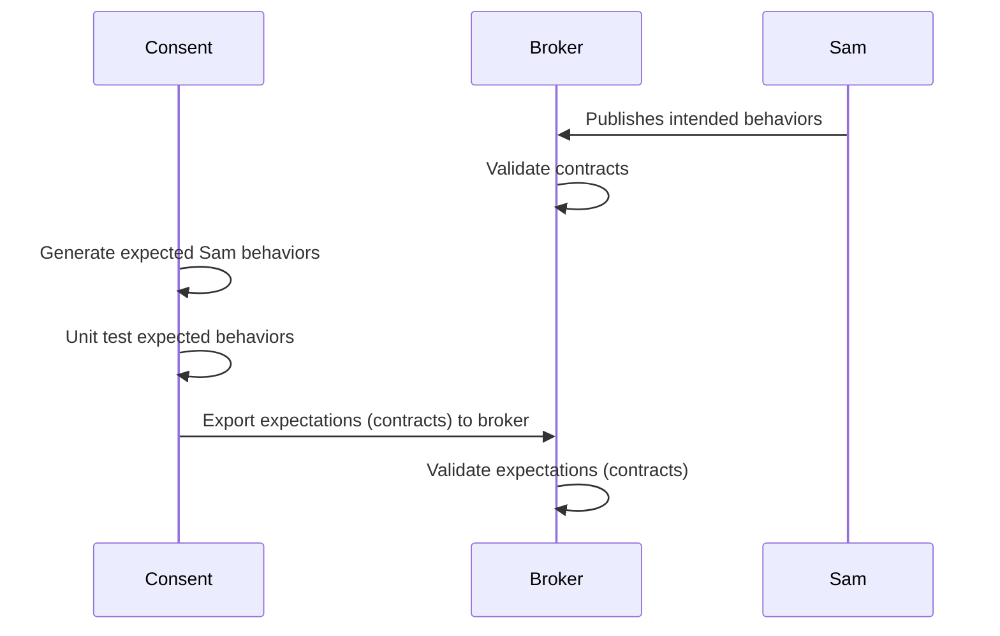
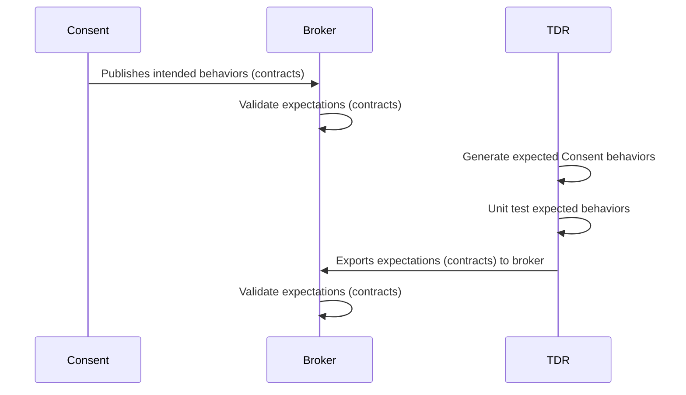

# Pact Testing

Pact tests can be run with maven using the `pact-tests` profile:

```shell
mvn clean test -Ppact-tests
```

More details on Contract Testing can be found in our handbook
 * https://broadworkbench.atlassian.net/wiki/spaces/IRT/pages/2660368406/Getting+Started+with+Pact+Contract+Testing

Each party owns a set of expectations (contracts). The consumer expectations (consumer contracts)
are completely independent of the provider expectations (provider contracts), and vice versa.

Specifically:
 * Consent runs tests against a mock Sam service with consent-defined expectations of what Sam does.
 * Upon success, publish a consumer-provider pact to DSP's [Pact Broker](https://pact-broker.dsp-eng-tools.broadinstitute.org/).
 * Pact Broker is the  source of truth to forge contractual obligations between consumer and provider expectations (contracts).
 * Sam obtains all Sam expectations (consent's consumer contracts) from Pact Broker and runs provider tests to validate its obligations to all consumers.

The Pact Broker is a 2-way street. The consumer can see in the dashboard if the service is able to
honor their consumer expectations (which is also true when those expectations are updated). The
provider can validate that a desired deployment would not break any of the consumers' published
expectations.  Both the consumer and the provider can gate deployment on availability/honoring of
the published pact (contract expectations) between the two.

### Sequence Diagrams

When developing a consumer test, i.e. a unit test that validates a Consent expectation of some other 
service, we are operating in a `Consumer` context. When developing a provider test, i.e. a unit test
that validates an external system's expectation of a Consent-provided behavior, we are operating in
a `Provider` context

#### Consumer Context



#### Provider Context

